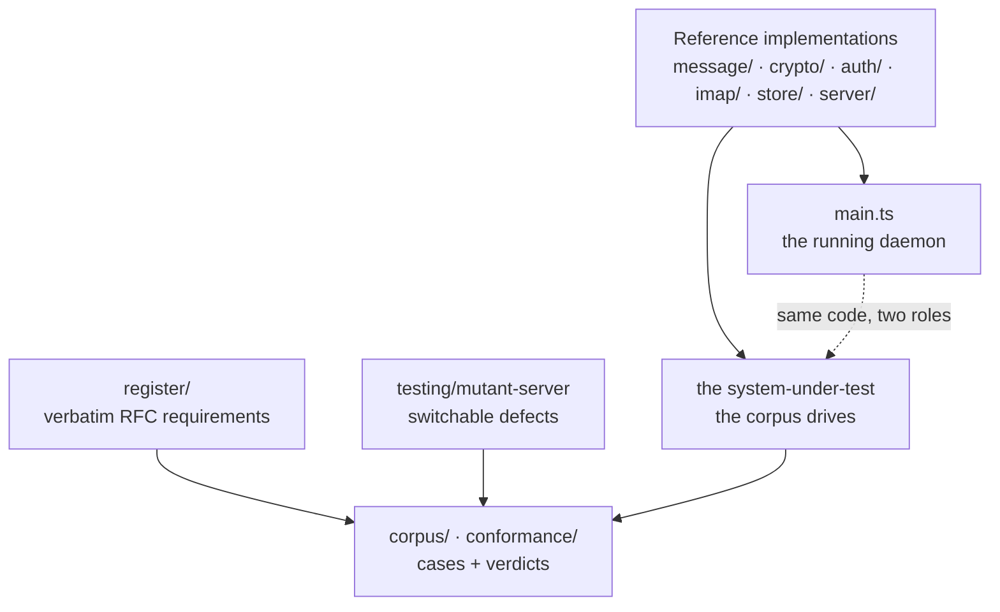
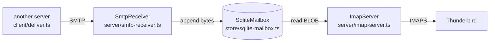
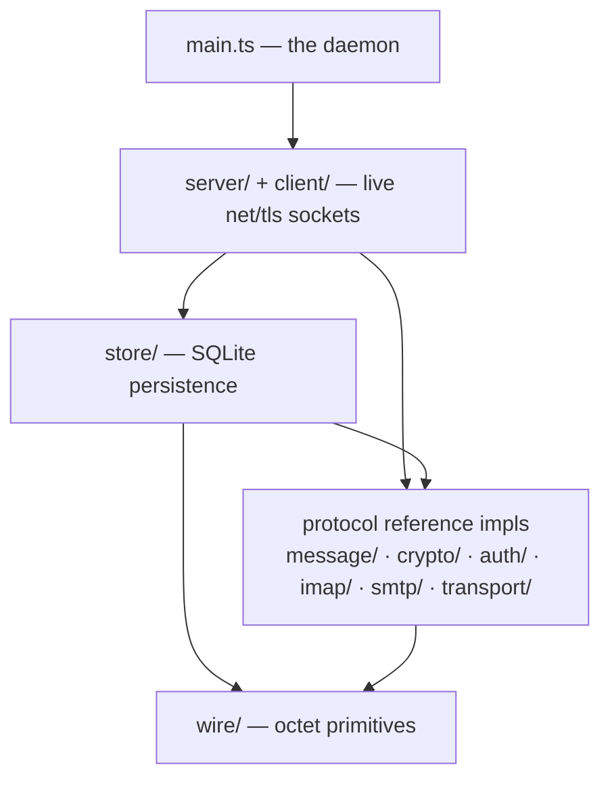
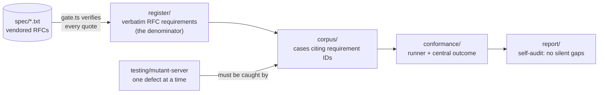

# Architecture — how this is built

Read this once and the tree stops looking like 150 files. It's really two
programs that share one spine:

- **A mail server** you can `npm start` — SMTP in, IMAP out, SQLite in the middle.
- **A whole-server conformance test bed** — a fixed register of what the RFCs
  require, a corpus of cases that check it, and a mutant harness that proves each
  case actually detects its violation.

The join is the thing worth understanding first: **the same code is both.** The
reference implementations under `message/`, `crypto/`, `imap/`, `store/`,
`server/` are what runs when you start the daemon *and* the system-under-test the
corpus drives. There is no separate "test double" of the parser to drift from the
real one — the corpus tests the code that ships. That is the whole design, and
everything below is a consequence of it.

## Follow one message

The fastest way to see the server is to trace a delivery, byte for byte. This is
exactly what `src/server/daemon.integration.test.ts` does end to end.

1. A sending MTA (in tests, our own `src/client/deliver.ts`) opens a socket and
   runs the transaction: `EHLO`, `MAIL FROM`, `RCPT TO`, `DATA`, the terminating
   `<CRLF>.<CRLF>`, `QUIT`.
2. `src/server/smtp-receiver.ts` reads it off the wire as raw `Buffer`s, un-stuffs
   the leading dots (RFC 5321 §4.5.2), and hands the delivered bytes to a
   `store` callback.
3. `src/main.ts` wired that callback to `SqliteMailbox.append()`, so the message
   lands in SQLite as a `BLOB` — byte-exact, no round-trip through a JS string.
4. Thunderbird connects to `src/server/imap-server.ts` over TLS, `LOGIN`s (verified
   against `src/store/accounts.ts`), `SELECT INBOX`, `FETCH 1 BODY[]`. The server
   reads the `BLOB` back out and writes it down the socket inside an IMAP literal —
   the same bytes that arrived.

Nothing in that path parses a message into an object and re-serialises it. The
envelope is parsed; the content is moved as octets. That is the "bytes, never
strings" rule (`src/wire/bytes.ts` explains why the wire DSL has no default line
terminator), and it is what lets the round-trip be byte-exact instead of
approximately-exact.

## The running server, bottom up

Each layer depends only on the ones above it in this list. You can read them in
this order and never look forward.

*(arrows are "depends on" — the daemon at the top, octets at the foundation.)*

**`wire/`** — octet primitives. `bytes.ts` builds exact wire input (`crlf`, `lf`,
`bare` are different functions on purpose, so a bare-LF smuggling probe reads as
deliberate at the call site). `reply.ts`, `transport.ts` are the reply grammar and
the socket abstraction. Everything else sends and receives through here.

**The protocol reference implementations** — hand-built parsers and engines, no
mail libraries, each with switchable defects for negative control:

- `message/` — RFC 5322 + MIME (2045/2046/2047) parsing, address grammar, DSN
  bodies (3464). The confusion surfaces — header injection, boundary splitting,
  encoded-word decoding — live here.
- `crypto/` — DKIM sign and verify end to end (canonicalisation → tag list → body
  hash → RSA/Ed25519), pinned to the RFC 6376 / 8463 test vectors. Real
  `node:crypto`, no crypto library.
- `auth/` — SPF, DMARC, ARC structure, and SCRAM (the password-never-sent proof).
- `imap/` — the IMAP4rev2 pieces: command and response grammars, literals,
  `ENVELOPE`, sequence sets, `SEARCH`.
- `smtp/`, `transport/` — the AUTH/SIZE decision logic and MTA-STS / SMTPUTF8.

**`store/`** — persistence. `mailbox.ts` is the *reference* mailbox: an in-memory
model that pins every IMAP storage invariant (UID monotonicity, no UID reuse,
flags, `EXPUNGE`, sequence numbers, `UIDVALIDITY`). `sqlite-mailbox.ts` is the
*real* one on `node:sqlite`. They expose one surface, and the corpus drives both
through a single invariant harness — so the persistent implementation is proven to
reproduce the reference behaviour exactly, not merely to look similar.
`accounts.ts` (SCRAM credentials) and `queue.ts` (outbound retry) sit alongside.

**`server/` + `client/`** — the live network layer. `smtp-receiver.ts` and
`imap-server.ts` are real `net`/`tls` servers that mount the reference
implementations on sockets. `client/deliver.ts` is the sending half; `client/mx.ts`
resolves MX hosts. These are thin: they move bytes between a socket and a
reference engine and own no protocol logic of their own.

**`main.ts`** — the daemon. ~120 lines that open the database, seed accounts, and
start three listeners (inbound SMTP, submission-with-AUTH, IMAPS). `startServer()`
is factored out from `main()` so the whole assembly is itself under test. If you
want to know what "the server" *is*, it is this file and the four modules it wires.

## The test bed, and why it can be trusted

A conformance suite that reports all-green against a broken server is worse than
none. Four moving parts stop that from happening.

**`register/` — the denominator.** Every normative statement, quoted *verbatim*
from a vendored RFC, with its RFC 2119 level, the party it binds (server / client /
both), and an honest `testability` tag. `register/types.ts` defines the shape;
`register/gate.ts` is a test that checks every quote against the `spec/*.txt` file
it claims to come from — so a paraphrased or fabricated quote fails the build. This
is the fixed thing everything else is measured against: 663 requirements across six
domains from 18 RFCs (`npm run registry` prints the live count). Registrations you
*can't* test (client-binding, out-of-band) stay in the register anyway — deleting
them would shrink the denominator and flatter the coverage number.

**`corpus/` — the cases.** A `TestCase` (`conformance/test-case.ts`) is *data*, not
an assertion function: "to check requirement R, drive this exchange, then judge
what came back." `requirement` is a typed `RequirementId`, so a case citing a
requirement that doesn't exist **fails to compile** — traceability is structural,
not a convention someone has to maintain. A case may only *observe* and *conclude*;
it cannot decide its own outcome.

**`conformance/` — the runner.** `outcome.ts` computes the verdict centrally from
the case's judgement plus the requirement's level, which is why a declined `SHOULD`
comes out as *permitted-latitude* and never a failure — a test author physically
cannot grade a `SHOULD` as a finding. `fixture.ts` handles state SMTP can't
establish in-band (a valid recipient, a size limit); a case needing a fixture the
run lacks yields *inconclusive*, never a false pass. `sink.ts` is the receiving
server used to observe what the system relayed downstream (dot-un-stuffing, the
`Received:` line — things invisible on the sending connection).

**`testing/` — the negative controls.** `mutant-server.ts` is the most important
file in the repo: a receiver whose conformance breaks one defect at a time. For
every planted defect, the corpus case for that requirement must report
*non-conformant* against exactly it — and clean against everything else. A
wire-testable requirement with a case but no mutant is only *half*-covered: proven
to pass clean servers, not to catch dirty ones. The library-adapter areas
(parsers, crypto) do the same trick in-process — the reference implementation
carries defect flags, and each case runs it both clean and broken.

**`report/` — the self-audit.** `npm run library-coverage` fails the build on any
parse-testable requirement with no citing test and no recorded
`deliberatelyUncovered` decision. `npm run registry` is the cross-domain inventory.
These exist so "we covered everything" is a checkable claim, not a hope. Every gap
is either a test or a dated decision — there is no silent third category.

## The conventions that are load-bearing

These aren't style preferences; break one and something real breaks.

- **Bytes, never strings.** Mail content is `Buffer` from socket to SQLite `BLOB`
  and back. Strings are UTF-16 and SMTP is octets; the one place a string touches
  the wire it is `latin1`-encoded so the mapping is exact (`wire/bytes.ts`).
- **Zero runtime dependencies.** SQLite is `node:sqlite`, crypto is `node:crypto`,
  TLS is `node:tls`. The `package.json` `dependencies` block is empty and is meant
  to stay that way. This is the "SQLite of email" claim taken literally.
- **`erasableSyntaxOnly` TypeScript, run directly.** Node ≥ 22.18 executes the
  `.ts` with no build step, which forbids anything that needs a runtime transform:
  no `enum`, no constructor parameter properties. Classes use explicit `#private`
  fields. `noUncheckedIndexedAccess` is on, so indexing is guarded then `!`-asserted.
- **Opinionated cuts are recorded, never silent.** No POP3, IMAP4rev2 only,
  MTA-STS not DANE, SCRAM + PLAIN-over-TLS only. Each cut is an ADR in
  `docs/decisions/` with a reason, so a future reader can tell "we decided against
  this" from "we forgot."

## Where to start reading

- **To understand the server:** `src/main.ts`, then `smtp-receiver.ts`,
  `sqlite-mailbox.ts`, `imap-server.ts` — the four files the daemon composes.
- **To understand the test discipline:** `register/types.ts` and
  `conformance/test-case.ts` (both have long, load-bearing header comments), then
  `testing/mutant-server.ts`.
- **To understand the philosophy:** `docs/TESTING-ROADMAP.md` is the map of every
  pillar and its status; `docs/IMPLEMENTING-A-CONFORMANT-SERVER.md` is the hard-won
  guidance on the requirements that are easy to get wrong.

## Adding an RFC

The shape is designed so a new spec is a small, uniform change:

1. Vendor the spec text as `spec/rfcNNNN.txt` and add `'rfcNNNN'` to `SpecSource`
   in `register/types.ts`.
2. Add a register section under the relevant `register/<domain>/sections/` — the
   verbatim quotes, gated automatically against the file you just vendored.
3. Build (or extend) the reference implementation with defect flags.
4. Write corpus cases citing the new requirement IDs, each with its negative
   control.

`npm run library-coverage` will refuse to go green until every testable new
requirement is either covered or carries a dated decision not to. The register
won't let you quote text that isn't in the spec file. The type system won't let a
case cite a requirement that doesn't exist. The guardrails are the point — they're
what make "we know exactly what works" a fact about the build rather than a
sentence in a README.
