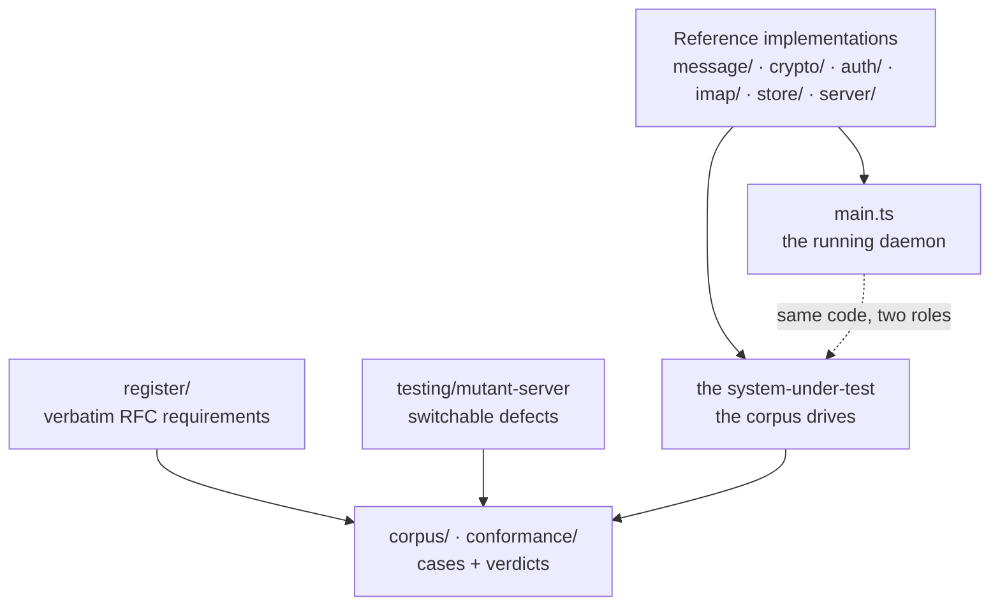
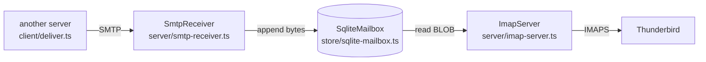
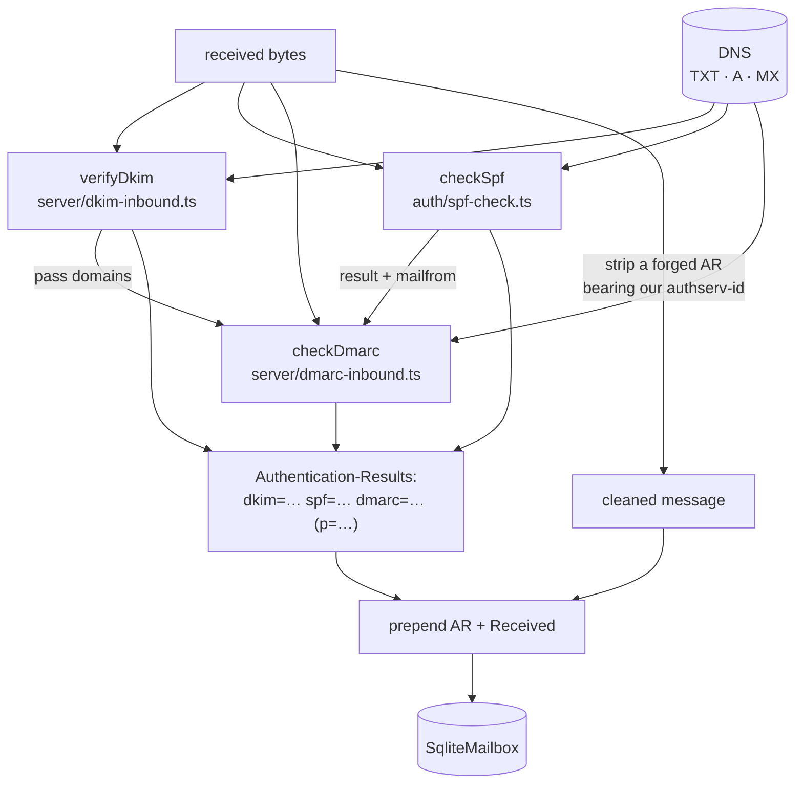
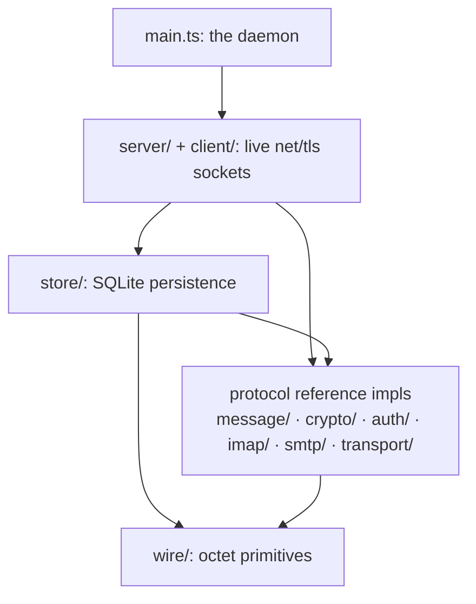
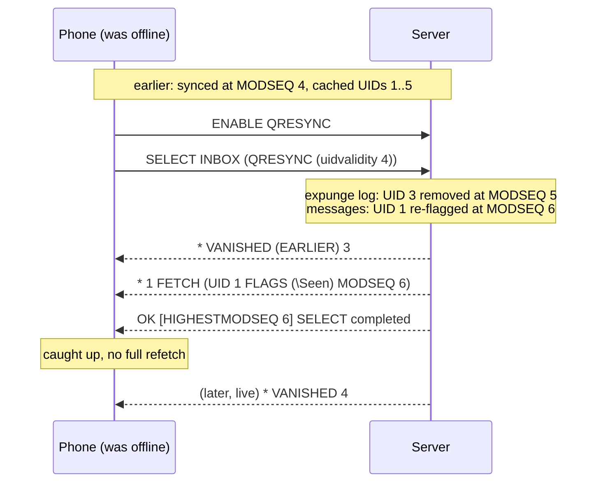
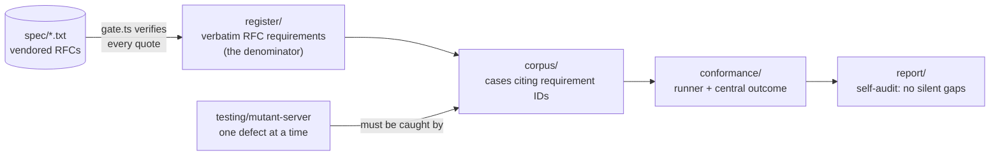

# Architecture: how this is built

The ~200 source files are three programs:

- **A mail server** that you start with `npm start`: SMTP in, IMAP out, SQLite in the middle.
- **A whole-server conformance test bed**: a fixed register of what the RFCs
  require, a corpus of cases that check it, and a mutant harness that proves each
  case detects its violation.
- **A self-updater** (`src/update/`), the one part of the tree that `main.ts` cannot
  reach. It pulls, verifies, and cuts over to a new version over the git remote
  the deployment was installed from (ADR 0025). Its own section is below.

The first two share one spine: **the same code is both.** The
reference implementations under `message/`, `crypto/`, `imap/`, `store/`,
`server/` run when you start the daemon. They are also the system-under-test that
the corpus drives. No separate "test double" of the parser can drift from the
real one, because the corpus tests the code that ships. Everything below follows from that.

```mermaid
flowchart TB
    ref["Reference implementations<br/>message/ · crypto/ · auth/ · imap/ · store/ · server/"]
    ref --> daemon["main.ts<br/>the running daemon"]
    ref --> sut["the system-under-test<br/>the corpus drives"]

    register["register/<br/>verbatim RFC requirements"] --> corpus["corpus/ · conformance/<br/>cases + verdicts"]
    mutant["testing/mutant-server<br/>switchable defects"] --> corpus
    sut --> corpus

    daemon -.->|"same code, two roles"| sut
```

## Follow one message

To see the server fastest, trace a delivery byte for byte. `src/server/daemon.integration.test.ts`
does this end to end.

```mermaid
flowchart LR
    A["another server<br/>client/deliver.ts"] -->|SMTP| B["SmtpReceiver<br/>server/smtp-receiver.ts"]
    B -->|append bytes| C[("SqliteMailbox<br/>store/sqlite-mailbox.ts")]
    C -->|read BLOB| D["ImapServer<br/>server/imap-server.ts"]
    D -->|IMAPS| E["Thunderbird"]
```

1. A sending MTA (in tests, our own `src/client/deliver.ts`) opens a socket and
   runs the transaction: `EHLO`, `MAIL FROM`, `RCPT TO`, `DATA`, the terminating
   `<CRLF>.<CRLF>`, `QUIT`.
2. `src/server/smtp-receiver.ts` reads it off the wire as raw `Buffer`s, un-stuffs
   the leading dots (RFC 5321 §4.5.2), and gives the delivered bytes to a
   `store` callback.
3. `src/main.ts` resolves the recipient to a local account and appends to *that user's*
   `SqliteMailbox`. The message lands in SQLite as a `BLOB`, byte-exact, with no round-trip
   through a JS string.
4. Thunderbird connects to `src/server/imap-server.ts` over TLS. It runs `LOGIN`
   (verified against the SCRAM `AccountRegistry` in `src/store/account-registry.ts`),
   `SELECT INBOX`, and `FETCH 1 BODY[]`. The server reads the `BLOB` back out and
   writes it down the socket inside an IMAP literal: the same bytes that arrived.

Nothing in that path parses a message into an object and re-serialises it. The
server parses the envelope and moves the content as octets. This is the "bytes, never
strings" rule (`src/wire/bytes.ts` explains why the wire DSL has no default line
terminator). It keeps the round-trip byte-exact instead of approximately-exact.

## What the receiver does before it stores

The trace above is the happy path. The server does not trust a message off the open
internet. Between "read the bytes" and "append to SQLite", the inbound handler in
`main.ts` authenticates the sender and records the result in `Authentication-Results`.
The server then *acts on* that result. If a message fails DMARC where the owner published
`p=quarantine`/`p=reject`, the server files it to the recipient's Junk folder rather than the inbox
(ADR 0010). The server never hard-rejects it at SMTP, so it does not bounce legitimately-forwarded
mail. A valid **ARC** chain from a trusted sealer can rescue the message to the inbox (ADR 0011).
A DKIM key and the SPF/DMARC/ARC records are DNS lookups, so the delivery handler
is `async`. `smtp-receiver.ts` serialises chunk processing through a promise
chain, so a pipelined sender cannot re-enter it and corrupt the receive buffer.

```mermaid
flowchart TB
    raw["received bytes"] --> dkim["verifyDkim<br/>server/dkim-inbound.ts"]
    raw --> spf["checkSpf<br/>auth/spf-check.ts"]
    raw --> dmarc["checkDmarc<br/>server/dmarc-inbound.ts"]
    dns[("DNS<br/>TXT · A · MX")] --> dkim & spf & dmarc
    dkim -->|"pass domains"| dmarc
    spf -->|"result + mailfrom"| dmarc
    dkim & spf & dmarc --> ar["Authentication-Results:<br/>dkim=… spf=… dmarc=… (p=…)"]
    raw -->|"strip a forged AR<br/>bearing our authserv-id"| clean["cleaned message"]
    ar --> stamp["prepend AR + Received"]
    clean --> stamp
    stamp --> store[("SqliteMailbox")]
```

- **DKIM** (`dkim-inbound.ts`) verifies *every* signature over RSA or Ed25519 (a
  message may carry several). It requires `From` in `h=` (§5.4) and honours
  expiry. It returns the set of passing `d=` domains, so DMARC can align against
  any. It composes the vector-pinned `crypto/dkim-*` primitives. DNS key retrieval
  is the only new part.
- **SPF** (`auth/spf-check.ts`) is an async recursive evaluator over the sending
  domain's policy. It resolves `a`/`mx`/`include`/`redirect` live and matches
  IPv4/IPv6 CIDR against the peer. It enforces the RFC 7208 ten-lookup limit, so a
  hostile record cannot fan the resolver into a DoS.
- **DMARC** (`dmarc-inbound.ts`) ties the two to the `From` domain. It passes only
  when an *aligned* DKIM or SPF identifier passed (relaxed = same organizational
  domain, resolved over the full embedded Public Suffix List in `auth/public-suffix.ts`.
  Strict = exact). The delivery path (`main.ts`) then enforces the policy, as described above.
- **ARC** (`server/arc-inbound.ts`) validates any Authenticated Received Chain per
  RFC 8617 §5.2 (structure, the newest message signature, and every seal, RSA/Ed25519).
  A forwarder that you trust can vouch for mail that broke the author's DKIM in transit.

The composition glue is fuzzed (`server/auth-fuzz.test.ts`): 1500 malformed
records and headers, all returning a verdict without throwing. This code and the
outbound signer follow the same rule: compose the tested crypto, do not reinvent it.

## The running server, bottom up

Each layer depends only on the ones above it in this list. You can read them in
this order and never look forward.

```mermaid
flowchart TB
    main["main.ts: the daemon"] --> net["server/ + client/: live net/tls sockets"]
    net --> store["store/: SQLite persistence"]
    net --> proto["protocol reference impls<br/>message/ · crypto/ · auth/ · imap/ · smtp/ · transport/"]
    store --> proto
    store --> wire["wire/: octet primitives"]
    proto --> wire
```

*(arrows are "depends on": the daemon at the top, octets at the foundation.)*

**`wire/`**: octet primitives. `bytes.ts` builds exact wire input (`crlf`, `lf`,
`bare` are different functions on purpose, so a bare-LF smuggling probe reads as
deliberate at the call site). `reply.ts`, `transport.ts` are the reply grammar and
the socket abstraction. Everything else sends and receives through here.

**The protocol reference implementations** are hand-built parsers and engines, no
mail libraries, each with switchable defects for negative control:

- `message/`: RFC 5322 + MIME (2045/2046/2047) parsing, address grammar, DSN
  bodies (3464). The confusion surfaces (header injection, boundary splitting,
  encoded-word decoding) live here.
- `crypto/`: DKIM sign and verify end to end (canonicalisation → tag list → body
  hash → RSA/Ed25519), pinned to the RFC 6376 / 8463 test vectors. Real
  `node:crypto`, no crypto library.
- `auth/`: SPF, DMARC (with the embedded Public Suffix List), ARC chain validation,
  and SCRAM (the password-never-sent proof).
- `imap/` holds the IMAP4rev2 pieces: command and response grammars, literals,
  `ENVELOPE`, sequence sets, `SEARCH`.
- `smtp/`, `transport/`: the AUTH/SIZE decision logic and MTA-STS / SMTPUTF8.

**`store/`**: persistence. `mailbox.ts` is the *reference* mailbox: an in-memory
model that pins every IMAP storage invariant (UID monotonicity, no UID reuse,
flags, `EXPUNGE`, sequence numbers, `UIDVALIDITY`). `sqlite-mailbox.ts` is the
*real* one on `node:sqlite`. It also carries `SqliteCatalog`, the set of
named folders (INBOX, Trash, Sent, …) that a real client creates. `memory-catalog.ts`
is its reference twin. They expose one surface, and the corpus drives both through
a single invariant harness. This proves that the persistent implementation reproduces the
reference behaviour exactly. More stores sit alongside them. `account-registry.ts`
is the multi-account SCRAM registry (StoredKey/ServerKey, never the password).
`mail-stores.ts` is the login-keyed cache that opens one mailbox DB per user.
`accounts.ts` is the shared SCRAM credential derivation. `queue.ts` is the retry
decision, and `sqlite-queue.ts` is the persisted outbound queue, with a `dead_letter`
table that keeps a message that exhausts its retries rather than dropping it.

**`server/` + `client/`**: the live network layer. `smtp-receiver.ts` and
`imap-server.ts` are real `net`/`tls` servers. `client/deliver.ts` is the sending
half and `client/mx.ts` resolves MX hosts. The send pipeline is a chain of small,
separately-tested transforms: `submission-fixup.ts` (add a missing From from the
envelope sender, plus Date/Message-ID), a strip of any `Authentication-Results`
that bears our own authserv-id (RFC 8601 §5 — the same defence as inbound, and more
load-bearing here, because nothing stamps a genuine result on top of a submitted
message), `received.ts` (stamp the trace hop),
`dkim-signer.ts` (sign), then `sqlite-queue.ts` + `relay-loop.ts` (persist and
retry) and `outbound.ts` (resolve MX, deliver with opportunistic STARTTLS and a
plaintext fallback). When the relay finally stops, `bounce.ts` assembles a
`multipart/report` non-delivery report and delivers it back to the sender (never to
a null return-path, so bounces cannot loop). `imap-server.ts` also serves the full
read side that a real client needs: `BODYSTRUCTURE` and per-part `BODY[n]` fetch (so a
client renders an attachment without a download of the whole message), the fetch
macros, `INTERNALDATE`, extended `SEARCH`/`ESEARCH`, `DELETE`/`RENAME`, the
`SPECIAL-USE` folders, and `CONDSTORE` (RFC 7162). `CONDSTORE` is a persisted
per-message mod-sequence, so a reconnecting client resyncs only the delta
(`FETCH CHANGEDSINCE`). It guards a flag edit against a racing client
(`STORE UNCHANGEDSINCE`). It also serves `QRESYNC`, which uses a persisted expunge
log to replay vanished UIDs and changed flags in one `SELECT (QRESYNC …)` round-trip
(the fast reconnect that a phone uses).
`mailbox-notifier.ts` is the pub/sub that lets one connection's change reach another.
An inbound delivery, or an APPEND/EXPUNGE/MOVE on any connection, wakes every other
connection selected on that mailbox. Each connection keeps its own view of the
mailbox (the UIDs the server told it about). It reconciles that view (untagged
`EXPUNGE` for what vanished and `EXISTS` for what arrived) only at a safe command
boundary (`NOOP`/`CHECK`, or in real time while it idles), never mid-`FETCH`, per
RFC 9051 §7.4.1. This keeps a phone and a desktop on the same mailbox in
agreement. Each module is thin and owns one concern.

A client that was offline resyncs in one round-trip with `QRESYNC`. It hands back
the `UIDVALIDITY` and mod-sequence it last saw. The server then replays what changed
from the persisted expunge log and mod-sequences, rather than a full refetch of the
mailbox by the client.

```mermaid
sequenceDiagram
    participant P as Phone (was offline)
    participant S as Server
    Note over P,S: earlier: synced at MODSEQ 4, cached UIDs 1..5
    P->>S: ENABLE QRESYNC
    P->>S: SELECT INBOX (QRESYNC (uidvalidity 4))
    Note over S: expunge log: UID 3 removed at MODSEQ 5<br/>messages: UID 1 re-flagged at MODSEQ 6
    S-->>P: * VANISHED (EARLIER) 3
    S-->>P: * 1 FETCH (UID 1 FLAGS (\Seen) MODSEQ 6)
    S-->>P: OK [HIGHESTMODSEQ 6] SELECT completed
    Note over P: caught up, no full refetch
    S-->>P: (later, live) * VANISHED 4
```

**`main.ts`**: the daemon. It opens a **control database** (`store/account-registry.ts`,
the SCRAM credential registry, plus the outbound queue), opens one mailbox database per user through
`store/mail-stores.ts`, and starts three listeners (inbound SMTP, submission-with-AUTH, IMAPS).
The server authenticates inbound mail (the section above), trace-stamps it, and delivers it into the
addressed account's mailbox. It does this only for recipients that we host (`loginForLocalAddress`),
so it never accepts mail that it cannot deliver. `routeRecipients` splits submitted mail: local
recipients into a folder, remote ones through the send pipeline above. Both auth-bearing listeners
share one per-IP brute-force throttle (`server/auth-throttle.ts`). `startServer()` is factored out
from `main()`, so the whole assembly is itself under test. "The server" is this file and the modules
it wires.

**`src/ops/`**: the operator CLI behind the same entry point (`node src/main.ts <command>`,
and no argument runs the daemon). Its design rule is *reuse the enforcement code as the
generation/checking code*. `setup` derives the DKIM TXT with the signer/verifier's own key
primitives, plus the MTA-STS policy that our own RFC 8461 parser must accept. `doctor` evaluates
the published SPF with the real RFC 7208 evaluator. `verify` asserts the invariants that the
crash/concurrency suites establish. `account` and `dead-letter` are thin verbs over the
registry and queue stores. Every network/filesystem touch goes through an injected seam, so
the suite tests each check/command in both directions (it detects the broken state, with no
false alarm on the healthy one). The operator provisions accounts here rather than by env
(ADR 0012). There is deliberately no HTTP listener (ADR 0013).

**`src/update/`**: the self-updater, and the one part of the tree that `main.ts` *cannot* reach.
It is a separate program that a systemd timer runs as a separate user. The whole
security argument is that the internet-facing daemon cannot write the code it will run next
(ADR 0025). So the dependency arrow points the other way round from everything above: the updater
imports the daemon's store and conformance code to verify a candidate, and the daemon imports
nothing from here. Bottom up: `pkt-line.ts`, `smart-http.ts`, `packfile.ts` and `objects.ts` speak
enough of git's wire protocol v2 over HTTPS to fetch and verify a commit with no `git` binary and no
dependency. `acquire.ts` and `checkout.ts` turn that into a content-verified tree. `shape.ts` and
`executable.ts` ask whether it can run on *this* machine. `snapshot.ts` copies the live databases
with `VACUUM INTO`. `preflight.ts` boots the candidate against those copies with the real
configuration and measures the migration. `version-store.ts` owns the `current` symlink.
`cutover.ts` performs the drained, crash-safe switch and the automatic revert. `state.ts` records
the phase, so a recovery is possible after an interrupted switch. `run-lock.ts` keeps two runs off
one store. `candidate-process.ts` is the seam that every "spawn the new version" step goes through,
so all of it is testable without a second machine. The operator's view is
[keeping a deployment up to date](SELF-UPDATE.md).

## The test bed, and why it can be trusted

A conformance suite that reports all-green against a broken server is worse than
none. Four moving parts stop that from happening.

```mermaid
flowchart LR
    register["register/<br/>verbatim RFC requirements<br/>(the denominator)"] --> corpus["corpus/<br/>cases citing requirement IDs"]
    corpus --> runner["conformance/<br/>runner + central outcome"]
    mutant["testing/mutant-server<br/>one defect at a time"] -->|must be caught by| corpus
    runner --> report["report/<br/>self-audit: no silent gaps"]
    spec[("spec/*.txt<br/>vendored RFCs")] -->|gate.ts verifies<br/>every quote| register
```

**`register/`: the denominator.** Every normative statement, quoted *verbatim*
from a vendored RFC, with its RFC 2119 level, the party it binds (server / client /
both), and an honest `testability` tag. `register/types.ts` defines the shape.
`register/gate.ts` is a test that checks every quote against the `spec/*.txt` file
it claims to come from, so a paraphrased or fabricated quote fails the build. It
is the fixed baseline that everything else measures against: 770 requirements across six
domains from 19 RFCs (`npm run registry` prints the live count). Registrations that you
*cannot* test (client-binding, out-of-band) stay in the register anyway. Deletion of
them would shrink the denominator and flatter the coverage number.

**`corpus/`: the cases.** A `TestCase` (`conformance/test-case.ts`) is *data*, not
an assertion function: "to check requirement R, drive this exchange, then judge
what came back." `requirement` is a typed `RequirementId`, so a case that cites a
requirement that does not exist **fails to compile**. Traceability is structural,
not a convention that someone has to maintain. A case may only *observe* and *conclude*.
It cannot decide its own outcome.

**`conformance/`: the runner.** `outcome.ts` computes the verdict centrally from
the case's judgement plus the requirement's level. This is why a declined `SHOULD`
comes out as *permitted-latitude* and never a failure. A test author physically
cannot grade a `SHOULD` as a finding. `fixture.ts` handles state that SMTP cannot
establish in-band (a valid recipient, a size limit). A case that needs a fixture the
run lacks yields *inconclusive*, never a false pass. `sink.ts` is the receiving
server that observes what the system relayed downstream (dot-un-stuffing, the
`Received:` line: things invisible on the sending connection).

**`testing/`: the negative controls.** `mutant-server.ts` is the most important
file in the repo: a receiver whose conformance breaks one defect at a time. For
every planted defect, the corpus case for that requirement must report
*non-conformant* against exactly it, and clean against everything else. A
wire-testable requirement with a case but no mutant is only *half*-covered: proven
to pass clean servers, not to catch dirty ones. The library-adapter areas
(parsers, crypto) work the same way in-process. The reference implementation
carries defect flags, and each case runs it both clean and broken.

**`report/`: the self-audit.** `npm run library-coverage` fails the build on any
parse-testable requirement with no citing test and no recorded
`deliberatelyUncovered` decision. `npm run registry` is the cross-domain inventory.
These exist so "we covered everything" is a checkable claim, not a hope. Every gap
is either a test or a dated decision. There is no silent third category.

## The conventions that are load-bearing

These are not style preferences. If you break one, something real breaks.

- **Bytes, never strings.** Mail content is `Buffer` from socket to SQLite `BLOB`
  and back. Strings are UTF-16 and SMTP is octets. In the one place a string touches
  the wire, the server `latin1`-encodes it, so the mapping is exact (`wire/bytes.ts`).
- **Zero runtime dependencies.** SQLite is `node:sqlite`, crypto is `node:crypto`,
  TLS is `node:tls`. `package.json` has no `dependencies` at all (only dev tooling)
  and must stay that way. This is the "SQLite of email" claim, taken literally.
- **`erasableSyntaxOnly` TypeScript, run directly.** Node ≥ 22.18 executes the
  `.ts` with no build step, which forbids anything that needs a runtime transform:
  no `enum`, no constructor parameter properties. Classes use explicit `#private`
  fields. `noUncheckedIndexedAccess` is on, so the code guards each index access, then `!`-asserts it.
- **Opinionated cuts recorded, never silent.** No POP3. IMAP4rev2 with a curated
  extension set (rev1 also advertised for client compatibility). MTA-STS, not DANE.
  SASL PLAIN over TLS on the wire (SCRAM-SHA-256 is the credential storage scheme, not a wire
  mechanism — ADR 0007). Each cut is an ADR in
  `docs/decisions/` with a reason, so a future reader can tell "we decided against
  this" from "we forgot."

## Where to start reading

- **To understand the server:** `src/main.ts`, then `smtp-receiver.ts`,
  `sqlite-mailbox.ts`, `imap-server.ts`: the four files that the daemon composes.
- **To understand the test discipline:** `register/types.ts` and
  `conformance/test-case.ts` (both have long, load-bearing header comments), then
  `testing/mutant-server.ts`.
- **To understand the philosophy:** `docs/WORKING-AGREEMENT.md` says how to build the
  project (scope discipline, the "no test that passes for the wrong reason" rule).
  `docs/TESTING.md` is the map of every pillar and its status.
  `docs/IMPLEMENTING-A-CONFORMANT-SERVER.md` is the hard-won guidance on the
  requirements that are easy to get wrong.

## Adding an RFC

To add a new spec, make a small, uniform change:

1. Vendor the spec text as `spec/rfcNNNN.txt`. Add `'rfcNNNN'` to `SpecSource`
   in `register/types.ts`.
2. Add a register section under the relevant `register/<domain>/sections/` with the
   verbatim quotes. The gate checks them automatically against the file that you just vendored.
3. Build (or extend) the reference implementation with defect flags.
4. Write corpus cases that cite the new requirement IDs, each with its negative
   control.

`npm run library-coverage` refuses to pass until every testable new
requirement is either covered or carries a dated decision not to. The register
does not let you quote text that is not in the spec file. The type system does not let a
case cite a requirement that does not exist. The guardrails are the point. They
make "we know exactly what works" a fact about the build rather than a
sentence in a README.
