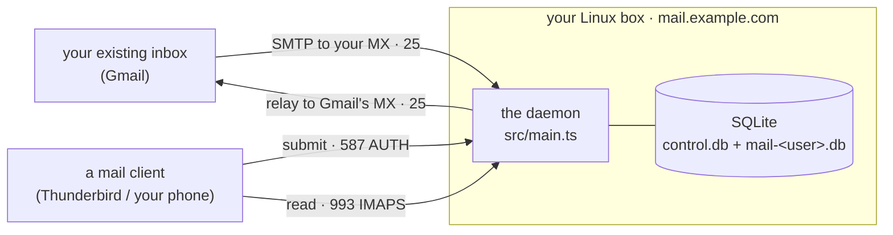
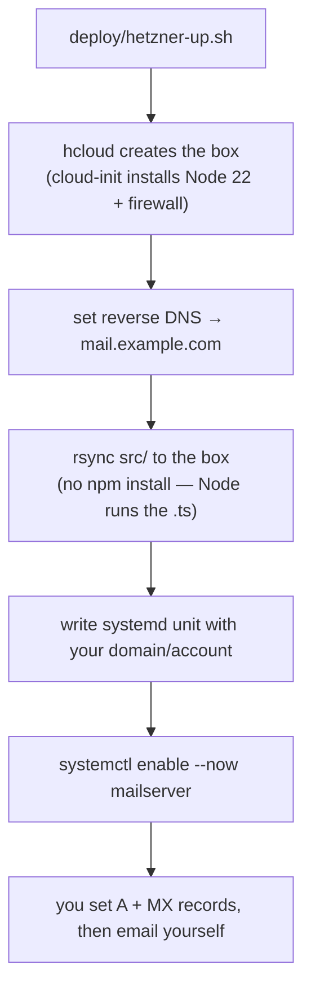
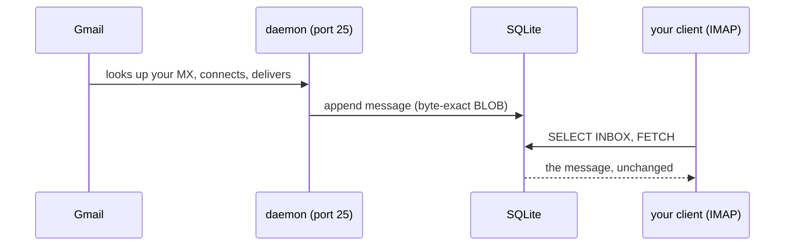
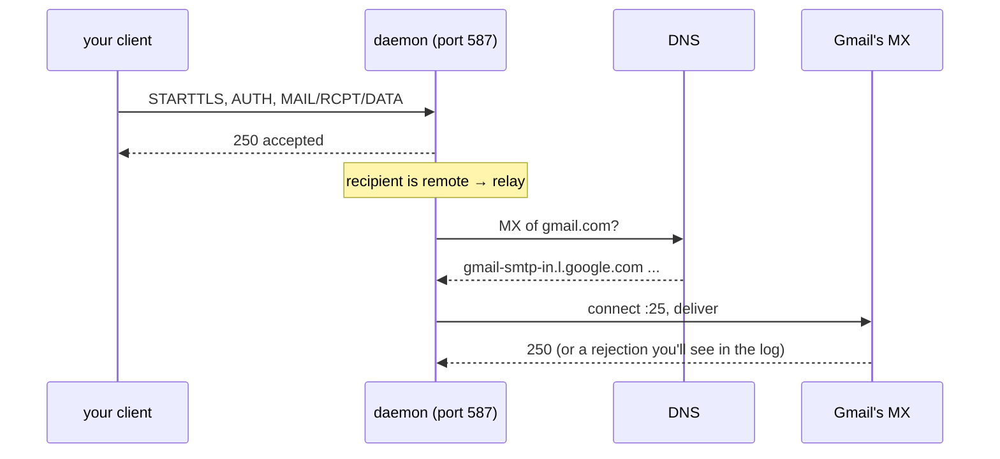

# Deploying to a small server and using it with real email

This is the walkthrough for the thing the project is now capable of: put the
daemon on a little Linux box, point DNS at it, and send mail to and receive mail
from your existing inbox (Gmail, Fastmail, whatever) through one or more accounts.

It is a **test bench, not a production MTA** — naive on purpose (see
[Known limitations](#known-limitations)). The point is to get it into the real
world so its gaps show up against real senders and receivers instead of a test
harness.

## The shape of it



One box runs the daemon. Your existing inbox is the far end. A mail client
(Thunderbird on a laptop, or your phone's mail app) talks to the daemon on 587 to
send and 993 to read — the daemon is *your* server; it does the talking to Gmail.

## Quick start: a throwaway Hetzner box (receiving)

Hetzner Cloud is the cheapest way to spin this up and throw it away — an ARM
`cax11` is about **€0.006/hour**, billed by the hour, gone the moment you delete
it. `deploy/hetzner-up.sh` and `deploy/hetzner-down.sh` automate the whole thing.

This path gets **receiving** working — mail *to* `you@mail.example.com` lands in
the mailbox and you read it over IMAP. Sending outward may work too, but check
first: Hetzner blocks outbound port 25 on *new* accounts (established accounts
have it open — test with `nc gmail-smtp-in.l.google.com 25` from the box). For
what receivers demand of outbound mail, see
[Known limitations](#known-limitations).



Once (per machine): install the [`hcloud` CLI](https://github.com/hetznercloud/cli),
authenticate it (`export HCLOUD_TOKEN=...`), and upload an SSH key
(`hcloud ssh-key create --name mykey --public-key-from-file ~/.ssh/id_ed25519.pub`).

Then:

```sh
MAIL_DOMAIN=mail.example.com \
MAIL_PASS='a-real-passphrase' \
SSH_KEY_NAME=mykey \
  ./deploy/hetzner-up.sh
```

It prints the two DNS records to set (an `A` and an `MX`, both pointing at the
box); reverse DNS is set for you. Watch mail arrive with
`ssh root@<ip> journalctl -fu mailserver`. When you're done:

```sh
./deploy/hetzner-down.sh          # deletes the box, billing stops
```

The rest of this document is the manual reference behind those scripts — read on
if you want to do it by hand or on another provider.

## What you need

- A small Linux server with a **public, static IP** and **port 25 reachable both
  ways**. Many home ISPs and some cheap VPS providers block port 25 — check
  first, because without it you can neither receive nor relay.
- A domain you control DNS for. This guide uses `mail.example.com` as both the
  hostname and the mail domain (so your address is `you@mail.example.com`) — that
  keeps every name consistent, which matters for deliverability. See the
  [double-duty note](#known-limitations) on why one name is used for both.
- Node ≥ 22.18 on the box. No build, no dependencies — copy the repo and run it.

## DNS

The A and MX get mail flowing; PTR + the SPF/DKIM/DMARC trifecta are what earn a
receiver's trust and keep you out of the spam folder.

**You don't have to assemble these by hand.** The server generates them from its
own configuration — including deriving the DKIM public key from the private key
(generating one first if none exists):

```sh
MAIL_DOMAIN=mail.example.com node src/main.ts setup --ip <your-ip>
```

prints every record below as annotated, copy-pasteable zone lines. Re-run it any
time to reprint them from the existing key (the output is deterministic, so you can
diff it against what you actually published). And once the records are in, verify
the whole deployment — live DNS, reverse DNS, SPF evaluation, DKIM key match, the
certificate, and whether your provider actually allows outbound port 25 — with:

```sh
node src/main.ts doctor
```

It exits 1 on any failure, so it works as a cron'd health check; re-run it whenever
deliverability "suddenly" changes, because the usual cause is drift in exactly the
things it checks (an expired certificate, a changed IP, a lost PTR). The table
explains what each record is *for*:

| Record | Name | Value | Why |
|---|---|---|---|
| **A** | `mail.example.com` | your server's IP | where the host lives |
| **MX** | `mail.example.com` | `10 mail.example.com` | tells senders to deliver here |
| **PTR** (reverse DNS) | your IP | `mail.example.com` | set at your VPS provider; Gmail checks the connecting IP resolves back to its HELO name |
| **TXT (SPF)** | `mail.example.com` | `v=spf1 ip4:<your-ip> -all` | authorises *this host's* IP to send for the domain |
| **TXT (DKIM)** | `<selector>._domainkey.mail.example.com` | `v=DKIM1; k=rsa; p=<pubkey>` | the public key that verifies your DKIM signatures (see Running it) |
| **TXT (DMARC)** | `_dmarc.mail.example.com` | `v=DMARC1; p=none; rua=mailto:you@mail.example.com` | the policy receivers apply; `p=none` monitors without quarantining |

All three align because the From domain, the DKIM `d=`, and the SPF domain are the
same name — so a receiver checking DMARC sees SPF *and* DKIM pass for the sending
domain, which is what moves mail from spam to the inbox. `p=none` is right while
you're testing; tighten to `quarantine`/`reject` once you trust your setup.

`setup` also prints an **optional inbound MTA-STS** section: the exact policy file to
host at `https://mta-sts.<domain>/.well-known/mta-sts.txt` (any static HTTPS host — this
server deliberately speaks no HTTP, ADR 0013) plus the `_mta-sts` TXT record, so senders
that honour MTA-STS can refuse to deliver your mail over anything but validated TLS.

## Running it

The daemon is configured entirely by environment variables — there is no config file, and the
SQLite databases are created on first run:

| Variable | For a real deployment |
|---|---|
| `MAIL_DOMAIN` | `mail.example.com` — your hostname *and* mail domain |
| `MAIL_HOST` | `0.0.0.0` — bind all interfaces, not just loopback |
| `MAIL_SMTP_PORT` / `MAIL_SUBMISSION_PORT` / `MAIL_IMAP_PORT` | `25` / `587` / `993` |
| `MAIL_USER` / `MAIL_PASS` | the **primary** account — used to *create* it on first boot; after that the registry is the source of truth and a changed env password is ignored with a warning (ADR 0012) |
| `MAIL_ACCOUNTS` | additional accounts as `"user:pass,user2:pass2"` — create-only, same rule; the clean way to manage accounts is `node src/main.ts account` (below) |
| `MAIL_CONTROL_DB` | `/var/lib/mailserver/control.db` — the control database (account registry + outbound queue) |
| `MAIL_DB` | `/var/lib/mailserver/mail.db` — the **primary** account's mailbox database (a durable path, not `:memory:`) |
| `MAIL_TLS_CERT` / `MAIL_TLS_KEY` | paths to a real certificate (Let's Encrypt) |
| `MAIL_DKIM_KEY` / `MAIL_DKIM_SELECTOR` | PEM key path + selector to sign outbound (see below) |
| `MAIL_TRUSTED_ARC_SEALERS` | comma-separated forwarder domains whose valid ARC chain may rescue a DMARC failure to the inbox (e.g. a mailing list you subscribe to); omit for none |
| `MAIL_MAX_SIZE` | max accepted message size in octets (default 25 MiB) |

Each account's mailbox lives in its own SQLite file; a shared control database holds the SCRAM
credential registry (which stores only the derived StoredKey/ServerKey, never the password) and the
persistent outbound queue. Inbound mail is delivered into the addressed account's mailbox; a
recipient that isn't a known local account is rejected at `RCPT` (no catch-all, no backscatter).

**Recommended first run: `init` (no password in the environment).** Instead of putting a
password in the unit file, create the primary account with a hidden prompt that writes SCRAM
straight to the registry — so no plaintext password ever lands in the unit or
`/proc/<pid>/environ`:

```sh
node src/main.ts init you --db /var/lib/mailserver/control.db
# prompts (twice, hidden) for the password, then prints a passwordless unit to run
```

`init` is first-run-only — it refuses once any account exists (use `account add` after). The
`MAIL_USER`/`MAIL_PASS` env vars remain as a create-only bootstrap for dev (`npm start`) and
unattended provisioning, but a production unit should carry **no password at all**; `doctor`
and the daemon both warn when `MAIL_PASS`/`MAIL_ACCOUNTS` are present but redundant.

**Managing accounts** — use the CLI thereafter (it prompts for the password; when piped, it
reads one line from stdin — never argv, which is visible in `ps`):

```sh
node src/main.ts account add you --db /var/lib/mailserver/control.db
node src/main.ts account set-password you --db /var/lib/mailserver/control.db
node src/main.ts account list --db /var/lib/mailserver/control.db
```

The running daemon sees changes immediately (auth reads the registry per attempt) — no
restart. There is deliberately no `remove`: `disable` refuses auth and delivery without
touching the user's mailbox database; deleting mail is an explicit `rm` of that file,
never a management-verb side effect (ADR 0012).

Passwords must be at least 8 characters (the NIST SP 800-63B floor); `init`, `account add`,
and `account set-password` refuse a shorter one. A weak password seeded through the
deprecated `MAIL_PASS`/`MAIL_ACCOUNTS` env path is only *warned* about (a boot must not fail
on it) — provision real credentials with `init`/`account` instead.

**Aliases and `+tag` subaddressing** — an account can answer to more than one address
(ADR 0014). An alias is a second address whose mail lands in the same mailbox — it adds no
database (a user is still one file), and you can't log in as one. Subaddressing is on by
default: `you+anything@your.domain` delivers to `you` with no setup, handy for per-service
filtering.

```sh
node src/main.ts account alias add you sales    # sales@your.domain now reaches "you"
node src/main.ts account alias list             # every alias and its owner
node src/main.ts account alias remove sales
```

Give the local-part only (`sales`, not `sales@your.domain`). An address is a login *or* an
alias, never both; unknown addresses are still refused at RCPT (no catch-all). New aliases
receive immediately — no restart.

**Sending as an alias** — you can also *send* as any address you own (your login, an alias, or
a `+tag` subaddress). Submission enforces this: your client's `From` (and the envelope sender)
must resolve to your account, on your domain, or the message is refused `550` (ADR 0015). Set
your mail client's identity/From to the alias — for example configure a `sales@your.domain`
identity in Thunderbird — and mail sends DKIM-signed as that address. You cannot send as
another account's address or a foreign domain; that is the point.

**Backups** — the whole server's state is the control database plus one mailbox database
per user, so a backup is one command (safe while the daemon runs — it uses SQLite's
`VACUUM INTO`, a transactionally consistent snapshot; a bare `cp` of a live WAL database
is *not* safe):

```sh
node src/main.ts backup /backups/mail-$(date +%F) --db /var/lib/mailserver/control.db
node src/main.ts verify /backups/mail-$(date +%F)   # a backup you haven't verified is a hope
```

`verify` is strictly read-only and checks both file integrity and the store invariants
(UID monotonicity, the live/expunged partition, the queue/dead-letter exclusivity). Honest
boundary: SQLite pages carry no checksums, so a bit flipped inside a message blob on disk
is invisible to it — media-level assurance is the filesystem's job (ZFS/btrfs/restic).

**"Did my mail actually leave?"** — the outbound queue and the dead-letter store (messages
delivery permanently gave up on, retained instead of dropped) are inspectable:

```sh
node src/main.ts queue list --db /var/lib/mailserver/control.db
node src/main.ts dead-letter list --db /var/lib/mailserver/control.db
node src/main.ts dead-letter show <id> --raw > message.eml   # the retained bytes, replayable
node src/main.ts dead-letter requeue <id>                    # try delivery again
```

A permanently-failed message always does two things: the sender gets a `multipart/report`
bounce, and the bytes land in the dead-letter store until an explicit `purge`.

What the running server does, end to end: it **receives** on 25 (stamping a
`Received:` trace line, rejecting oversized messages and mail loops), authenticates
every sender (**SPF + DKIM + DMARC**, aligned over the full Public Suffix List, plus
**ARC** validation) and records the result in `Authentication-Results` — then **enforces**
DMARC by filing a `p=quarantine`/`p=reject` failure into the recipient's Junk folder
(never a hard reject; a trusted ARC sealer can rescue it). It **serves** the mailbox on 993
with the IMAP surface a real client needs — multiple folders, `IDLE` for instant new-mail,
`UIDPLUS`, `CONDSTORE`/`QRESYNC` — and **sends** what's submitted on 587 by signing it (DKIM),
stamping `Received:`, and relaying to the recipient's MX over STARTTLS (opportunistic, or
MTA-STS-enforced when the destination publishes a policy), with a persistent retry queue behind it.

Ports 25/587/993 are privileged (< 1024), so the process needs the capability to
bind them. The clean way is a systemd unit that grants exactly that and nothing
else — no running as root:

```ini
# /etc/systemd/system/mailserver.service
[Unit]
Description=mail server
After=network.target

[Service]
Type=simple
User=mail
WorkingDirectory=/opt/mailserver
ExecStart=/usr/bin/node src/main.ts
Environment=MAIL_DOMAIN=mail.example.com
Environment=MAIL_HOST=0.0.0.0
Environment=MAIL_CONTROL_DB=/var/lib/mailserver/control.db
Environment=MAIL_DB=/var/lib/mailserver/mail.db
Environment=MAIL_SMTP_PORT=25 MAIL_SUBMISSION_PORT=587 MAIL_IMAP_PORT=993
# No MAIL_USER/MAIL_PASS: create the primary account with `init` (above), which writes
# SCRAM to the registry — the unit carries no password. (MAIL_USER/MAIL_PASS still work
# as a create-only bootstrap for dev, but the daemon warns when they linger unnecessarily.)
Environment=MAIL_TLS_CERT=/var/lib/mailserver/tls/cert.pem
Environment=MAIL_TLS_KEY=/var/lib/mailserver/tls/key.pem
# Bind privileged ports (25/587/993) without root, and nothing more:
AmbientCapabilities=CAP_NET_BIND_SERVICE
CapabilityBoundingSet=CAP_NET_BIND_SERVICE
Restart=on-failure

# Defense-in-depth sandboxing (systemd-analyze security: 9.3 UNSAFE -> 1.6 OK).
# MemoryDenyWriteExecute is deliberately OMITTED — the V8 JIT needs W+X memory and
# Node will not start with it. RestrictAddressFamilies keeps AF_INET/AF_INET6 (SMTP/
# IMAP + c-ares DNS) and AF_UNIX; verify outbound relay still works after any change.
NoNewPrivileges=true
ProtectSystem=strict
ProtectHome=true
ReadWritePaths=/var/lib/mailserver
PrivateTmp=true
PrivateDevices=true
ProtectKernelTunables=true
ProtectKernelModules=true
ProtectKernelLogs=true
ProtectControlGroups=true
ProtectClock=true
ProtectHostname=true
ProtectProc=invisible
ProcSubset=pid
RestrictAddressFamilies=AF_UNIX AF_INET AF_INET6
RestrictNamespaces=true
RestrictRealtime=true
RestrictSUIDSGID=true
LockPersonality=true
SystemCallArchitectures=native
SystemCallFilter=@system-service
SystemCallFilter=~@privileged
UMask=0077

[Install]
WantedBy=multi-user.target
```

Keep the data directory owner-only — `chmod 700 /var/lib/mailserver` (and its `tls/`
and `dkim/` subdirs). The daemon writes each database `0600` and re-tightens every
*registered* account's database to `0600` at boot (so even a disabled account's mailbox
can't linger world-readable), but a `700` directory is the belt-and-braces that keeps a
stray file unreachable by other local users in the first place.

`systemctl enable --now mailserver`, then `journalctl -fu mailserver` to watch it
— including the queue lines that report each relay attempt, its result, and any
retry or give-up. A transient failure is retried on a backoff from the persistent
SQLite queue (below); a `5xx` bounces at once.

### TLS: getting the certificate to the daemon, and keeping it fresh

The daemon runs as `mail` and cannot read root-only `/etc/letsencrypt/live/` —
point it at a copy instead (that's why the unit above uses
`/var/lib/mailserver/tls/`). Issue with the standalone authenticator (port 80
must be open in the firewall; nothing else binds it), copy, and — the part that
prevents a silent outage two renewals later — install a **deploy hook** so every
renewal propagates the new cert and restarts the daemon:

```sh
certbot certonly --standalone -d mail.example.com
install -o mail -g mail -m 600 /etc/letsencrypt/live/mail.example.com/fullchain.pem /var/lib/mailserver/tls/cert.pem
install -o mail -g mail -m 600 /etc/letsencrypt/live/mail.example.com/privkey.pem  /var/lib/mailserver/tls/key.pem

cat > /etc/letsencrypt/renewal-hooks/deploy/mailserver-tls.sh <<'EOF'
#!/bin/sh
set -eu
case "${RENEWED_LINEAGE:-}" in */mail.example.com) ;; *) exit 0 ;; esac
install -o mail -g mail -m 600 "$RENEWED_LINEAGE/fullchain.pem" /var/lib/mailserver/tls/cert.pem
install -o mail -g mail -m 600 "$RENEWED_LINEAGE/privkey.pem"  /var/lib/mailserver/tls/key.pem
systemctl restart mailserver
EOF
chmod +x /etc/letsencrypt/renewal-hooks/deploy/mailserver-tls.sh
certbot renew --dry-run   # proves the renewal path works
```

Serve `fullchain.pem` (not `cert.pem`) — clients need the intermediate. Without
the hook, certbot renews into `/etc/letsencrypt` while the daemon keeps serving
the stale copy until it expires ~30 days later.

## Pointing your mail client at it

In Thunderbird (or any client), add an account for `you@mail.example.com`:

- **Incoming — IMAP:** `mail.example.com`, port `993`, SSL/TLS, your username +
  password.
- **Outgoing — SMTP:** `mail.example.com`, port `587`, STARTTLS, *same* username +
  password (auth required).

The daemon **refuses to boot** if you bind a non-loopback `MAIL_HOST` without a real
certificate (`MAIL_TLS_CERT`/`MAIL_TLS_KEY`): the bundled dev cert's private key is
committed to the repo, so serving it publicly would let anyone MITM your credential
ports. `deploy/hetzner-up.sh` generates a per-box self-signed cert (a fresh, private
key) so the box boots; a client still warns about self-signed, and a real Let's Encrypt
cert avoids the warning and is what outside senders' opportunistic TLS expects.
(`MAIL_ALLOW_DEV_CERT=1` forces the bundled dev cert onto a public interface — for a
deliberate throwaway test only, never in production.)

## What actually happens on send and receive

Receiving — someone at Gmail emails `you@mail.example.com`:



Sending — you compose in Thunderbird to a Gmail address:



Both paths are the real code — the same `smtp-receiver`, `sqlite-mailbox`,
`imap-server`, and the new `outbound` relay that `daemon.integration.test.ts` and
`outbound.integration.test.ts` exercise end to end.

## Known limitations

These are deliberate, recorded, and roughly in priority order for closing:

- **DKIM signing is wired in** (opt-in). Set `MAIL_DKIM_KEY` (a PEM private key,
  RSA ≥1024-bit or Ed25519) and `MAIL_DKIM_SELECTOR`, and publish the matching
  public key as a TXT record at `<selector>._domainkey.<domain>`. The easy path
  is `node src/main.ts setup` (see [DNS](#dns)), which generates the key and
  prints the record; the openssl equivalent, if you prefer to see the moving parts:
  ```sh
  openssl genpkey -algorithm RSA -pkeyopt rsa_keygen_bits:2048 -out dkim.key
  echo "v=DKIM1; k=rsa; p=$(openssl rsa -in dkim.key -pubout -outform DER 2>/dev/null | base64 -w0)"
  ```
  Outbound mail is then signed after the §6409 fix-up. Without it, delivery
  relies on SPF alone (accepted, but spam-foldered). Signing is fail-open: a key
  problem sends the message unsigned rather than dropping it.
- **Retry queue is persistent.** A transient failure (greylist `4xx`, MX down,
  DNS hiccup) is queued in SQLite and retried on an exponential backoff until it
  delivers or the give-up window (~5 days) passes; a `5xx` bounces at once. The
  queue survives a restart. `MAIL_*` needs no extra config for this.
- **`MAIL_DOMAIN` does double duty** as both the SMTP greeting/HELO name and the
  local mail domain. That's why this guide uses one name for host and domain
  (`you@mail.example.com`): a split like greeting `mail.example.com` + addresses
  `you@example.com` isn't separable yet.
- **Relay is IPv4-only, deliberately.** Gmail hard-rejects IPv6 connections
  without a matching v6 PTR and authentication; the PTR this guide sets is for
  the v4 address, so the relay pins `family: 4`. Revisit if you set up full
  IPv6 forward-confirmed rDNS.
- **Hardened at the protocol and OS layers, but not fully operationally.** The wire surface
  has been adversarially audited — SMTP-smuggling defence, DoS caps (recipient count, DATA
  scan, reply framing, a per-connection command-error limit that drops a peer streaming
  junk), auth-header spoofing and DMARC display-spoof fixes, an MX SSRF guard, a bounded
  TLS handshake — and the auth paths carry a **per-IP brute-force throttle** (submission +
  IMAP; over the threshold, auth is refused without checking the password). The systemd unit
  is **sandboxed** (`systemd-analyze security` ≈ 1.6/OK: no-new-privileges, read-only
  filesystem bar the data dir, restricted syscalls/address-families/namespaces, private
  /tmp and /dev), and the data directory + every account database are owner-only. But there
  is still *no spam filtering and no fail2ban-style network banning*, and it has not been
  through a third-party security review. Don't put anything you care about behind it yet.
