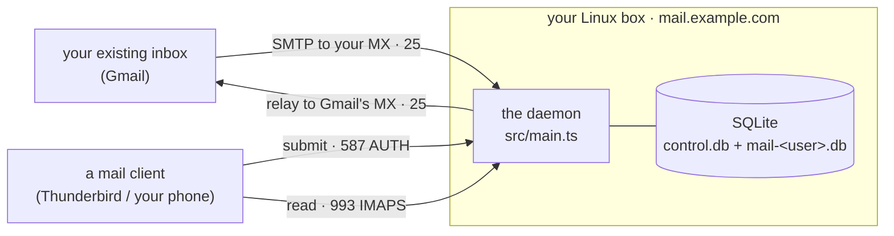
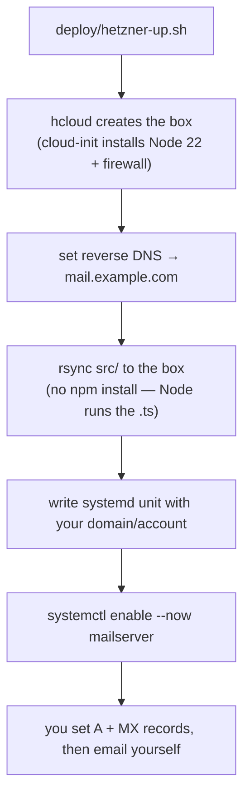
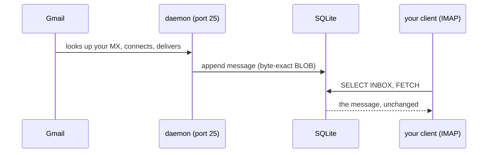
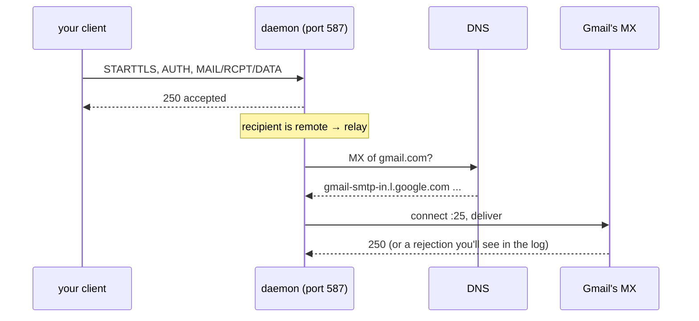

# Deploying to a small server and using it with real email

This walkthrough puts the daemon on a little Linux box, points DNS at it, and
gets mail flowing to and from your existing inbox (Gmail, Fastmail, whatever)
through one or more accounts.

It is a **test bench, not a production MTA** — naive on purpose (see
[Known limitations](#known-limitations)). The point is to get it into the real
world so its gaps show up against real senders and receivers instead of a test
harness. Practical translation, up front: run it on a **spare domain or a
subdomain**, not yet as the only home of mail you can't lose — there is no spam
filter and no third-party security review. When you're ready to move a real
domain later, [Cutting over a domain you already use](#cutting-over-a-domain-you-already-use)
is the sequencing.

## The shape of it



One box runs the daemon. Your existing inbox is the far end. A mail client
(Thunderbird on a laptop, or your phone's mail app) talks to the daemon on 587 to
send and 993 to read — the daemon is *your* server; it does the talking to Gmail.

## Before you start

Four things decide whether this is worth your afternoon (it takes about one):

- **A small Linux VPS with port 25 open both ways** (~€4/month; the throwaway
  path below is billed by the hour). This is the make-or-break item: most home
  ISPs block port 25 entirely, and most cloud providers block *outbound* 25 on
  new accounts until you ask — check yours before doing anything else.
- **A domain whose DNS you control.** A subdomain of one you already own is
  perfect (this guide uses `mail.example.com` throughout).
- **Comfort with a shell and systemd.** You do not need to know Node, npm, or
  TypeScript — Node.js here is just the runtime the server happens to need,
  the way a Python tool needs Python. Every command you must type is printed
  in full.
- **An hour or two**, most of it waiting for DNS.

## The whole job, in order

Every step links to its section; do them top to bottom — each one depends on
the ones before it:

1. [Get the code and Node onto the box](#what-you-need) — install Node 22 + git, clone to `/opt/mailserver`.
2. [Prepare the box](#what-you-need) — data directory, firewall.
3. [Create your account with `init`](#running-it) — **before the daemon ever starts**; the daemon refuses to boot with no accounts.
4. [Generate the DKIM key and print your DNS records with `setup`](#dns), then publish them.
5. [Issue the TLS certificate](#tls-getting-the-certificate-to-the-daemon-and-keeping-it-fresh) — certbot, plus the renewal hook.
6. [Install and start the systemd unit](#the-systemd-unit).
7. [Verify: `doctor` (the outside), then `selftest` (the mail path)](#verify-it-end-to-end).
8. [Point your mail client at it](#pointing-your-mail-client-at-it) and email yourself from Gmail.

Prefer containers? [Running it in a container](#running-it-in-a-container) replaces
steps 2, 3, and 6. In a hurry? The throwaway box below automates all of it.

## Quick start: a throwaway Hetzner box (receiving)

Hetzner Cloud is the cheapest way to spin this up and throw it away — an ARM
`cax11` is about **€0.006/hour**, billed by the hour, gone the moment you delete
it. `deploy/hetzner-up.sh` and `deploy/hetzner-down.sh` automate the whole thing.

This path gets **receiving** working — mail *to* `you@mail.example.com` lands in
the mailbox and you read it over IMAP. Sending outward may work too, but check
first: Hetzner blocks outbound port 25 on *new* accounts (established accounts
have it open — test with `nc gmail-smtp-in.l.google.com 25` from the box). For
what receivers demand of outbound mail, see
[Known limitations](#known-limitations).



This all runs **on your laptop** (a Unix shell — on Windows, use WSL2). Once, per
machine:

1. Clone the repo: `git clone https://github.com/jamie-lord/cutiemail && cd cutiemail`
   (the script rsyncs `src/` from your checkout to the box).
2. Create a [Hetzner Cloud](https://console.hetzner.com/) account and a read/write
   API token (a project's *Security → API tokens*), then install the
   [`hcloud` CLI](https://github.com/hetznercloud/cli) and authenticate it
   (`export HCLOUD_TOKEN=...`).
3. Upload an SSH key:
   `hcloud ssh-key create --name mykey --public-key-from-file ~/.ssh/id_ed25519.pub`.

Then, from the repo folder:

```sh
MAIL_DOMAIN=mail.example.com \
MAIL_PASS='a-real-passphrase' \
SSH_KEY_NAME=mykey \
  ./deploy/hetzner-up.sh
```

It creates one account, login **`you`** (set `MAIL_USER=somethingelse` to change
it), so your address is `you@mail.example.com`. Passing the password through the
environment is the throwaway-box trade-off; the manual path below uses `init`
instead, so a real deployment's unit file carries no password at all. The script
prints the two DNS records to set at your DNS host (an `A` and an `MX`, both
pointing at the box — at Cloudflare, set the A record to **DNS only**, see
[DNS](#dns)); reverse DNS is set for you. Watch mail arrive with
`ssh root@<ip> journalctl -fu mailserver`. When you're done:

```sh
./deploy/hetzner-down.sh          # deletes the box, billing stops
```

The rest of this document is the manual reference behind those scripts — read on
if you want to do it by hand or on another provider.

## What you need

- A small Linux server with a **public, static IP** and **port 25 reachable both
  ways**. Many home ISPs and some cheap VPS providers block port 25 — check
  first, because without it you can neither receive nor relay. How to check,
  from the box once you have it: outbound is
  `nc -vz gmail-smtp-in.l.google.com 25` (a `succeeded` means open; cloud
  providers like Hetzner/AWS/DigitalOcean block outbound 25 on new accounts
  until you request it). Inbound is best checked later from another network —
  `nc -vz <your-box-ip> 25` from home — once the daemon is listening.
- A domain you control DNS for. This guide uses `mail.example.com` as both the
  hostname and the mail domain (so your address is `you@mail.example.com`) — that
  keeps every name consistent, which matters for deliverability. See the
  [double-duty note](#known-limitations) on why one name is used for both.
- Node ≥ 22.18 and the repo on the box. There is no build and nothing else to
  install — but note the Node in Debian/Ubuntu's own `apt` archive is **too old**;
  install from [NodeSource](https://github.com/nodesource/distributions), which
  also lands it at `/usr/bin/node` (the path the unit's `ExecStart` uses — an
  `nvm`/`snap` install puts `node` elsewhere, so adjust `ExecStart` accordingly):

  ```sh
  # on the box, as root (or prefix sudo):
  curl -fsSL https://deb.nodesource.com/setup_22.x | sudo -E bash -
  sudo apt-get install -y nodejs git
  node --version                      # v22.18.0 or newer

  # the code, somewhere stable — the unit uses /opt/mailserver as its WorkingDirectory
  sudo git clone https://github.com/jamie-lord/cutiemail /opt/mailserver
  cd /opt/mailserver                  # every `node src/main.ts …` in this guide runs from here
  ```

  On a distro without a `mail` system user (it exists out of the box on
  Debian/Ubuntu), create one for the daemon:

  ```sh
  sudo useradd --system --user-group --home-dir /var/lib/mailserver --shell /usr/sbin/nologin mail
  ```

**Prepare the box first.** Create the data directory owned by the user the daemon runs as (the
unit below uses `mail`, which already exists on Debian/Ubuntu; create a system user otherwise),
and open the firewall — do this **before** the DNS/`setup` step, which writes the DKIM key into
`/var/lib/mailserver/dkim/`:

```sh
# data + secrets directories, owned by the daemon's user, owner-only
sudo install -d -o mail -g mail -m 700 /var/lib/mailserver /var/lib/mailserver/tls /var/lib/mailserver/dkim

# open the ports (host firewall). Also check your PROVIDER's cloud firewall — many block
# inbound 25 by default, and `doctor` only tests OUTBOUND 25, so blocked inbound is silent.
sudo ufw allow 22/tcp && sudo ufw allow 25/tcp && sudo ufw allow 587/tcp && sudo ufw allow 993/tcp
# add 80/tcp if you use certbot's standalone HTTP challenge (needed at renewal too, not just issuance)
sudo ufw enable   # rules do nothing until the firewall is on; 22/tcp is already allowed above
```

> **Run every CLI command as the daemon's user** (`sudo -u mail node src/main.ts …`). The CLI
> creates files `0600` owned by whoever runs it (`UMask=0077`); a `control.db` or DKIM key created
> by `root` is `root:root` and the `mail`-user daemon gets a permission error at boot. This applies
> to `init`, `setup`, `account`, and `backup` alike.

> One cosmetic thing to expect: every `node src/main.ts …` command may print a harmless
> `ExperimentalWarning: SQLite is an experimental feature` line — that's Node's own notice about
> its built-in SQLite, not a problem with your setup. The npm scripts and the systemd unit
> silence it with `--disable-warning=ExperimentalWarning`; feel free to ignore it elsewhere.

## Running it in a container

If you deploy in containers rather than on bare-metal systemd, the repo ships a `Dockerfile`
and `docker-compose.yml` at the root ([ADR 0020](decisions/0020-container-image.md)). Because the
project has zero runtime dependencies and no build step, the image is just the Node runtime plus
`src/` — nothing to compile.

The first run has a strict order, because the daemon refuses to start without a real
certificate on a public bind **and** refuses to start with no accounts:

```sh
git clone https://github.com/jamie-lord/cutiemail && cd cutiemail

# 1. the certificate: the compose file mounts ./tls (read-only) into the container
mkdir tls
cp /path/to/fullchain.pem tls/cert.pem
cp /path/to/privkey.pem   tls/key.pem

# 2. edit docker-compose.yml — set MAIL_DOMAIN to your real name

# 3. your account — BEFORE anything is listening (hidden password prompt)
docker compose run --rm mail init you

# 4. the DKIM key + the exact DNS records to publish
docker compose run --rm mail setup

# 5. up — and watch the per-message + auth-failure trail
docker compose up -d
docker compose logs -f
```

One named volume (`/data`) holds every database and the DKIM key; the container binds the
unprivileged ports internally and maps them to 25/587/993 on the host, so nothing inside needs
a privileged-port capability. If a step is skipped the daemon says so instead of guessing — a
missing certificate or a zero-account registry each fail the boot with a message naming the fix
(there is **no** `demo`/`demo` fallback on a public bind; that convenience account is seeded on
loopback dev runs only). The rest of this guide — DNS, TLS renewal, backups, the account CLI —
applies unchanged; prefix day-2 CLI commands with `docker compose exec mail`, e.g.
`docker compose exec mail node src/main.ts selftest you`.

## DNS

The A and MX get mail flowing; PTR + the SPF/DKIM/DMARC trifecta are what earn a
receiver's trust and keep you out of the spam folder.

**You don't have to assemble these by hand.** The server generates them from its
own configuration — including deriving the DKIM public key from the private key
(generating one first if none exists). Give the DKIM key a **stable path** and run
`setup` as the daemon's user, so the daemon later signs with the *same* key the
published record verifies (without `MAIL_DKIM_KEY`, `setup` writes `dkim-<selector>.key`
into the current directory — a moving target, and re-running from elsewhere would mint a
second key that no longer matches DNS):

```sh
sudo -u mail env MAIL_DOMAIN=mail.example.com \
  MAIL_DKIM_KEY=/var/lib/mailserver/dkim/mail.key MAIL_DKIM_SELECTOR=s1 \
  node src/main.ts setup --ip <your-ip>
```

The daemon signs outbound mail **only when both `MAIL_DKIM_KEY` and `MAIL_DKIM_SELECTOR` are set**
— set the same two values in the unit (below), or mail goes out unsigned (SPF-only) and big
receivers spam-folder it.

`setup` prints every record below as annotated, copy-pasteable zone lines. Re-run it any
time to reprint them from the existing key (the output is deterministic, so you can
diff it against what you actually published). And once the records are in, verify
the whole deployment — live DNS, reverse DNS, SPF evaluation, DKIM key match, the
certificate, and whether your provider actually allows outbound port 25 — with:

```sh
# doctor reads the same env the daemon does: MAIL_DOMAIN is required, and the DKIM-match
# and certificate checks only run when the DKIM/TLS vars are present. Give it the deployment's
# environment (easiest: run it on the box with the unit's values). Add
# MAIL_TLS_CERT=/var/lib/mailserver/tls/cert.pem once the certificate exists (the TLS
# section below) — pointing it at a file that isn't there yet aborts the whole run.
sudo -u mail env MAIL_DOMAIN=mail.example.com \
  MAIL_DKIM_KEY=/var/lib/mailserver/dkim/mail.key MAIL_DKIM_SELECTOR=s1 \
  node src/main.ts doctor
```

By default `doctor`'s outbound-25 probe dials `gmail.com`'s MX; use `--probe <domain>` to dial
a different one, or `--skip-dial` to skip it (e.g. offline). `doctor` checks the *outside* (DNS,
cert, outbound 25). Once the daemon is running, prove the
*mail path itself* — authenticated submission, local delivery, IMAP read-back — with
`node src/main.ts selftest <login>` (below). Note that `doctor` does **not** test *inbound* port 25
reachability from the internet — see the firewall note under [What you need](#what-you-need).

It exits 1 on any failure, so it works as a cron'd health check; re-run it whenever
deliverability "suddenly" changes, because the usual cause is drift in exactly the
things it checks (an expired certificate, a changed IP, a lost PTR). The table
explains what each record is *for*:

One warning that outranks the table: **if your DNS host can proxy traffic (Cloudflare's
orange cloud), turn it OFF for the A record** — set it to *DNS only*. Mail protocols
cannot pass through an HTTP proxy: a proxied record makes port 25/587/993 unreachable
and points SPF/PTR at the proxy's IPs instead of yours, and nothing in the resulting
failures says why. Cloudflare's default for a new A record is *proxied*.

| Record | Name | Value | Why |
|---|---|---|---|
| **A** | `mail.example.com` | your server's IP (**DNS only**, never proxied) | where the host lives |
| **MX** | `mail.example.com` | `10 mail.example.com` | tells senders to deliver here |
| **PTR** (reverse DNS) | your IP | `mail.example.com` | set at your VPS provider; Gmail checks the connecting IP resolves back to its HELO name |
| **TXT (SPF)** | `mail.example.com` | `v=spf1 ip4:<your-ip> -all` | authorises *this host's* IP to send for the domain |
| **TXT (DKIM)** | `<selector>._domainkey.mail.example.com` | `v=DKIM1; k=rsa; p=<pubkey>` | the public key that verifies your DKIM signatures (see Running it) |
| **TXT (DMARC)** | `_dmarc.mail.example.com` | `v=DMARC1; p=quarantine` | the policy receivers apply. `setup` emits `p=quarantine` by default; pass `--dmarc-policy none` while you're still testing (monitor only), then tighten. (No `rua=` is generated — add one yourself if you want aggregate reports.) |

All three align because the From domain, the DKIM `d=`, and the SPF domain are the
same name — so a receiver checking DMARC sees SPF *and* DKIM pass for the sending
domain, which is what moves mail from spam to the inbox. `setup` publishes `p=quarantine`;
use `--dmarc-policy none` (monitor only) while you're still testing, then move to
`quarantine`/`reject` once you trust your setup.

`setup` also prints an **optional inbound MTA-STS** section: the exact policy file to
host at `https://mta-sts.<domain>/.well-known/mta-sts.txt` (any static HTTPS host — this
server deliberately speaks no HTTP, ADR 0013) plus the `_mta-sts` TXT record, so senders
that honour MTA-STS can refuse to deliver your mail over anything but validated TLS.

## Running it

The daemon is configured entirely by environment variables — there is no config file, and the
SQLite databases are created on first run:

| Variable | For a real deployment |
|---|---|
| `MAIL_DOMAIN` | `mail.example.com` — your hostname *and* mail domain |
| `MAIL_HOST` | `0.0.0.0` — bind all interfaces, not just loopback |
| `MAIL_SMTP_PORT` / `MAIL_SUBMISSION_PORT` / `MAIL_IMAP_PORT` | `25` / `587` / `993` |
| `MAIL_USER` / `MAIL_PASS` | the **primary** account — used to *create* it on first boot; after that the registry is the source of truth and a changed env password is ignored with a warning (ADR 0012) |
| `MAIL_ACCOUNTS` | additional accounts as `"user:pass,user2:pass2"` — create-only, same rule; the clean way to manage accounts is `node src/main.ts account` (below) |
| `MAIL_CONTROL_DB` | `/var/lib/mailserver/control.db` — the control database (account registry + outbound queue) |
| `MAIL_DB` | only used **with** `MAIL_USER` (legacy bootstrap). Under the recommended `init` flow, each account's mailbox is `mail-<login>.db` beside the control DB — leave `MAIL_DB` unset |
| `MAIL_TLS_CERT` / `MAIL_TLS_KEY` | paths to a real certificate (Let's Encrypt) |
| `MAIL_DKIM_KEY` / `MAIL_DKIM_SELECTOR` | PEM key path + selector to sign outbound (see below) |
| `MAIL_TRUSTED_ARC_SEALERS` | comma-separated forwarder domains whose valid ARC chain may rescue a DMARC failure to the inbox (e.g. a mailing list you subscribe to); omit for none |
| `MAIL_MAX_SIZE` | max accepted message size in octets (default 25 MiB) |

Each account's mailbox lives in its own SQLite file; a shared control database holds the SCRAM
credential registry (which stores only the derived StoredKey/ServerKey, never the password) and the
persistent outbound queue. Inbound mail is delivered into the addressed account's mailbox; a
recipient that isn't a known local account is rejected at `RCPT` (no catch-all, no backscatter).

**Recommended first run: `init` (no password in the environment).** Instead of putting a
password in the unit file, create the primary account with a hidden prompt that writes SCRAM
straight to the registry — so no plaintext password ever lands in the unit or
`/proc/<pid>/environ`:

```sh
sudo -u mail node src/main.ts init you --db /var/lib/mailserver/control.db
# prompts (twice, hidden) for the password, then prints a passwordless unit to run
```

`init` is first-run-only — it refuses once any account exists (use `account add` after) — and
it is not optional in this flow: on a public bind the daemon **refuses to boot with zero
accounts** (the loopback-only `demo`/`demo` dev convenience never fires on a real server), so
run `init` before the unit is ever started. The `MAIL_USER`/`MAIL_PASS` env vars remain as a
create-only bootstrap for dev (`npm start`) and unattended provisioning, but a production unit
should carry **no password at all**; `doctor` and the daemon both warn when
`MAIL_PASS`/`MAIL_ACCOUNTS` are present but redundant.

Passwords must be at least 8 characters (the NIST SP 800-63B floor); `init`, `account add`,
and `account set-password` refuse a shorter one. A weak password seeded through the
deprecated `MAIL_PASS`/`MAIL_ACCOUNTS` env path is only *warned* about (a boot must not fail
on it) — provision real credentials with `init`/`account` instead.

Day-2 account management — adding people, app passwords, aliases — is all one CLI and is
covered in [Day-2 operations](#day-2-operations-accounts-backups-the-queue) below; nothing
there is needed to get the server live.

What the running server does, end to end: it **receives** on 25 (stamping a
`Received:` trace line, rejecting oversized messages and mail loops), authenticates
every sender (**SPF + DKIM + DMARC**, aligned over the full Public Suffix List, plus
**ARC** validation) and records the result in `Authentication-Results` — then **enforces**
DMARC by filing a `p=quarantine`/`p=reject` failure into the recipient's Junk folder
(never a hard reject; a trusted ARC sealer can rescue it). It **serves** the mailbox on 993
with the IMAP surface a real client needs — multiple folders, `IDLE` for instant new-mail,
`UIDPLUS`, `CONDSTORE`/`QRESYNC` — and **sends** what's submitted on 587 by signing it (DKIM),
stamping `Received:`, and relaying to the recipient's MX over STARTTLS (opportunistic, or
MTA-STS-enforced when the destination publishes a policy), with a persistent retry queue behind it.

### TLS: getting the certificate to the daemon, and keeping it fresh

Do this **before** starting the daemon — the unit below points at
`/var/lib/mailserver/tls/`, and the daemon exits at boot (naming the missing
file) if the certificate isn't there yet. The daemon runs as `mail` and cannot
read root-only `/etc/letsencrypt/live/`, so you point it at a copy. Issue with
the standalone authenticator (port 80 must be open in the firewall; nothing
else may bind it), copy, and — the part that prevents a silent outage two
renewals later — install a **deploy hook** so every renewal propagates the new
cert and restarts the daemon. All of this is root's work, hence `sudo -i`:

```sh
sudo apt-get install -y certbot
sudo -i    # a root shell for the rest of this block

certbot certonly --standalone -d mail.example.com
install -o mail -g mail -m 600 /etc/letsencrypt/live/mail.example.com/fullchain.pem /var/lib/mailserver/tls/cert.pem
install -o mail -g mail -m 600 /etc/letsencrypt/live/mail.example.com/privkey.pem  /var/lib/mailserver/tls/key.pem

cat > /etc/letsencrypt/renewal-hooks/deploy/mailserver-tls.sh <<'EOF'
#!/bin/sh
set -eu
case "${RENEWED_LINEAGE:-}" in */mail.example.com) ;; *) exit 0 ;; esac
install -o mail -g mail -m 600 "$RENEWED_LINEAGE/fullchain.pem" /var/lib/mailserver/tls/cert.pem
install -o mail -g mail -m 600 "$RENEWED_LINEAGE/privkey.pem"  /var/lib/mailserver/tls/key.pem
systemctl restart mailserver
EOF
chmod +x /etc/letsencrypt/renewal-hooks/deploy/mailserver-tls.sh
certbot renew --dry-run   # proves the renewal path works
exit       # leave the root shell
```

Serve `fullchain.pem` (not `cert.pem`) — clients need the intermediate. Without
the hook, certbot renews into `/etc/letsencrypt` while the daemon keeps serving
the stale copy until it expires ~30 days later.

### The systemd unit

Ports 25/587/993 are privileged (< 1024), so the process needs the capability to
bind them. The clean way is a systemd unit that grants exactly that and nothing
else — no running as root:

```ini
# /etc/systemd/system/mailserver.service
[Unit]
Description=mail server
After=network.target

[Service]
Type=simple
User=mail
WorkingDirectory=/opt/mailserver
ExecStart=/usr/bin/node --disable-warning=ExperimentalWarning src/main.ts
Environment=MAIL_DOMAIN=mail.example.com
Environment=MAIL_HOST=0.0.0.0
Environment=MAIL_CONTROL_DB=/var/lib/mailserver/control.db
Environment=MAIL_SMTP_PORT=25 MAIL_SUBMISSION_PORT=587 MAIL_IMAP_PORT=993
# No MAIL_USER/MAIL_PASS: create the primary account with `init` (above), which writes
# SCRAM to the registry — the unit carries no password. (MAIL_USER/MAIL_PASS still work
# as a create-only bootstrap for dev, but the daemon warns when they linger unnecessarily.)
# No MAIL_DB either: it is only read alongside MAIL_USER. With `init`, each account's mailbox
# is mail-<login>.db beside the control DB, created automatically.
Environment=MAIL_TLS_CERT=/var/lib/mailserver/tls/cert.pem
Environment=MAIL_TLS_KEY=/var/lib/mailserver/tls/key.pem
# DKIM signing — the same key + selector `setup` generated (see DNS). Omit these and outbound
# mail is unsigned (SPF-only) and gets spam-foldered:
Environment=MAIL_DKIM_KEY=/var/lib/mailserver/dkim/mail.key
Environment=MAIL_DKIM_SELECTOR=s1
# Bind privileged ports (25/587/993) without root, and nothing more:
AmbientCapabilities=CAP_NET_BIND_SERVICE
CapabilityBoundingSet=CAP_NET_BIND_SERVICE
# Headroom for open mail DBs (~3 fds each) + one fd per IMAP connection; the 1024 default
# is a hard wall under load (docs/PERFORMANCE.md).
LimitNOFILE=65536
Restart=on-failure

# Defense-in-depth sandboxing (systemd-analyze security scores this unit ~1.6 / OK).
# MemoryDenyWriteExecute is deliberately OMITTED — the V8 JIT needs W+X memory and
# Node will not start with it. RestrictAddressFamilies keeps AF_INET/AF_INET6 (SMTP/
# IMAP + c-ares DNS) and AF_UNIX; verify outbound relay still works after any change.
NoNewPrivileges=true
ProtectSystem=strict
ProtectHome=true
ReadWritePaths=/var/lib/mailserver
PrivateTmp=true
PrivateDevices=true
ProtectKernelTunables=true
ProtectKernelModules=true
ProtectKernelLogs=true
ProtectControlGroups=true
ProtectClock=true
ProtectHostname=true
ProtectProc=invisible
ProcSubset=pid
RestrictAddressFamilies=AF_UNIX AF_INET AF_INET6
RestrictNamespaces=true
RestrictRealtime=true
RestrictSUIDSGID=true
LockPersonality=true
SystemCallArchitectures=native
SystemCallFilter=@system-service
SystemCallFilter=~@privileged
UMask=0077

[Install]
WantedBy=multi-user.target
```

The data directory is owner-only (`mode 700`, set in *Prepare the box* above). The daemon writes
each database `0600` and re-tightens every *registered* account's database to `0600` at boot (so
even a disabled account's mailbox can't linger world-readable), but the `700` directory is the
belt-and-braces that keeps a stray file unreachable by other local users in the first place.

Before starting it, make sure the earlier steps really happened — the unit
depends on all three: the account (`init`), the DKIM key (`setup`), and the
certificate (TLS above). If one is missing the daemon exits with a message
naming the file or the fix, and `Restart=on-failure` means `systemctl status
mailserver` will show it retrying — `journalctl -u mailserver` has the reason.

`sudo systemctl enable --now mailserver`, then `journalctl -fu mailserver` to watch it. The daemon logs
one line per accepted inbound message (envelope, size, SPF/DKIM/DMARC verdicts, and which folder it
was filed to), one per accepted submission (with the queue id), each relay deferral with its remote
reason and next-attempt time, the final sent/bounced/gave-up outcome, and every failed
authentication with its source IP — the raw material for spotting a credential-stuffing run (there
is no built-in fail2ban integration; see [Known limitations](#known-limitations)). A transient
failure is retried on a backoff from the persistent SQLite queue (below); a `5xx` bounces at once.

### Verify it end to end

Two checks, in order. First `doctor` proves the *outside* — DNS, PTR, SPF, the DKIM key
match, certificate validity, outbound 25 — now with the certificate in its environment
(unlike the pre-cert run in [DNS](#dns)):

```sh
sudo -u mail env MAIL_DOMAIN=mail.example.com \
  MAIL_TLS_CERT=/var/lib/mailserver/tls/cert.pem \
  MAIL_DKIM_KEY=/var/lib/mailserver/dkim/mail.key MAIL_DKIM_SELECTOR=s1 \
  node src/main.ts doctor
```

Then `selftest` proves the *mail path itself*, before pointing a client at it — authenticated
submission, local delivery, and IMAP read-back, in one command against the running daemon:

```sh
sudo -u mail env MAIL_DOMAIN=mail.example.com MAIL_SUBMISSION_PORT=587 MAIL_IMAP_PORT=993 \
  node src/main.ts selftest you
```

A green run means the mail path is sound; a failure names the step that broke (auth, delivery, or
IMAP). If the daemon can't start at all, it prints a specific reason — a port already in use,
or a privileged port without the capability — rather than a stack trace. If a test message you
sent from elsewhere seems to vanish, check the **Junk** folder and read its `Authentication-Results`
header: DMARC enforcement files a failing message there rather than the inbox (a common surprise
while DNS is still settling).

## Migrating your existing mail in

cutiemail speaks standard IMAP, so moving your existing mail in is a plain IMAP-to-IMAP copy with
an off-the-shelf tool — there's nothing bespoke to learn. [`imapsync`](https://imapsync.lamiral.info/)
is the usual choice:

```sh
imapsync \
  --host1 imap.gmail.com --user1 you@gmail.com --passfile1 gmail.pass --ssl1 \
  --host2 mail.example.com --user2 you --passfile2 cutie.pass --ssl2
```

Or, with no extra software: add both accounts in Thunderbird and drag folders from the old account
to the new one. Either way the copy is byte-exact and preserves each message's original date
(`INTERNALDATE`) and flags. One boundary: an individual message larger than `MAIL_MAX_SIZE`
(25 MiB default) is refused on `APPEND` — raise `MAIL_MAX_SIZE` if your archive has very large
messages (it raises the SMTP and IMAP limits together).

## Cutting over a domain you already use

Moving a domain that already receives real mail (rather than a fresh subdomain) is a sequencing
problem — do it in this order so nothing is lost in the window:

1. **Lower the TTL** on your current MX record to 300s a day ahead, so the switch propagates fast.
2. **Stand the box up fully under a subdomain first** (`mx.example.com`) and get `doctor` and
   `selftest` green there — DNS, TLS, DKIM, the mail path — while your real MX still serves the
   domain.
3. **Import first** (above), so your history is already present when you switch.
4. **Publish `--dmarc-policy none`** during the overlap so a misalignment quarantines nothing while
   you watch; tighten to `quarantine`/`reject` once `doctor` is clean and mail flows.
5. **Switch the MX** to the new box. A well-behaved sender that connects mid-switch and gets no
   answer **retries for days** — mail isn't lost, it's delayed — so a brief overlap is safe.
6. **Keep the old mailbox reachable** for a week or two before decommissioning; stragglers and
   slow-retrying senders trickle in after the cutover.

There is deliberately no backup-MX support (recorded in [the backlog](BACKLOG.md)) — the
sender-retry behaviour above is what covers a short outage, so a second MX isn't needed at this
scale.

## Pointing your mail client at it

In Thunderbird (or any client), add an account for `you@mail.example.com`:

- **Incoming — IMAP:** `mail.example.com`, port `993`, SSL/TLS, your username +
  password.
- **Outgoing — SMTP:** `mail.example.com`, port `587`, STARTTLS, *same* username +
  password (auth required).
- **Username:** the account **login** exactly as you created it (`you`), **not** the
  full email address `you@mail.example.com`, and case-sensitive. Clients pre-fill the
  address as the username; change it to the bare login or auth fails on both ports.

The daemon **refuses to boot** if you bind a non-loopback `MAIL_HOST` without a real
certificate (`MAIL_TLS_CERT`/`MAIL_TLS_KEY`): the bundled dev cert's private key is
committed to the repo, so serving it publicly would let anyone MITM your credential
ports. `deploy/hetzner-up.sh` generates a per-box self-signed cert (a fresh, private
key) so the box boots; a client still warns about self-signed, and a real Let's Encrypt
cert avoids the warning and is what outside senders' opportunistic TLS expects.
(`MAIL_ALLOW_DEV_CERT=1` forces the bundled dev cert onto a public interface — for a
deliberate throwaway test only, never in production.)

## Day-2 operations: accounts, backups, the queue

Everything here runs against the live server — no restarts, no downtime. Two standing rules
from earlier apply to every command: run them **as the daemon's user** (`sudo -u mail …`, so no
root-owned file ever blocks the daemon) and **from `/opt/mailserver`**.

> Every example passes `--db /var/lib/mailserver/control.db`. Set `MAIL_CONTROL_DB` in your
> shell (or rely on the unit's environment) to drop it — without either, the CLI targets
> `./control.db` in the current directory, and a "no account" error there means you're pointed
> at the wrong database, not that the account is gone (the error names the path it searched).

**Managing accounts** — the CLI prompts for the password; when piped, it reads one line from
stdin — never argv, which is visible in `ps`:

```sh
sudo -u mail node src/main.ts account add anna --db /var/lib/mailserver/control.db
sudo -u mail node src/main.ts account set-password anna --db /var/lib/mailserver/control.db
sudo -u mail node src/main.ts account list --db /var/lib/mailserver/control.db
```

The running daemon sees changes immediately (auth reads the registry per attempt) — no
restart. There is deliberately no `remove`: `disable` refuses auth and delivery without
touching the user's mailbox database; deleting mail is an explicit `rm` of that file,
never a management-verb side effect (ADR 0012).

**App-specific passwords** (ADR 0017) — a revocable per-device credential, so a lost phone
doesn't mean rotating your one password everywhere. Each is server-generated and shown once:

```sh
sudo -u mail node src/main.ts account app-password add you phone --db /var/lib/mailserver/control.db  # prints a strong secret ONCE
sudo -u mail node src/main.ts account app-password list you --db /var/lib/mailserver/control.db
sudo -u mail node src/main.ts account app-password remove you phone --db /var/lib/mailserver/control.db  # revoke; honoured live
```

Use the printed secret as this account's password on one device. Your primary password still
works everywhere; the recommended practice is to put app passwords on your devices and keep the
primary for `account` management only, so no device ever holds your primary. A revoked app
password stops authenticating immediately, and disabling the account disables all of them.

**Aliases and `+tag` subaddressing** — an account can answer to more than one address
(ADR 0014). An alias is a second address whose mail lands in the same mailbox — it adds no
database (a user is still one file), and you can't log in as one. Subaddressing is on by
default: `you+anything@your.domain` delivers to `you` with no setup, handy for per-service
filtering.

```sh
sudo -u mail node src/main.ts account alias add you sales --db /var/lib/mailserver/control.db  # sales@your.domain → "you"
sudo -u mail node src/main.ts account alias list --db /var/lib/mailserver/control.db           # every alias and its owner
sudo -u mail node src/main.ts account alias remove sales --db /var/lib/mailserver/control.db
```

Give the local-part only (`sales`, not `sales@your.domain`). An address is a login *or* an
alias, never both; unknown addresses are still refused at RCPT (no catch-all). New aliases
receive immediately — no restart.

**Sending as an alias** — you can also *send* as any address you own (your login, an alias, or
a `+tag` subaddress). Submission enforces this: your client's `From` (and the envelope sender)
must resolve to your account, on your domain, or the message is refused `550` (ADR 0015). Set
your mail client's identity/From to the alias — for example configure a `sales@your.domain`
identity in Thunderbird — and mail sends DKIM-signed as that address. You cannot send as
another account's address or a foreign domain; that is the point.

**Backups** — the whole server's state is the control database plus one mailbox database
per user, so a backup is one command (safe while the daemon runs — it uses SQLite's
`VACUUM INTO`, a transactionally consistent snapshot; a bare `cp` of a live WAL database
is *not* safe):

```sh
sudo install -d -o mail -g mail -m 700 /backups   # once
sudo -u mail node src/main.ts backup /backups/mail-$(date +%F) --db /var/lib/mailserver/control.db
sudo -u mail node src/main.ts verify /backups/mail-$(date +%F)   # a backup you haven't verified is a hope
```

`verify` is strictly read-only and checks both file integrity and the store invariants
(UID monotonicity, the live/expunged partition, the queue/dead-letter exclusivity). Honest
boundary: SQLite pages carry no checksums, so a bit flipped inside a message blob on disk
is invisible to it — media-level assurance is the filesystem's job (ZFS/btrfs/restic).

A backup is the **complete mail store plus the credential registry, in plaintext SQLite** — the
SCRAM records aren't reversible to passwords, but message bodies are in the clear. Encrypt it
before it leaves the box (`age`, `restic`, or your backup tool's own encryption).

**Restoring from a backup** — stop the daemon, copy the snapshot files over the live ones beside
`MAIL_CONTROL_DB`, restart, and confirm:

```sh
sudo systemctl stop mailserver
sudo cp /backups/mail-2026-07-21/*.db /var/lib/mailserver/     # control.db + every mail-<login>.db
sudo chown mail:mail /var/lib/mailserver/*.db
sudo systemctl start mailserver
sudo -u mail node src/main.ts verify /var/lib/mailserver        # integrity + invariants
sudo -u mail env MAIL_DOMAIN=mail.example.com MAIL_SUBMISSION_PORT=587 MAIL_IMAP_PORT=993 \
  node src/main.ts selftest you                                 # the mail path end to end
```

`backup` copies the databases whole, so a restore is just putting them back. An account present in
the registry whose mailbox file is missing from the backup comes back as an empty mailbox (its
credentials and aliases are intact) rather than failing the restore.

**"Did my mail actually leave?"** — the outbound queue (transient failures retry on an
exponential backoff for ~5 days before giving up; the queue survives a restart) and the
dead-letter store (messages delivery permanently gave up on, retained instead of dropped)
are inspectable:

```sh
sudo -u mail node src/main.ts queue list --db /var/lib/mailserver/control.db
sudo -u mail node src/main.ts queue retry <id> --db /var/lib/mailserver/control.db   # skip the backoff after fixing a fault (--all for every message)
sudo -u mail node src/main.ts queue cancel <id> --db /var/lib/mailserver/control.db  # pull a message (retained in dead-letter, never discarded)
sudo -u mail node src/main.ts dead-letter list --db /var/lib/mailserver/control.db
sudo -u mail node src/main.ts dead-letter show <id> --raw --db /var/lib/mailserver/control.db > message.eml   # the retained bytes, replayable
sudo -u mail node src/main.ts dead-letter requeue <id> --db /var/lib/mailserver/control.db                    # try delivery again
sudo -u mail node src/main.ts mail list you --db /var/lib/mailserver/control.db      # read a delivered mailbox without an IMAP client
```

A permanently-failed message always does two things: the sender gets a `multipart/report`
bounce, and the bytes land in the dead-letter store until an explicit `purge`.

## What actually happens on send and receive

Receiving — someone at Gmail emails `you@mail.example.com`:



Sending — you compose in Thunderbird to a Gmail address:



Both paths are the real code — the same `smtp-receiver`, `sqlite-mailbox`,
`imap-server`, and `outbound` relay that `daemon.integration.test.ts` and
`outbound.integration.test.ts` exercise end to end.

## Known limitations

These are deliberate and recorded:

- **DKIM signing is opt-in.** Without `MAIL_DKIM_KEY` (a PEM private key, RSA
  ≥1024-bit or Ed25519) and `MAIL_DKIM_SELECTOR` set, outbound delivery relies
  on SPF alone — accepted by the big providers, but reliably spam-foldered. The
  easy path is `node src/main.ts setup` (see [DNS](#dns)), which generates the
  key and prints the TXT record for `<selector>._domainkey.<domain>`; the
  openssl equivalent, if you prefer to see the moving parts:
  ```sh
  openssl genpkey -algorithm RSA -pkeyopt rsa_keygen_bits:2048 -out dkim.key
  echo "v=DKIM1; k=rsa; p=$(openssl rsa -in dkim.key -pubout -outform DER 2>/dev/null | base64 -w0)"
  ```
  Signing is fail-open: a key problem sends the message unsigned rather than
  dropping it — deliverability degrades, mail is never lost.
- **`MAIL_DOMAIN` does double duty** as both the SMTP greeting/HELO name and the
  local mail domain. That's why this guide uses one name for host and domain
  (`you@mail.example.com`): a split like greeting `mail.example.com` + addresses
  `you@example.com` isn't separable yet.
- **Relay is IPv4-only, deliberately.** Gmail hard-rejects IPv6 connections
  without a matching v6 PTR and authentication; the PTR this guide sets is for
  the v4 address, so the relay pins `family: 4`. Revisit if you set up full
  IPv6 forward-confirmed rDNS.
- **Hardened at the protocol and OS layers, but not fully operationally.** The wire surface
  is hardened — SMTP-smuggling defence, DoS caps (recipient count, DATA
  scan, reply framing, a per-connection command-error limit that drops a peer streaming
  junk), auth-header spoofing and DMARC display-spoof defences, an MX SSRF guard, a bounded
  TLS handshake — and the auth paths carry a **per-IP brute-force throttle** (submission +
  IMAP; over the threshold, auth is refused without checking the password). The systemd unit
  is **sandboxed** (`systemd-analyze security` ≈ 1.6/OK: no-new-privileges, read-only
  filesystem bar the data dir, restricted syscalls/address-families/namespaces, private
  /tmp and /dev), and the data directory + every account database are owner-only. But there
  is still *no spam filtering and no fail2ban-style network banning*, and it has not been
  through a third-party security review. Don't put anything you care about behind it yet.
