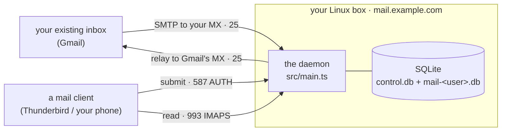
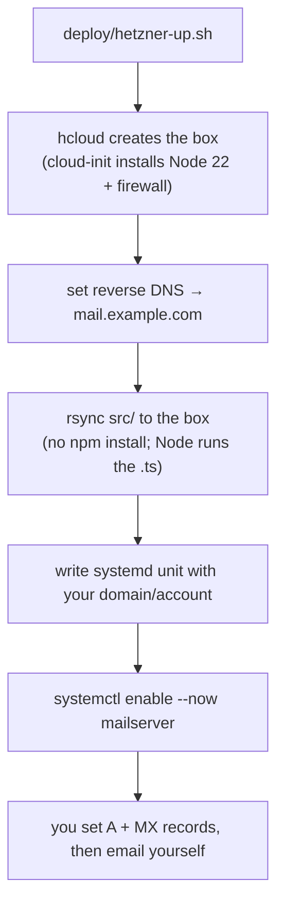
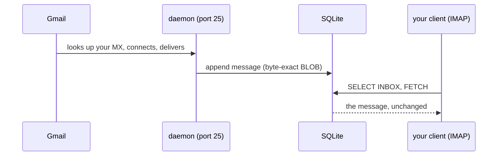
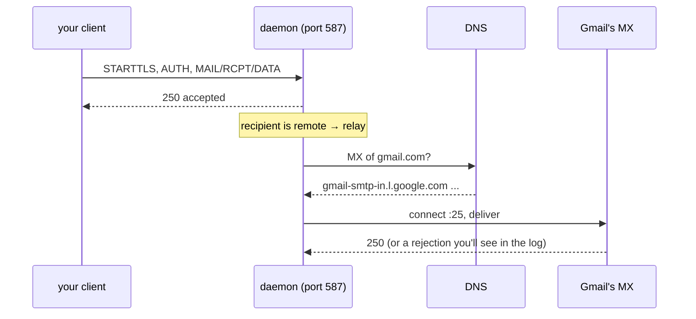

# Deploying to a small server and using it with real email

This walkthrough installs the daemon on a small Linux box, points DNS at it, and
moves mail to and from your current inbox (Gmail, Fastmail, or another) through
one or more accounts.

It is a **test bench, not a production MTA** (deliberately naive, see
[Known limitations](#known-limitations)). Real senders and receivers show the
gaps that a test harness cannot. In practice, run it on a **spare domain or a
subdomain**. Do not yet make it the only home of mail you cannot lose. There is
no spam filter and no third-party security review. To move a real domain later,
[Cutting over a domain you already use](#cutting-over-a-domain-you-already-use)
gives the sequence.

## The shape of it


```mermaid
flowchart LR
    GMAIL["your existing inbox<br/>(Gmail)"]
    subgraph BOX["your Linux box · mail.example.com"]
        DAEMON["the daemon<br/>src/main.ts"]
        DB[("SQLite<br/>control.db + mail-&lt;user&gt;.db")]
        DAEMON --- DB
    end
    CLIENT["a mail client<br/>(Thunderbird / your phone)"]

    GMAIL -->|"SMTP to your MX · 25"| DAEMON
    DAEMON -->|"relay to Gmail's MX · 25"| GMAIL
    CLIENT -->|"submit · 587 AUTH"| DAEMON
    CLIENT -->|"read · 993 IMAPS"| DAEMON
```

One box runs the daemon. Your current inbox is the far end. A mail client
(Thunderbird on a laptop, or your phone's mail app) speaks to the daemon on 587 to
send and 993 to read. The daemon is *your* server. It speaks to Gmail for you.

## Before you start

Four things decide whether this is worth your afternoon (it takes about one):

- **A small Linux VPS with port 25 open both ways** (~€4/month — the throwaway
  path below is billed by the hour). This is the make-or-break item. Most home
  ISPs block port 25 completely, and most cloud providers block *outbound* 25 on
  new accounts until you ask. Check yours first.
- **A domain whose DNS you control.** A subdomain of one you already own is
  ideal (this guide uses `mail.example.com` throughout).
- **Knowledge of a shell and systemd.** You do not need to know Node, npm, or
  TypeScript. Here, Node.js is only the runtime the server needs, the same way a
  Python tool needs Python. The guide prints every command you must type in full.
- **An hour or two**, most of it a wait for DNS.

The walkthrough assumes a **Debian/Ubuntu** box. Every package command below is
Debian-family (`apt-get`, `ufw`, the NodeSource `.deb` script). On RHEL-family
distros (Fedora, Rocky, AlmaLinux), substitute `dnf` for `apt-get` and `firewalld`
for `ufw`. Also use NodeSource's
[rpm setup script](https://github.com/nodesource/distributions#rpm-distributions)
in place of the deb one. Everything else (the CLI, the systemd unit, the DNS) is
identical.

## The whole job, in order

Every step links to its section. Do them top to bottom. Each step depends on
the steps before it:

1. [Get the code and Node onto the box](#what-you-need): install Node 22 + git, clone to `/opt/mailserver`.
2. [Prepare the box](#what-you-need): data directory, firewall.
3. [Create your account with `init`](#running-it): **before the daemon starts**. The daemon refuses to start with no accounts.
4. [Generate the DKIM key and print your DNS records with `setup`](#dns), then publish them.
5. [Issue the TLS certificate](#tls-getting-the-certificate-to-the-daemon-and-keeping-it-fresh): certbot, plus the renewal hook.
6. [Install and start the systemd unit](#the-systemd-unit).
7. [Verify: `doctor` (the outside), then `selftest` (the mail path)](#verify-it-end-to-end).
8. [Point your mail client at it](#pointing-your-mail-client-at-it) and email yourself from Gmail.

Do you prefer containers? [Running it in a container](#running-it-in-a-container) replaces
steps 2, 3, and 6. Are you in a hurry? The throwaway box below automates all of it. Once it is
live, [Keeping a deployment up to date](SELF-UPDATE.md) sets up automatic updates.
[Upgrading by hand](#upgrading-by-hand) covers how you pull a new version yourself.
[Decommissioning](#decommissioning) is the removal when you are done.

## Quick start: a throwaway Hetzner box (receiving)

Hetzner Cloud is the cheapest way to start this and then delete it. An ARM
`cax11` is about **€0.006/hour**, billed by the hour, and gone the moment you delete
it. `deploy/hetzner-up.sh` and `deploy/hetzner-down.sh` automate the whole task.

This path makes **receiving** work. Mail *to* `you@mail.example.com` lands in
the mailbox, and you read it over IMAP. Outbound mail can also work, but check
first. Hetzner blocks outbound port 25 on *new* accounts (established accounts
have it open — test with `nc gmail-smtp-in.l.google.com 25` from the box). For
what receivers demand of outbound mail, see
[Known limitations](#known-limitations).


```mermaid
flowchart TB
    up["deploy/hetzner-up.sh"] --> create["hcloud creates the box<br/>(cloud-init installs Node 22 + firewall)"]
    create --> rdns["set reverse DNS → mail.example.com"]
    rdns --> rsync["rsync src/ to the box<br/>(no npm install; Node runs the .ts)"]
    rsync --> unit["write systemd unit with your domain/account"]
    unit --> start["systemctl enable --now mailserver"]
    start --> dns["you set A + MX records, then email yourself"]
```

This all runs **on your laptop** (a Unix shell — on Windows, use WSL2). Do this
once per machine:

1. Clone the repo: `git clone https://github.com/jamie-lord/cutiemail && cd cutiemail`
   (the script rsyncs `src/` from your checkout to the box).
2. Create a [Hetzner Cloud](https://console.hetzner.com/) account and a read/write
   API token (a project's *Security → API tokens*), then install the
   [`hcloud` CLI](https://github.com/hetznercloud/cli) and authenticate it
   (`export HCLOUD_TOKEN=...`).
3. Upload an SSH key:
   `hcloud ssh-key create --name mykey --public-key-from-file ~/.ssh/id_ed25519.pub`.

Then, from the repo folder:

```sh
MAIL_DOMAIN=mail.example.com \
MAIL_PASS='a-real-passphrase' \
SSH_KEY_NAME=mykey \
  ./deploy/hetzner-up.sh
```

It creates one account, login **`you`** (set `MAIL_USER=somethingelse` to change
it), so your address is `you@mail.example.com`. To pass the password through the
environment is the throwaway-box trade-off. The manual path below uses `init`
instead, so a real deployment's unit file carries no password at all. The script
prints the two DNS records to set at your DNS host (an `A` and an `MX`, both
pointed at the box — at Cloudflare, set the A record to **DNS only**, see
[DNS](#dns)). It sets reverse DNS for you. To watch mail arrive, use
`ssh root@<ip> journalctl -fu mailserver`. When you are done:

```sh
./deploy/hetzner-down.sh          # deletes the box, billing stops
```

The rest of this document is the manual reference behind those scripts. Continue
if you want to do it by hand or on another provider.

## What you need

- A small Linux server with a **public, static IP** and **port 25 reachable both
  ways**. Many home ISPs and some cheap VPS providers block port 25, so check
  first. Without it, you can neither receive nor relay. To check from the box
  once you have it: for outbound, run
  `nc -vz gmail-smtp-in.l.google.com 25` (a `succeeded` means open — cloud
  providers like Hetzner/AWS/DigitalOcean block outbound 25 on new accounts
  until you request it). Check inbound later from another network
  (`nc -vz <your-box-ip> 25` from home) once the daemon listens.
- A domain whose DNS you control. This guide uses `mail.example.com` as both the
  hostname and the mail domain (so your address is `you@mail.example.com`). That
  keeps every name consistent, which matters for deliverability. See the
  [double-duty note](#known-limitations) on why the guide uses one name for both.
- Node ≥ 22.18 and the repo on the box. There is no build and nothing else to
  install. But note that the Node in Debian/Ubuntu's own `apt` archive is **too old**.
  Install from [NodeSource](https://github.com/nodesource/distributions), which
  also puts it at `/usr/bin/node` (the path the unit's `ExecStart` uses — an
  `nvm`/`snap` install puts `node` elsewhere, so adjust `ExecStart` for that):

  ```sh
  # on the box, as root (or prefix sudo):
  curl -fsSL https://deb.nodesource.com/setup_22.x | sudo -E bash -
  sudo apt-get install -y nodejs git
  node --version                      # v22.18.0 or newer

  # the code, somewhere stable: the unit uses /opt/mailserver as its WorkingDirectory
  sudo git clone https://github.com/jamie-lord/cutiemail /opt/mailserver
  cd /opt/mailserver                  # every `node src/main.ts …` in this guide runs from here
  ```

  On a distro without a `mail` system user (it exists by default on
  Debian/Ubuntu), create one for the daemon:

  ```sh
  sudo useradd --system --user-group --home-dir /var/lib/mailserver --shell /usr/sbin/nologin mail
  ```

**Prepare the box first.** Create the data directory, owned by the user the daemon runs as (the
unit below uses `mail`, which already exists on Debian/Ubuntu — if not, create a system user).
Then open the firewall. Do this **before** the DNS/`setup` step, which writes the DKIM key into
`/var/lib/mailserver/dkim/`:

```sh
# data + secrets directories, owned by the daemon's user, owner-only
sudo install -d -o mail -g mail -m 700 /var/lib/mailserver /var/lib/mailserver/tls /var/lib/mailserver/dkim

# open the ports (host firewall). Also check your PROVIDER's cloud firewall: many block
# inbound 25 by default, and `doctor` only tests OUTBOUND 25, so blocked inbound is silent.
sudo ufw allow 22/tcp && sudo ufw allow 25/tcp && sudo ufw allow 587/tcp && sudo ufw allow 993/tcp
# add 80/tcp if you use certbot's standalone HTTP challenge (needed at renewal too, not just issuance)
sudo ufw enable   # rules do nothing until the firewall is on; 22/tcp is already allowed above
```

> **Run every CLI command as the daemon's user** (`sudo -u mail node src/main.ts …`). The CLI
> creates files `0600`, owned by whoever runs it (`UMask=0077`). A `control.db` or DKIM key created
> by `root` is `root:root`, and the `mail`-user daemon then gets a permission error at start. This
> applies to `init`, `setup`, `account`, and `backup` alike.

> Expect one cosmetic thing: every `node src/main.ts …` command can print a harmless
> `ExperimentalWarning: SQLite is an experimental feature` line. That is Node's own notice about
> its built-in SQLite, not a problem with your setup. The npm scripts and the systemd unit
> silence it with `--disable-warning=ExperimentalWarning`. You can ignore it elsewhere.

## Running it in a container

If you deploy in containers rather than on bare-metal systemd, the repo ships a `Dockerfile`
and `docker-compose.yml` at the root ([ADR 0020](decisions/0020-container-image.md)). The
project has zero runtime dependencies and no build step, so the image is only the Node runtime plus
`src/`, with nothing to compile.

The first run has a strict order, because the daemon refuses to start without a real
certificate on a public bind **and** refuses to start with no accounts:

```sh
git clone https://github.com/jamie-lord/cutiemail && cd cutiemail

# 1. the certificate: the compose file mounts ./tls (read-only) into the container
mkdir tls
cp /path/to/fullchain.pem tls/cert.pem
cp /path/to/privkey.pem   tls/key.pem

# 2. edit docker-compose.yml: set MAIL_DOMAIN to your real name

# 3. your account: BEFORE anything is listening (hidden password prompt)
docker compose run --rm mail init you

# 4. the DKIM key + the exact DNS records to publish
docker compose run --rm mail setup

# 5. up, and watch the per-message + auth-failure trail
docker compose up -d
docker compose logs -f
```

**Do you only want to try it locally?** The real-certificate requirement stops you from serving
the repo's public dev key on a public bind. It does not block a throwaway local run.
There are two ways past it. Set `MAIL_ALLOW_DEV_CERT: 1` in the environment to serve the bundled
self-signed dev cert (your client warns about it, and the same public-key caveat applies, so
never do this where anyone outside can reach the box). Or make your own self-signed cert into
`./tls` in one line:

```sh
openssl req -x509 -newkey rsa:2048 -nodes \
  -keyout tls/key.pem -out tls/cert.pem -days 365 -subj "/CN=$MAIL_DOMAIN"
```

Let's Encrypt (step 1 above) stays the production answer. These are for a local test only.

One named volume (`/data`) holds every database and the DKIM key. The container binds the
unprivileged ports internally and maps them to 25/587/993 on the host, so nothing inside needs
a privileged-port capability. If you skip a step, the daemon says so instead of a guess. A
missing certificate or a zero-account registry each fail the start with a message that names the fix
(there is **no** `demo`/`demo` fallback on a public bind — that convenience account is seeded on
loopback dev runs only). The rest of this guide (DNS, TLS renewal, backups, the account CLI)
applies unchanged. Prefix day-2 CLI commands with `docker compose exec mail`, for example
`docker compose exec mail node src/main.ts selftest you`.

## DNS

The A and MX make mail flow. The PTR and the SPF/DKIM/DMARC trifecta earn a
receiver's trust and keep you out of the spam folder.

**You do not have to assemble these by hand.** The server generates them from its
own configuration. It also derives the DKIM public key from the private key (and
generates one first if none exists). Give the DKIM key a **stable path**, and run
`setup` as the daemon's user. The daemon then signs with the *same* key the
published record verifies. Without `MAIL_DKIM_KEY`, `setup` writes `dkim-<selector>.key`
into the current directory, a moving target, and a re-run from elsewhere makes a
second key that no longer matches DNS:

```sh
sudo -u mail env MAIL_DOMAIN=mail.example.com \
  MAIL_DKIM_KEY=/var/lib/mailserver/dkim/mail.key MAIL_DKIM_SELECTOR=s1 \
  node src/main.ts setup --ip <your-ip>
```

The daemon signs outbound mail **only when both `MAIL_DKIM_KEY` and `MAIL_DKIM_SELECTOR` are set**.
Set the same two values in the unit (below). If not, mail is unsigned (SPF-only), and big
receivers spam-folder it.

`setup` prints every record below as annotated, copy-pasteable zone lines. Re-run it any
time to reprint them from the existing key (the output is deterministic, so you can
diff it against what you published). Once the records are in, verify
the whole deployment (live DNS, reverse DNS, SPF evaluation, DKIM key match, the
certificate, and whether your provider allows outbound port 25) with:

```sh
# doctor reads the same env the daemon does: MAIL_DOMAIN is required, and the DKIM-match
# and certificate checks only run when the DKIM/TLS vars are present. Give it the deployment's
# environment (easiest: run it on the box with the unit's values). Add
# MAIL_TLS_CERT=/var/lib/mailserver/tls/cert.pem once the certificate exists (the TLS
# section below). Pointing it at a file that isn't there yet aborts the whole run.
sudo -u mail env MAIL_DOMAIN=mail.example.com \
  MAIL_DKIM_KEY=/var/lib/mailserver/dkim/mail.key MAIL_DKIM_SELECTOR=s1 \
  node src/main.ts doctor
```

By default, `doctor`'s outbound-25 probe dials `gmail.com`'s MX. Use `--probe <domain>` to dial
a different one, or `--skip-dial` to skip it (for example, when offline). `doctor` checks the
*outside* (DNS, cert, outbound 25). Two of its checks ask a question that is easy to forget, because
a record can be correct about you and still be useless. `spf-exclusive` evaluates your SPF
record from `192.0.2.1`, a reserved documentation address (RFC 5737) that can never be yours.
It fails if the record *authorises* that address, which catches a `+all` or an over-broad `include:`
that the per-address check passes happily. `dmarc-org` looks up the registered domain's
DMARC record when your mail domain sits below it (see [One record does not cover a whole
domain](#one-record-does-not-cover-a-whole-domain)). Once the daemon runs, prove the
*mail path itself* (authenticated submission, local delivery, IMAP read-back) with
`node src/main.ts selftest <login>` (below). Note that `doctor` does **not** test *inbound* port 25
reachability from the internet. See the firewall note under [What you need](#what-you-need).

It exits 1 on any failure, so it works as a cron'd health check. Re-run it whenever
deliverability "suddenly" changes, because the usual cause is drift in exactly the
things it checks (an expired certificate, a changed IP, a lost PTR). It does **not**
check two things. It refuses the literal placeholder `mail.example.com` (it has no
real DNS), so substitute your real domain, as everywhere in this guide. It also does not
test whether your IP is on a blocklist (Spamhaus, Barracuda, and similar). If DNS, PTR,
and cert all pass but mail is suddenly rejected or spam-foldered,
check the IP against the major blocklists by hand (see
[Known limitations](#known-limitations)). The table explains what each record is *for*:

One point outranks the table. **If your DNS host can proxy traffic (Cloudflare's
orange cloud), disable it for the A record.** Set it to *DNS only*. Mail protocols
cannot pass through an HTTP proxy. A proxied record makes port 25/587/993 unreachable
and points SPF/PTR at the proxy's IPs instead of yours, and nothing in the resulting
failures says why. Cloudflare's default for a new A record is *proxied*.

| Record | Name | Value | Why |
|---|---|---|---|
| **A** | `mail.example.com` | your server's IP (**DNS only**, never proxied) | where the host lives |
| **MX** | `mail.example.com` | `10 mail.example.com` | tells senders to deliver here |
| **PTR** (reverse DNS) | your IP | `mail.example.com` | set at your VPS provider. Gmail checks that the connecting IP resolves back to its HELO name |
| **TXT (SPF)** | `mail.example.com` | `v=spf1 ip4:<your-ip> -all` | authorises *this host's* IP to send for the domain |
| **TXT (DKIM)** | `<selector>._domainkey.mail.example.com` | `v=DKIM1; k=rsa; p=<pubkey>` | the public key that verifies your DKIM signatures (see Running it) |
| **TXT (DMARC)** | `_dmarc.mail.example.com` | `v=DMARC1; p=quarantine` | the policy receivers apply. `setup` emits `p=quarantine` by default. Pass `--dmarc-policy none` while you still test (monitor only), then tighten. (It generates no `rua=`. Add one yourself if you want aggregate reports.) |

All three align because the From domain, the DKIM `d=`, and the SPF domain are the
same name. So a receiver that checks DMARC sees SPF *and* DKIM pass for the sending
domain. That is what receivers need before they even *consider* your
reputation: a prerequisite for the inbox, not a guarantee of it (see
[Known limitations](#known-limitations) on why a passing auth is only half the job).

`setup` publishes `p=quarantine`. If you would rather ease in, start at `p=none`
(`--dmarc-policy none`) while you confirm SPF and DKIM align (add a `rua=`
address to the record and read the aggregate reports that receivers return), then tighten
to `quarantine`/`reject` once the reports show clean passes and you trust your setup.
`doctor` warns while you are still at `p=none`, so a rollout that was meant to be temporary
does not quietly become permanent — that is the single most common DMARC state on the
internet, and it enforces nothing.

### One record does not cover a whole domain

This guide uses `mail.example.com` for both the host and the mail domain. That has a
consequence worth knowing before someone else finds it for you: **the `_dmarc` record above
protects exactly that one name.** It does not protect `example.com`, and it does not protect
`anything-else.mail.example.com`.

A receiver that evaluates a forged `billing@notreal.mail.example.com` looks for
`_dmarc.notreal.mail.example.com` and finds nothing. Under RFC 7489 §6.6.3, which the
receivers that decide today still implement, it goes straight to the *registered* domain,
`_dmarc.example.com`, and skips `mail.example.com` completely. If nothing is published there, no
policy applies at all, and the forgery is delivered.

If you own the registered domain and it sends no mail of its own, publish this at its apex:

```
example.com.        IN TXT "v=spf1 -all"
_dmarc.example.com. IN TXT "v=DMARC1; p=reject; sp=reject"
```

`sp=reject` is the part that matters here. Without it, `sp` inherits from `p`, which is fine
until someone sets `p` and forgets that subdomains are a separate decision. `doctor`'s
`dmarc-org` check looks for this record whenever your mail domain sits below its registered
domain, and tells you which record actually governs your subdomains.

(The replacement spec, RFC 9989 §4.10, walks the intermediate names and *would* find your
record. This server's own inbound evaluation follows it — [ADR
0027](decisions/0027-dmarc-rfc9989.md) — but what protects your domain is what other people's
receivers do, so publish the apex record anyway.)

`setup` also prints an **optional inbound MTA-STS** section: the exact policy file to
host at `https://mta-sts.<domain>/.well-known/mta-sts.txt` (any static HTTPS host — this
server deliberately speaks no HTTP, ADR 0013) plus the `_mta-sts` TXT record, so senders
that honour MTA-STS can refuse to deliver your mail over anything but validated TLS.

## Running it

Environment variables configure the daemon entirely. There is no config file, and the daemon
creates the SQLite databases on first run:

| Variable | For a real deployment |
|---|---|
| `MAIL_DOMAIN` | `mail.example.com`, your hostname *and* mail domain |
| `MAIL_HOST` | `0.0.0.0`, bind all interfaces, not just loopback |
| `MAIL_SMTP_PORT` / `MAIL_SUBMISSION_PORT` / `MAIL_IMAP_PORT` | `25` / `587` / `993` |
| `MAIL_USER` / `MAIL_PASS` | the **primary** account, used to *create* it on first start. After that, the registry is the source of truth, and a changed env password is ignored with a warning (ADR 0012) |
| `MAIL_ACCOUNTS` | additional accounts as `"user:pass,user2:pass2"`, create-only, same rule. Every entry must contain a colon. An entry that does not (a stray trailing comma, or a password that contains one) **fails the start** and names the entry, rather than being silently dropped. An entry whose login an alias already claims, or which collides case-insensitively with an existing login, is skipped with a logged warning. The clean way to manage accounts is `node src/main.ts account` (below) |
| `MAIL_CONTROL_DB` | `/var/lib/mailserver/control.db`, the control database (account registry + outbound queue) |
| `MAIL_DB` | only used **with** `MAIL_USER` (legacy bootstrap). Under the recommended `init` flow, each account's mailbox is `mail-<login>.db` beside the control DB. Leave `MAIL_DB` unset |
| `MAIL_TLS_CERT` / `MAIL_TLS_KEY` | paths to a real certificate (Let's Encrypt) |
| `MAIL_DKIM_KEY` / `MAIL_DKIM_SELECTOR` | PEM key path + selector to sign outbound (see below) |
| `MAIL_TRUSTED_ARC_SEALERS` | comma-separated forwarder domains whose valid ARC chain may rescue a DMARC failure to the inbox (for example, a mailing list you subscribe to). Omit for none |
| `MAIL_MAX_SIZE` | max accepted message size in octets (default 25 MiB) |

Each account's mailbox lives in its own SQLite file. A shared control database holds the SCRAM
credential registry (which stores only the derived StoredKey/ServerKey, never the password) and the
persistent outbound queue. The daemon delivers inbound mail into the addressed account's mailbox.
It rejects a recipient that is not a known local account at `RCPT` (no catch-all, no backscatter).

**Recommended first run: `init` (no password in the environment).** Instead of a
password in the unit file, create the primary account with a hidden prompt that writes SCRAM
straight to the registry, so no plaintext password ever lands in the unit or
`/proc/<pid>/environ`:

```sh
sudo -u mail env MAIL_DOMAIN=mail.example.com \
  node src/main.ts init you --db /var/lib/mailserver/control.db
# prompts (twice, hidden) for the password, then prints a passwordless unit to run
```

Pass `MAIL_DOMAIN` here even though `init` does not strictly need it. The unit it prints
back embeds whatever domain it sees, so without it the suggested unit carries the
placeholder `MAIL_DOMAIN=mail.example.com`. Either set it as above, or replace that line
with your real domain before you install the unit.

`init` is first-run-only (it refuses once any account exists — use `account add` after), and
it is not optional in this flow. On a public bind the daemon **refuses to start with zero
accounts** (the loopback-only `demo`/`demo` dev convenience never runs on a real server), so
run `init` before you start the unit. The `MAIL_USER`/`MAIL_PASS` env vars remain as a
create-only bootstrap for dev (`npm start`) and unattended provisioning. But a production unit
should carry **no password at all**. `doctor` and the daemon both warn when
`MAIL_PASS`/`MAIL_ACCOUNTS` are present but redundant.

Passwords must be at least 8 characters (the NIST SP 800-63B floor). `init`, `account add`,
and `account set-password` refuse a shorter one. A weak password seeded through the
deprecated `MAIL_PASS`/`MAIL_ACCOUNTS` env path only gets a *warning* (a start must not fail
on it). Provision real credentials with `init`/`account` instead.

Day-2 account management (people, app passwords, aliases) is all one CLI, and
[Day-2 operations](#day-2-operations-accounts-backups-the-queue) below covers it. Nothing
there is necessary to get the server live.

The running server does this, end to end. It **receives** on 25 (it stamps a
`Received:` trace line, and rejects oversized messages and mail loops). It authenticates
every sender (**SPF + DKIM + DMARC**, aligned over the full Public Suffix List, plus
**ARC** validation) and records the result in `Authentication-Results`. It then **enforces**
DMARC and files a `p=quarantine`/`p=reject` failure into the recipient's Junk folder
(never a hard reject — a trusted ARC sealer can rescue it). It **serves** the mailbox on 993
with the IMAP surface a real client needs (multiple folders, `IDLE` for instant new-mail,
`UIDPLUS`, `CONDSTORE`/`QRESYNC`). It **sends** what you submit on 587: it signs the mail (DKIM),
stamps `Received:`, and relays to the recipient's MX over STARTTLS (opportunistic, or
MTA-STS-enforced when the destination publishes a policy), with a persistent retry queue behind it.

### TLS: getting the certificate to the daemon, and keeping it fresh

Do this **before** you start the daemon. The unit below points at
`/var/lib/mailserver/tls/`, and the daemon exits at start (and names the missing
file) if the certificate is not there yet. The daemon runs as `mail` and cannot
read root-only `/etc/letsencrypt/live/`, so point it at a copy. Issue the
certificate with the standalone authenticator (port 80 must be open in the
firewall, and nothing else may bind it). Then copy it, and install a **deploy
hook** (the part that prevents a silent outage two renewals later) so every
renewal propagates the new cert and restarts the daemon. All of this is root's
work, hence `sudo -i`:

```sh
sudo apt-get install -y certbot
sudo -i    # a root shell for the rest of this block

certbot certonly --standalone -d mail.example.com
install -o mail -g mail -m 600 /etc/letsencrypt/live/mail.example.com/fullchain.pem /var/lib/mailserver/tls/cert.pem
install -o mail -g mail -m 600 /etc/letsencrypt/live/mail.example.com/privkey.pem  /var/lib/mailserver/tls/key.pem

cat > /etc/letsencrypt/renewal-hooks/deploy/mailserver-tls.sh <<'EOF'
#!/bin/sh
set -eu
case "${RENEWED_LINEAGE:-}" in */mail.example.com) ;; *) exit 0 ;; esac
install -o mail -g mail -m 600 "$RENEWED_LINEAGE/fullchain.pem" /var/lib/mailserver/tls/cert.pem
install -o mail -g mail -m 600 "$RENEWED_LINEAGE/privkey.pem"  /var/lib/mailserver/tls/key.pem
systemctl restart mailserver
EOF
chmod +x /etc/letsencrypt/renewal-hooks/deploy/mailserver-tls.sh
certbot renew --dry-run   # proves the renewal path works
exit       # leave the root shell
```

Serve `fullchain.pem` (not `cert.pem`): clients need the intermediate. Without
the hook, certbot renews into `/etc/letsencrypt` while the daemon still serves
the stale copy until it expires ~30 days later.

The apt certbot installs a systemd timer that runs `renew` twice daily and fires the
deploy hook above when a cert is renewed. No separate cron is needed. Confirm it is
active with `systemctl list-timers certbot.timer`. Some snap and pip installs do not add
one. In that case, add your own timer or cron entry that runs `certbot renew`.

### The systemd unit

Ports 25/587/993 are privileged (< 1024), so the process needs the capability to
bind them. The clean way is a systemd unit that grants exactly that and nothing
else, with no run as root:

```ini
# /etc/systemd/system/mailserver.service
[Unit]
Description=mail server
After=network.target

[Service]
Type=simple
User=mail
WorkingDirectory=/opt/mailserver
ExecStart=/usr/bin/node --disable-warning=ExperimentalWarning src/main.ts
Environment=MAIL_DOMAIN=mail.example.com
Environment=MAIL_HOST=0.0.0.0
Environment=MAIL_CONTROL_DB=/var/lib/mailserver/control.db
Environment=MAIL_SMTP_PORT=25 MAIL_SUBMISSION_PORT=587 MAIL_IMAP_PORT=993
# No MAIL_USER/MAIL_PASS: create the primary account with `init` (above), which writes
# SCRAM to the registry; the unit carries no password. (MAIL_USER/MAIL_PASS still work
# as a create-only bootstrap for dev, but the daemon warns when they linger unnecessarily.)
# No MAIL_DB either: it is only read alongside MAIL_USER. With `init`, each account's mailbox
# is mail-<login>.db beside the control DB, created automatically.
Environment=MAIL_TLS_CERT=/var/lib/mailserver/tls/cert.pem
Environment=MAIL_TLS_KEY=/var/lib/mailserver/tls/key.pem
# DKIM signing: the same key + selector `setup` generated (see DNS). Omit these and outbound
# mail is unsigned (SPF-only) and gets spam-foldered:
Environment=MAIL_DKIM_KEY=/var/lib/mailserver/dkim/mail.key
Environment=MAIL_DKIM_SELECTOR=s1
# Bind privileged ports (25/587/993) without root, and nothing more:
AmbientCapabilities=CAP_NET_BIND_SERVICE
CapabilityBoundingSet=CAP_NET_BIND_SERVICE
# Headroom for open mail DBs (~3 fds each) + one fd per IMAP connection; the 1024 default
# is a hard wall under load (docs/PERFORMANCE.md).
LimitNOFILE=65536
Restart=on-failure
# Give the daemon at least as long to drain as the self-updater waits for a clean drain before a
# cutover (MAIL_UPDATE_DRAIN_SECONDS, default 120s). systemd's DefaultTimeoutStopSec is 90s, so
# without this it would SIGKILL mid-delivery and still report the stop as clean. See SELF-UPDATE.md.
TimeoutStopSec=180

# Defense-in-depth sandboxing (systemd-analyze security scores this unit ~1.6 / OK).
# MemoryDenyWriteExecute is deliberately OMITTED: the V8 JIT needs W+X memory and
# Node will not start with it. RestrictAddressFamilies keeps AF_INET/AF_INET6 (SMTP/
# IMAP + c-ares DNS) and AF_UNIX; verify outbound relay still works after any change.
NoNewPrivileges=true
ProtectSystem=strict
ProtectHome=true
ReadWritePaths=/var/lib/mailserver
PrivateTmp=true
PrivateDevices=true
ProtectKernelTunables=true
ProtectKernelModules=true
ProtectKernelLogs=true
ProtectControlGroups=true
ProtectClock=true
ProtectHostname=true
ProtectProc=invisible
ProcSubset=pid
RestrictAddressFamilies=AF_UNIX AF_INET AF_INET6
RestrictNamespaces=true
RestrictRealtime=true
RestrictSUIDSGID=true
LockPersonality=true
SystemCallArchitectures=native
SystemCallFilter=@system-service
SystemCallFilter=~@privileged
UMask=0077

[Install]
WantedBy=multi-user.target
```

The data directory is owner-only (`mode 700`, set in *Prepare the box* above). The daemon writes
each database `0600`, and re-tightens every *registered* account's database to `0600` at start (so
even a disabled account's mailbox cannot linger world-readable). But the `700` directory is the
belt-and-braces that keeps a stray file unreachable by other local users in the first place.

Before you start it, confirm that the earlier steps happened. The unit
depends on all three: the account (`init`), the DKIM key (`setup`), and the
certificate (TLS above). If one is missing, the daemon exits with a message
that names the file or the fix. `Restart=on-failure` means `systemctl status
mailserver` shows it retry. `journalctl -u mailserver` has the reason.

Run `sudo systemctl enable --now mailserver`, then `journalctl -fu mailserver` to watch it. The daemon logs
one line per accepted inbound message (envelope, size, SPF/DKIM/DMARC verdicts, and the folder it
filed to), one per accepted submission (with the queue id), each relay deferral with its remote
reason and next-attempt time, the final sent/bounced/gave-up outcome, and every failed
authentication with its source IP. That is the raw material to spot a credential-stuffing run (there
is no built-in fail2ban integration — see [Known limitations](#known-limitations)). The daemon
retries a transient failure on a backoff from the persistent SQLite queue (below). A `5xx` bounces at once.

A representative slice of that trail, one gloss each:

```text
inbound 4b2f: from=<alice@gmail.com> to=<you@mail.example.com> size=4213 dkim=pass spf=pass dmarc=pass filed=INBOX
    ^ accepted inbound: all three auth checks passed, delivered to the inbox
inbound e7a1: from=<spammer@evil.test> to=<you@mail.example.com> size=902 dkim=none spf=fail dmarc=fail filed=Junk
    ^ accepted but failing DMARC: filed to Junk, not rejected (a trusted ARC sealer could still rescue it)
submission 9c1d: user=you from=<you@mail.example.com> local=0 remote=1 queued=42 size=1876
    ^ accepted submission from an authenticated client: one remote recipient, enqueued as id 42
queue 42: deferred for 1 recipient(s) (attempt 2), 421 4.7.0 try again later; next attempt 2026-07-22T14:03:11.000Z
    ^ transient relay failure: retried on backoff from the persistent queue, not lost
queue 42 bob@example.net: bounced (gave up after 12 attempts)
    ^ delivery permanently gave up: sender gets a bounce, the bytes land in dead-letter
submission auth failed for "you" from 203.0.113.7
    ^ a failed login with its source IP (imap auth failed ... from ... is the IMAP-side equivalent)
```

### Verify it end to end

Two checks, in order. First `doctor` proves the *outside* (DNS, PTR, SPF, the DKIM key
match, certificate validity, outbound 25), now with the certificate in its environment
(unlike the pre-cert run in [DNS](#dns)):

```sh
sudo -u mail env MAIL_DOMAIN=mail.example.com \
  MAIL_TLS_CERT=/var/lib/mailserver/tls/cert.pem \
  MAIL_DKIM_KEY=/var/lib/mailserver/dkim/mail.key MAIL_DKIM_SELECTOR=s1 \
  node src/main.ts doctor
```

Then `selftest` proves the *mail path itself*, before you point a client at it: authenticated
submission, local delivery, and IMAP read-back, in one command against the running daemon
(it prompts for the account's password, and both submission and IMAP authenticate as that login,
or it reads one line from stdin when piped):

```sh
sudo -u mail env MAIL_DOMAIN=mail.example.com MAIL_SUBMISSION_PORT=587 MAIL_IMAP_PORT=993 \
  node src/main.ts selftest you
```

A green run means the mail path is sound. A failure names the step that broke (auth, delivery, or
IMAP). If the daemon cannot start at all, it prints a specific reason (a port already in use,
or a privileged port without the capability) rather than a stack trace.

`selftest` sends the account's password, so it refuses to authenticate against a server whose
greeting names a different domain than `MAIL_DOMAIN`. Pass the same `MAIL_*` environment as the
daemon, as above, or it dials the development defaults and stops. For the same reason it
validates the TLS certificate unless the target is loopback, where the bundled development
certificate cannot pass a hostname check anyway. If a test message you
sent from elsewhere seems to vanish, check the **Junk** folder and read its `Authentication-Results`
header. DMARC enforcement files a failing message there rather than the inbox (a common surprise
while DNS still settles).

## Migrating your existing mail

cutiemail speaks standard IMAP, so you move your existing mail in with a plain IMAP-to-IMAP copy
and a standard tool. There is nothing bespoke to learn. [`imapsync`](https://imapsync.lamiral.info/)
is the usual choice:

```sh
imapsync \
  --host1 imap.gmail.com --user1 you@gmail.com --passfile1 gmail.pass --ssl1 \
  --host2 mail.example.com --user2 you --passfile2 cutie.pass --ssl2
```

Or, with no extra software: add both accounts in Thunderbird, and drag folders from the old account
to the new one. Either way the copy is byte-exact and preserves each message's original date
(`INTERNALDATE`) and flags. One boundary: the server refuses an individual message larger than
`MAIL_MAX_SIZE` (25 MiB default) on `APPEND`. If your archive has very large messages, raise
`MAIL_MAX_SIZE` (it raises the SMTP and IMAP limits together).

## Cutting over a domain you already use

To move a domain that already receives real mail (rather than a fresh subdomain) is a sequencing
problem. Do it in this order so nothing is lost in the window:

1. **Lower the TTL** on your current MX record to 300s a day ahead, so the switch propagates fast.
2. **Set up the box fully under a subdomain first** (`mx.example.com`), and make `doctor` and
   `selftest` green there (DNS, TLS, DKIM, the mail path) while your real MX still serves the
   domain.
3. **Import first** (above), so your history is already present when you switch.
4. **Publish `--dmarc-policy none`** during the overlap so a misalignment quarantines nothing while
   you watch. Tighten to `quarantine`/`reject` once `doctor` is clean and mail flows.
5. **Switch the MX** to the new box. A well-behaved sender that connects mid-switch and gets no
   answer **retries for days** (mail is not lost, only delayed), so a brief overlap is safe.
6. **Keep the old mailbox reachable** for a week or two before you decommission it. Stragglers and
   slow-retrying senders arrive after the cutover.

There is deliberately no backup-MX support (recorded in [the backlog](BACKLOG.md)): the
sender-retry behaviour above covers a short outage, so a second MX is not necessary at this
scale.

## Pointing your mail client at it

In Thunderbird (or any client), add an account for `you@mail.example.com`:

- **Incoming (IMAP):** `mail.example.com`, port `993`, SSL/TLS, your username +
  password.
- **Outgoing (SMTP):** `mail.example.com`, port `587`, STARTTLS, *same* username +
  password (auth required).
- **Username:** the account **login** (`you`), **not** the full email address
  `you@mail.example.com`. Clients pre-fill the address as the username. Change it to the
  bare login, or auth fails on both ports. Case does not matter — `You` and `YOU`
  authenticate the same account. But a login that differs from an existing one *only* in
  case is refused at creation, because both would map to the same `mail-<login>.db`.

The daemon **refuses to start** if you bind a non-loopback `MAIL_HOST` without a real
certificate (`MAIL_TLS_CERT`/`MAIL_TLS_KEY`). The repo commits the bundled dev cert's private
key, so to serve it publicly would let anyone MITM your credential
ports. `deploy/hetzner-up.sh` generates a per-box self-signed cert (a fresh, private
key) so the box starts. A client still warns about self-signed. A real Let's Encrypt
cert avoids the warning, and is what outside senders' opportunistic TLS expects.
(`MAIL_ALLOW_DEV_CERT=1` forces the bundled dev cert onto a public interface, for a
deliberate throwaway test only, never in production.)

## Day-2 operations: accounts, backups, the queue

Everything here runs against the live server: no restarts, no downtime. Two standing rules
from earlier apply to every command: run them **as the daemon's user** (`sudo -u mail …`, so no
root-owned file ever blocks the daemon) and **from `/opt/mailserver`**.

> Every example passes `--db /var/lib/mailserver/control.db`. Set `MAIL_CONTROL_DB` in your
> shell (or rely on the unit's environment) to drop it. Without either, the CLI targets
> `./control.db` in the current directory. There, a "no account" error means you are pointed
> at the wrong database, not that the account is gone (the error names the path it searched).

**Account management.** The CLI prompts for the password. When piped, it reads one line from
stdin, never argv, which is visible in `ps`:

```sh
sudo -u mail node src/main.ts account add anna --db /var/lib/mailserver/control.db
sudo -u mail node src/main.ts account set-password anna --db /var/lib/mailserver/control.db
sudo -u mail node src/main.ts account list --db /var/lib/mailserver/control.db
```

The running daemon sees changes immediately (auth reads the registry per attempt), with no
restart. There is deliberately no `remove`. `disable` refuses auth and delivery without a
change to the user's mailbox database. To delete mail is an explicit `rm` of that file,
never a management-verb side effect (ADR 0012).

**What containment actually cuts.** `disable` and `set-password` both take effect on
*already-established* IMAP sessions, not only on the next login. The daemon re-checks every
live session on a short timer, and drops any whose account is now disabled or whose
credential is now replaced (`* BYE`). That matters because an attacker's session is most
likely to sit in IDLE, which sends no commands to refuse, and because a session can
hold a socket open indefinitely without one complete command. Mail the account *already*
submitted stays in the outbound queue — use `queue cancel` if that matters.

**App-specific passwords** (ADR 0017) are a revocable per-device credential, so a lost phone
does not mean you rotate your one password everywhere. The server generates each one and shows it once:

```sh
sudo -u mail node src/main.ts account app-password add you phone --db /var/lib/mailserver/control.db  # prints a strong secret ONCE
sudo -u mail node src/main.ts account app-password list you --db /var/lib/mailserver/control.db
sudo -u mail node src/main.ts account app-password remove you phone --db /var/lib/mailserver/control.db  # revoke; honoured live
```

Use the printed secret as this account's password on one device. Your primary password still
works everywhere. The recommended practice is to put app passwords on your devices and keep the
primary for `account` management only, so no device ever holds your primary. A revoked app
password stops authentication immediately, and a disabled account disables all of them.

**Aliases and `+tag` subaddressing.** An account can answer to more than one address
(ADR 0014). An alias is a second address whose mail lands in the same mailbox. It adds no
database (a user is still one file), and you cannot authenticate as one. Subaddressing is on by
default. `you+anything@your.domain` delivers to `you` with no setup, and is handy for per-service
filtering.

```sh
sudo -u mail node src/main.ts account alias add you sales --db /var/lib/mailserver/control.db  # sales@your.domain → "you"
sudo -u mail node src/main.ts account alias list --db /var/lib/mailserver/control.db           # every alias and its owner
sudo -u mail node src/main.ts account alias remove sales --db /var/lib/mailserver/control.db
```

Give the local-part only (`sales`, not `sales@your.domain`). An address is a login *or* an
alias, never both. Unknown addresses are still refused at RCPT (no catch-all). New aliases
receive immediately, with no restart.

**`postmaster` always works, and lands in your first account.** RFC 5321 §4.5.1 makes this a
MUST rather than a convention. Every mail server must accept `postmaster@your.domain`, and
also the bare `RCPT TO:<postmaster>` with no domain at all, as a case-insensitive name. So it
does. Unless something else claims the name, it resolves to your first enabled account, and the
startup banner says which one:

```text
  postmaster: <postmaster@your.domain> and the bare <postmaster> deliver to you (RFC 5321 §4.5.1).
```

To send it somewhere else, make an alias and it wins outright. The built-in behaviour is only a
floor under everything else, so an alias (or a real account named `postmaster`) takes precedence:

```sh
sudo -u mail node src/main.ts account alias add admin postmaster --db /var/lib/mailserver/control.db
```

What you cannot do is disable it. That is deliberate. It is where other postmasters write when
your server misbehaves, where DMARC and abuse reports go, and where a remote operator looks before
it blocks you. See [ADR 0026](decisions/0026-reserved-postmaster-mailbox.md).

**Send as an alias.** You can also *send* as any address you own (your login, an alias, or
a `+tag` subaddress). Submission enforces this. Your client's `From` (and the envelope sender)
must resolve to your account, on your domain, or the message is refused `550` (ADR 0015). Set
your mail client's identity/From to the alias (for example, configure a `sales@your.domain`
identity in Thunderbird), and mail sends DKIM-signed as that address. You cannot send as
another account's address or a foreign domain. That is the point.

**Backups.** The whole server's state is the control database plus one mailbox database
per user, so a backup is one command (safe while the daemon runs: it uses SQLite's
`VACUUM INTO`, a transactionally consistent snapshot. A bare `cp` of a live WAL database
is *not* safe):

```sh
sudo install -d -o mail -g mail -m 700 /backups   # once
sudo -u mail node src/main.ts backup /backups/mail-$(date +%F) --db /var/lib/mailserver/control.db
sudo -u mail node src/main.ts verify /backups/mail-$(date +%F)   # a backup you haven't verified is a hope
```

`verify` is strictly read-only and checks both file integrity and the store invariants
(UID monotonicity, the live/expunged partition, the queue/dead-letter exclusivity). Honest
boundary: SQLite pages carry no checksums, so a bit flipped inside a message blob on disk
is invisible to it. Media-level assurance is the filesystem's job (ZFS/btrfs/restic).

For an on-demand check of the **live** store (not a snapshot), `doctor --store` runs
`PRAGMA quick_check` over the control database and every mailbox database it references. It is
read-only and safe against a running daemon (WAL readers do not block the writer), so it answers
"are my databases still sound on disk" without a stop:

```sh
sudo -u mail node src/main.ts doctor --store --db /var/lib/mailserver/control.db
```

If any `quick_check` fails, it exits non-zero and prints the offending database. This is the
b-tree-structure complement to `verify`'s invariant checks. Neither sees a bit flipped inside a
message blob (that stays the filesystem's job).

**CAUTION: Before a backup leaves the box, encrypt it** (`age`, `restic`, or your backup tool's
own encryption). A backup is the **complete mail store plus the credential registry, in plaintext
SQLite**. The SCRAM records are not reversible to passwords, but message bodies are in the clear.

**Make it nightly.** The one command above is easy to wire into a timer so backups happen
whether or not you remember. A cron entry that snapshots, verifies, prunes to a retention window,
and ships an encrypted copy off-box:

```sh
# /etc/cron.d/mailserver-backup: 03:15 nightly, as the daemon's user
15 3 * * * mail cd /opt/mailserver && dest=/backups/mail-$(date +\%F) && \
  node --disable-warning=ExperimentalWarning src/main.ts backup "$dest" --db /var/lib/mailserver/control.db && \
  node --disable-warning=ExperimentalWarning src/main.ts verify "$dest" && \
  age -r <your-age-recipient> "$dest"/*.db && rclone copy "$dest" remote:mail-backups/ && \
  find /backups -maxdepth 1 -name 'mail-*' -mtime +14 -exec rm -rf {} +
```

Swap `age`/`rclone` for whatever your backup tool uses. The load-bearing parts are `backup`
then `verify` (never trust an unverified snapshot), a retention prune (`-mtime +14` keeps two
weeks), and an *encrypted* copy off the box. A backup that only lives on the box it protects
is no backup. A systemd timer + oneshot service does the same job if you prefer it to
cron.

**Restore from a backup.** Do these steps in order:

1. Stop the daemon.
2. **Delete any stale WAL/SHM sidecars** in the data directory.
3. Copy the snapshot files over the live ones.
4. Restart the daemon.
5. Confirm.

**CAUTION: Before you copy the snapshot, delete the stale `-wal` and `-shm` sidecars.** A `-wal`
or `-shm` left by an uncleanly-stopped daemon replays into the `.db` beside it on the next open.
It then resurrects state the snapshot never held.

```sh
sudo systemctl stop mailserver
# Delete stale sidecars FIRST. A -wal / -shm left by an uncleanly-stopped daemon replays into
# whatever .db sits beside it on the next open, resurrecting state the snapshot never held. The
# snapshot is self-contained (VACUUM INTO writes a checkpointed db with no sidecar), so remove
# them before copying.
sudo rm -f /var/lib/mailserver/*.db-wal /var/lib/mailserver/*.db-shm
sudo cp /backups/mail-2026-07-21/*.db /var/lib/mailserver/     # control.db + every mail-<login>.db
sudo chown mail:mail /var/lib/mailserver/*.db
sudo systemctl start mailserver
sudo -u mail node src/main.ts verify /var/lib/mailserver        # integrity + invariants
sudo -u mail env MAIL_DOMAIN=mail.example.com MAIL_SUBMISSION_PORT=587 MAIL_IMAP_PORT=993 \
  node src/main.ts selftest you                                 # the mail path end to end
```

`backup` copies the databases whole, so a restore puts them back. Restore to the
**original data directory**. The control registry records each account's mailbox as an
*absolute* `mail-<login>.db` path, so a snapshot dropped somewhere else leaves the daemon
to open the old locations (or none). An account present in the registry whose mailbox file is
missing from the backup comes back as an empty mailbox (its credentials and aliases are intact)
rather than a failed restore.

**"Did my mail actually leave?"** The outbound queue (transient failures retry on an
exponential backoff for ~5 days before they give up, and the queue survives a restart) and the
dead-letter store (messages delivery permanently gave up on, retained instead of dropped)
are inspectable:

```sh
sudo -u mail node src/main.ts queue list --db /var/lib/mailserver/control.db
sudo -u mail node src/main.ts queue retry <id> --db /var/lib/mailserver/control.db   # skip the backoff after fixing a fault (--all for every message)
sudo -u mail node src/main.ts queue cancel <id> --db /var/lib/mailserver/control.db  # pull a message (retained in dead-letter, never discarded)
sudo -u mail node src/main.ts dead-letter list --db /var/lib/mailserver/control.db
sudo -u mail node src/main.ts dead-letter show <id> --raw --db /var/lib/mailserver/control.db > message.eml   # the retained bytes, replayable
sudo -u mail node src/main.ts dead-letter requeue <id> --db /var/lib/mailserver/control.db                    # try delivery again
sudo -u mail node src/main.ts mail list you --db /var/lib/mailserver/control.db      # read a delivered mailbox without an IMAP client
```

A permanently-failed message always does two things: the sender gets a `multipart/report`
bounce, and the bytes land in the dead-letter store until an explicit `purge`.

## Keeping an eye on it

A single-box mail server does not need a metrics stack. A cron'd `doctor` (a health check that
exits non-zero on drift, [above](#dns)) plus a couple of threshold one-liners cover the things
that go wrong. Three are worth the effort:

```sh
# queue not draining: alert if more than N messages are stuck waiting to relay
[ "$(sudo -u mail node src/main.ts queue list --db /var/lib/mailserver/control.db | wc -l)" -gt 50 ] \
  && echo "mail queue backing up" | mail -s "queue depth" you@elsewhere.example

# anything in dead-letter is delivery that permanently gave up; you want to know
[ "$(sudo -u mail node src/main.ts dead-letter list --db /var/lib/mailserver/control.db | wc -l)" -gt 0 ] \
  && echo "dead-letter is non-empty" | mail -s "dead-letter" you@elsewhere.example

# free space on the data volume: the store grows with the mailboxes; alert under ~10%
df --output=pcent /var/lib/mailserver | tail -1 | tr -dc 0-9 | awk '$1 > 90 { print "disk >90% on mail volume" }'
```

Two more habits need no tooling. **Watch free disk** on the data volume (a full disk makes
inbound delivery fail *transiently*, so senders retry rather than lose mail — see
[Performance](PERFORMANCE.md#the-ceilings) — but you do not want to run there). **Check the
IP against the major blocklists periodically** (Spamhaus, Barracuda, and mxtoolbox's combined
lookup). `doctor` cannot see a blocklisting, and a fresh cloud IP can appear on one without warning.

## Keeping itself up to date

Self-hosted software rots: it gets deployed, it works, and then it sits unpatched because an upgrade
is a chore nobody schedules. cutiemail can keep itself current instead — fetch the next version,
prove it works on this machine against a snapshot of your real data, and switch to it with a
rollback that runs automatically if the switch was wrong.

It needs a different layout from the one above (a version store and a second, non-daemon user), so
it is a deployment decision rather than a setting, and it ships **reporting-only** until you enable
switching. [Keeping a deployment up to date](SELF-UPDATE.md) is the whole of it: the layout, the
units, what a check verifies, and how to watch it. The reasoning is in
[ADR 0025](decisions/0025-self-update.md).

Either way, read the next section. A manual upgrade is what you do without it, and what you use
when it refuses.

## Upgrading by hand

The code *is* the runtime (no build, no compiled artefact), so an upgrade is a `git pull`.
Schema migrations run **automatically and forward-only** the first time the daemon opens each database.
Each database carries a schema epoch in `PRAGMA user_version`. Migrations *within* an epoch are
additive (a new table or a defaulted column), so an older binary still reads a same-epoch
database. An upgrade that bumps the epoch stamps the store to the new number, and an **older
binary then refuses that database outright** with a clear error, rather than opening it and
writing rows it would misread. So a downgrade after an epoch bump needs the pre-upgrade backup,
not just a code checkout.

**CAUTION: Before you upgrade, back up the databases and stop the daemon.** An upgrade that bumps
the schema epoch is one-way. Without the pre-upgrade backup, you cannot downgrade to the older
version.

```sh
# 1. back up and verify: this is your rollback (see below)
sudo -u mail node src/main.ts backup /backups/pre-upgrade-$(date +%F) --db /var/lib/mailserver/control.db
sudo -u mail node src/main.ts verify  /backups/pre-upgrade-$(date +%F)

# 2. stop, pull (as the checkout's owner: root here, since it was cloned with sudo), start
sudo systemctl stop mailserver
sudo git -C /opt/mailserver pull
sudo systemctl start mailserver

# 3. prove it: the outside, then the mail path
sudo -u mail env MAIL_DOMAIN=mail.example.com \
  MAIL_TLS_CERT=/var/lib/mailserver/tls/cert.pem \
  MAIL_DKIM_KEY=/var/lib/mailserver/dkim/mail.key MAIL_DKIM_SELECTOR=s1 \
  node src/main.ts doctor
sudo -u mail env MAIL_DOMAIN=mail.example.com MAIL_SUBMISSION_PORT=587 MAIL_IMAP_PORT=993 \
  node src/main.ts selftest you
```

**To reverse the upgrade**, a checkout of the old code is not enough if the upgrade bumped the schema
epoch. The previous version **refuses** the migrated database (`database ... was written by a
newer cutiemail (schema vN); this binary understands up to vM`), a clean stop rather than a
silent misread. Restore the pre-upgrade backup you took in step 1 (`git -C /opt/mailserver
checkout <old-ref>`, stop the daemon, copy the snapshot back over the live databases as in
[Restoring from a backup](#day-2-operations-accounts-backups-the-queue), start again). That is
exactly why step 1 is not optional. (An additive same-epoch upgrade would let the old binary open
the store, but the matching backup is still the clean rollback.)

### One upgrade that can refuse to start: case-colliding logins

A login is **case-insensitive identity**: `ALICE` and `alice` are one account. The control
database now carries a unique index on `lower(login)`, so that is a database constraint
rather than a convention every write path must remember.

Almost every deployment is unaffected, because `account add` and `init` already reject
case-colliding logins. The exception is a registry seeded through
`MAIL_ACCOUNTS` before that guard existed, which could create both. On the first start
after the upgrade, the daemon **refuses to start** and names the pair:

```text
account registry has logins that differ only in case: ALICE, alice. A login is
case-insensitive identity — these share one mail-<login>.db on a case-insensitive
filesystem, so auth can read one row while a password change writes the other.
```

That is deliberate. The two accounts already shared one mailbox file on a
case-insensitive filesystem (macOS, some container volumes), and authentication could read
one row while a password change wrote the other — so a rotated password silently did
nothing. To refuse to start is better than to run like that.

To resolve it, with the daemon stopped:

1. `sudo -u mail node src/main.ts account list --db /var/lib/mailserver/control.db`, and
   check which spelling actually holds the mail (`mail-<login>.db`, beside the control DB).
2. Decide which one survives. There is deliberately no `account remove` (ADR 0012). To
   retire the other, move its messages into the survivor over IMAP (`imapsync`, or
   drag the folders across in a mail client — see
   [Migrating your existing mail](#migrating-your-existing-mail)), then delete its
   row from `control.db` by hand.
3. Remove the colliding entry from `MAIL_ACCOUNTS` in the unit file, or it is seeded again
   on the next start.
4. Start the daemon and confirm with `selftest`.

If you would rather reverse the upgrade and plan the migration properly, that is exactly what the
pre-upgrade backup from step 1 above is for.

## Decommissioning

A clean removal is setup in reverse: stop the service, take the secrets and mail with
you (or destroy them deliberately), and remove the DNS so nothing points at a dead host.

**CAUTION: Before you run `rm -rf /var/lib/mailserver`, take a final backup.** That directory
holds the DKIM private key and every message in cleartext. You cannot recover it after deletion.

```sh
# 1. stop and remove the service
sudo systemctl disable --now mailserver
sudo rm /etc/systemd/system/mailserver.service
sudo systemctl daemon-reload

# 2. take a final backup BEFORE you delete anything (skip only if you truly want the mail gone)
sudo -u mail node src/main.ts backup /backups/final-$(date +%F) --db /var/lib/mailserver/control.db

# 3. remove the data directory: this holds the DKIM PRIVATE KEY and every message in cleartext.
#    `rm -rf` is enough on most disks; on an SSD, disk-level secure erase is illusory, so if the
#    box is a VM, destroying the instance's disk is the real guarantee.
sudo rm -rf /var/lib/mailserver

# 4. the certificate and its renewal hook
sudo certbot delete --cert-name mail.example.com
sudo rm -f /etc/letsencrypt/renewal-hooks/deploy/mailserver-tls.sh
```

Finally, **remove the DNS records** you published (A, MX, PTR, and the SPF/DKIM/DMARC TXT records)
at your DNS host and VPS provider. A lingering MX that points at a host that no longer answers just
delays mail for anyone who writes to the old address. Then delete the box.

## What actually happens on send and receive

Receiving: someone at Gmail emails `you@mail.example.com`:


```mermaid
sequenceDiagram
    participant G as Gmail
    participant D as daemon (port 25)
    participant DB as SQLite
    participant C as your client (IMAP)
    G->>D: looks up your MX, connects, delivers
    D->>DB: append message (byte-exact BLOB)
    C->>DB: SELECT INBOX, FETCH
    DB-->>C: the message, unchanged
```

Sending: you compose in Thunderbird to a Gmail address:


```mermaid
sequenceDiagram
    participant C as your client
    participant D as daemon (port 587)
    participant DNS as DNS
    participant M as Gmail's MX
    C->>D: STARTTLS, AUTH, MAIL/RCPT/DATA
    D-->>C: 250 accepted
    Note over D: recipient is remote → relay
    D->>DNS: MX of gmail.com?
    DNS-->>D: gmail-smtp-in.l.google.com ...
    D->>M: connect :25, deliver
    M-->>D: 250 (or a rejection you'll see in the log)
```

Both paths are the real code: the same `smtp-receiver`, `sqlite-mailbox`,
`imap-server`, and `outbound` relay that `daemon.integration.test.ts` and
`outbound.integration.test.ts` exercise end to end.

## Known limitations

These are deliberate and recorded:

- **Deliverability is more than DNS.** Correct SPF/DKIM/DMARC gets you *past* a
  receiver's authentication checks. It does nothing for the other half of the decision, your
  IP and domain **reputation**, and this guide cannot hand you that. Concretely: a brand-new
  cloud IP (exactly the throwaway-VPS path recommended above) is often *already* on a
  blocklist from whoever held it last, so check it against
  [Spamhaus](https://check.spamhaus.org/) and [mxtoolbox](https://mxtoolbox.com/blacklists.aspx)
  before you trust it. Microsoft (Outlook.com / Office 365) blocks large swathes of cloud IP
  ranges outright, and expects you to enrol in [SNDS](https://sendersupport.olc.protection.outlook.com/snds/)
  and JMRP even with flawless auth. New domains and IPs are trusted slowly: reputation *warms*
  over weeks of low, steady, wanted volume. And every "it reached the inbox" proof in this
  guide is Gmail. Gmail acceptance of your mail is a good sign, not universal acceptance.
- **DKIM signing is opt-in.** Without `MAIL_DKIM_KEY` (a PEM private key, RSA
  ≥1024-bit or Ed25519) and `MAIL_DKIM_SELECTOR` set, outbound delivery relies
  on SPF alone: accepted by the big providers, but reliably spam-foldered. The
  easy path is `node src/main.ts setup` (see [DNS](#dns)), which generates the
  key and prints the TXT record for `<selector>._domainkey.<domain>`. Here is the
  openssl equivalent, if you prefer to see the moving parts:
  ```sh
  openssl genpkey -algorithm RSA -pkeyopt rsa_keygen_bits:2048 -out dkim.key
  echo "v=DKIM1; k=rsa; p=$(openssl rsa -in dkim.key -pubout -outform DER 2>/dev/null | base64 -w0)"
  ```
  Signing is fail-open: a key problem sends the message unsigned rather than
  a drop. Deliverability degrades, but mail is never lost.
- **`MAIL_DOMAIN` does double duty** as both the SMTP greeting/HELO name and the
  local mail domain. That is why this guide uses one name for host and domain
  (`you@mail.example.com`): a split like greeting `mail.example.com` + addresses
  `you@example.com` is not separable yet.
- **Relay is IPv4-only, deliberately.** Gmail hard-rejects IPv6 connections
  without a matching v6 PTR and authentication. The PTR this guide sets is for
  the v4 address, so the relay pins `family: 4`. Revisit this if you configure full
  IPv6 forward-confirmed rDNS.
- **Hardened at the protocol and OS layers, but not fully operationally.** The wire surface
  is hardened: SMTP-smuggling defence, DoS caps (recipient count, DATA
  scan, reply framing, a per-connection command-error limit on both SMTP and IMAP that drops
  a peer that streams junk), auth-header spoofing and DMARC display-spoof defences, an MX SSRF
  guard, bounded TLS handshakes, and bounded outbound reads and writes so one unresponsive or
  flooding MX cannot stall or exhaust the daemon. The auth paths carry a **per-IP brute-force throttle** (submission +
  IMAP — over the threshold, auth is refused without a password check). The systemd unit
  is **sandboxed** (`systemd-analyze security` ≈ 1.6/OK: no-new-privileges, read-only
  filesystem bar the data dir, restricted syscalls/address-families/namespaces, private
  /tmp and /dev), and the data directory + every account database are owner-only. But there
  is still *no spam filtering and no fail2ban-style network banning*, and it has not had
  a third-party security review. Do not put anything you care about behind it yet.
