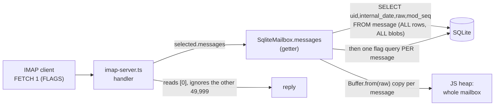

# Performance — where the server stops scaling, and why

*Measured 2026-07-19. Benchmarks live in [`perf/`](../perf) and drive the real production
code paths (`SqliteMailbox`, the IMAP + SMTP servers) — they are measurement rigs, not tests,
so `npm test` and `tsc` ignore them. Two machines: **laptop** (8-core, 16 GB, NVMe) and **box**
(the live target: Hetzner cx23, 2 vCPU, 3.7 GB, the hardware this is actually deployed on).*

## TL;DR

The server is correct and fine at rest, but **one moderately-large mailbox being read makes
the whole server unresponsive for every other user and for all inbound mail.** Two root causes
compound:

1. **Every IMAP command materialises the entire mailbox** — all message bytes + an N+1 flag
   query — even to answer `FETCH 1 (FLAGS)`. Cost is O(total mailbox bytes), not O(what was asked).
2. **`node:sqlite` is synchronous on a single-threaded server**, so that whole-mailbox read
   *blocks the event loop* — freezing every other connection and every delivery for its duration.

On the box, with a 221 MB mailbox (50k typical messages — a few years of one person's mail) and
just **3 concurrent readers**, a new IMAP connection waits **4.6 s** for its greeting and an
inbound email takes **25 s** to be accepted. A sending MTA would time out and retry; the box
looks dead. None of this needs an attacker — it is ordinary use at a boringly normal scale.

The good news: cause (1) is the lever. Making the storage layer fetch only what a command needs
turns almost every operation into a bounded, sub-millisecond query, which also removes the
event-loop stalls of (2) on the common path. It is a contained refactor behind one interface.

## How a command touches storage today



`messages` is a getter that re-runs on **every access**, and handlers touch it several times per
command (SELECT reads it 3×). The `ServableMailbox` interface itself — `readonly messages:
readonly ServableMessage[]` — is what forces this: there is no way to ask for less.

## Measured — mailbox-size scaling (`perf/storage-scaling.bench.ts`)

Cost to answer **one** `FETCH 1 (FLAGS)`, by mailbox size, 4 KB messages:

| mailbox | on disk | laptop FETCH1 | **box FETCH1** | heap churned | RSS spike (laptop) |
|--------:|--------:|--------------:|---------------:|-------------:|-------------------:|
|   1,000 |  4.5 MB |        4.2 ms |        35.9 ms |      3.9 MB |            7 MB |
|  10,000 | 44.2 MB |         55 ms |         273 ms |     39.1 MB |           82 MB |
|  50,000 |  221 MB |        311 ms |    **1,825 ms** |    195.3 MB |          426 MB |

Reading **one** message costs the same as reading **all 50,000**, because the whole mailbox is
materialised first. `sequenceNumber()` (an indexed `COUNT`) stayed <2 ms throughout — it is *not*
a problem; the BLOB materialisation is. Append held ~550 msg/s on the box (one fsync'd
transaction each) — fine for personal scale, and disk-fsync-bound, not CPU-bound.

## Measured — head-of-line blocking (`perf/concurrency.bench.ts`)

While N clients hammer `FETCH 1` on a 50k mailbox, we sample two things that should be cheap: a
fresh IMAP connection's time-to-greeting (touches no mailbox — a pure event-loop-responsiveness
probe) and a full inbound delivery (`MAIL`/`RCPT`/`DATA` → 250).

**Box, 3 loaders:**

| probe | idle p50 | under load | blow-up |
|---|--:|--:|--:|
| IMAP greeting (touches nothing) | 1.7 ms | **4,616 ms** | 2,710× |
| SMTP delivery (inbound email)   | 49 ms | **24,751 ms** | 505× |

```mermaid
sequenceDiagram
    participant New as New connection / inbound mail
    participant Loop as Event loop (single thread)
    participant SQL as node:sqlite (synchronous)
    Loop->>SQL: reader A: load 50k mailbox (~1.8s)
    Note over Loop: BLOCKED — nothing else runs
    New--xLoop: SYN / MAIL FROM sits in the OS queue
    SQL-->>Loop: done
    Loop->>SQL: reader B: load 50k mailbox (~1.8s)
    Note over Loop: still blocked; new work keeps waiting
    Loop-->>New: finally serviced, seconds later
```

The greeting delay is decisive: that probe reads no mailbox, yet it waits seconds — proof the
stall is event-loop starvation, not per-command work. Inbound mail waits in the same queue, so
throughput "in" and "out" don't share the machine gracefully; they exclude each other.

## Measured — many-users footprint (`perf/many-users.bench.ts`)

Holding user databases open (as `MailStores` does, permanently):

| open user DBs | RSS Δ | per user |
|--------------:|------:|---------:|
| 500 | 140 MB | 287 KB |
| 2,000 | 344 MB | 176 KB |

Memory per user is *reasonable* — RAM is not the first wall. Two sharper limits are:

- **File descriptors.** Each open WAL database holds ~3 fds (db + `-wal` + `-shm`), plus one per
  live connection. The box's `ulimit -n` is **1024**, so ~300 distinct active users would exhaust
  descriptors long before memory — and `MailStores` **never evicts**, so the floor only grows
  with distinct logins seen since boot.
- **Unbounded cache.** No cap, no idle close. A busy day's worth of distinct senders/logins is a
  monotonic leak of handles until restart.

## What to change — prioritised

### 1. [HIGH] Make the storage layer fetch only what a command needs

The one high-value change. Replace the all-or-nothing `messages` getter with lazy accessors on
`ServableMailbox`, and push aggregates into SQL:

- `uids()` → `SELECT uid … ORDER BY uid` (no BLOBs) for sequence-set resolution, `EXISTS`, and
  `sequenceNumber` — the common metadata path stops reading bodies entirely.
- `rawForUid(uid)` → fetch a **single** BLOB, only when a FETCH actually asks for a body/part.
- `flagsFor(uid)` / batched flags → drop the N+1.
- `STATUS` → `COUNT(*)`, `COUNT(*) WHERE NOT \Seen`, `SUM(length(raw))` in SQL, not a JS map/reduce
  over materialised rows.
- `SEARCH` on flags/uid/size → SQL `WHERE`; only body/header text criteria need to stream BLOBs,
  and those can be fetched one row at a time rather than all at once.

This turns `FETCH 1 (FLAGS)` from O(mailbox) into O(1), which is the whole ballgame: a bounded,
sub-millisecond query doesn't stall the event loop, so it also dissolves most of finding (2).
It is a contained change — one interface (`ServableMailbox`), its two implementations
(`SqliteMailbox`, `MemoryCatalog`/reference), and the ~15 `.messages` call sites in
`imap-server.ts` — gated by the existing catalog-parity differential oracle and the full suite.

### 2. [MED] Keep every synchronous DB op small (and revisit only if one can't be)

Once (1) lands, no single common operation is large, so the synchronous `node:sqlite` model is
fine at this scale — the honest "SQLite of email" answer is *bounded operations*, not a thread
pool. The one op that can still be inherently large is a body/header `SEARCH` of a huge mailbox;
if that proves painful in practice, stream it row-by-row with a periodic yield, or offload to a
worker thread. Not needed on the evidence so far — recorded as the trigger, not built.

### 3. [MED] Bound and evict the `MailStores` cache; raise the fd limit

- Add an LRU cap that closes idle stores — but only those with **zero live connections and no
  in-flight delivery** (the shared-instance invariant in `mail-stores.ts` is load-bearing for
  IDLE and multi-connection sync). Ref-count, evict at zero.
- Set `LimitNOFILE` in the systemd unit well above the per-user fd math (e.g. 65536), so the cap
  is a policy choice, not an accidental crash at ulimit.

### 4. [LOW] Stop re-running DDL on every mailbox resolution

`SqliteCatalog.get()` → `SqliteMailbox.open()` re-executes `CREATE TABLE IF NOT EXISTS` ×4, three
`pragma_table_info` migration probes, and `CREATE INDEX IF NOT EXISTS` on **every** access. Cheap
per call, but pure overhead on the hot path — run schema/migrations once at catalog open and cache
the mailbox handle per id.

### Not a problem (measured, so it isn't guessed at)

`sequenceNumber` (indexed COUNT, <2 ms at 50k); append throughput (~550/s on the box, disk-bound,
ample for personal scale); per-user memory (176 KB). Don't spend effort here.
