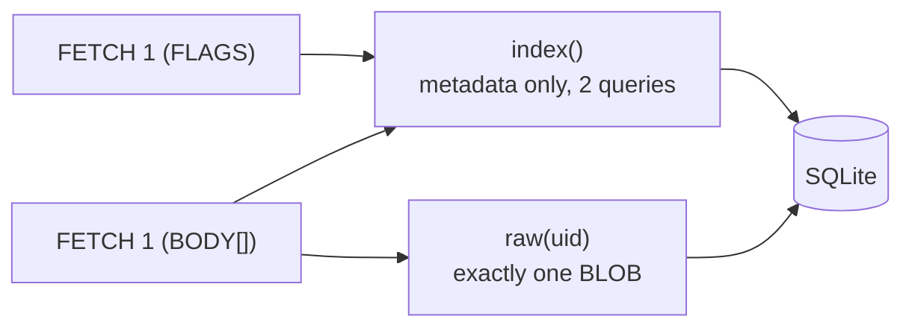

# Performance — what it handles, and where the ceilings are

cutiemail is one Node process over synchronous SQLite — a shape chosen for simplicity and
crash-safety, with consequences this page measures rather than hand-waves. Everything below was
benchmarked on deliberately small hardware: a **2-vCPU, 4 GB cloud VM**, the class of machine the
project actually targets. An 8-core laptop runs the same rigs 5–10× faster.

The benchmark rigs live in [`perf/`](../perf) and drive the real production code paths
(`SqliteMailbox`, the IMAP and SMTP servers). They are measurement rigs, not tests — `npm test`
and `tsc` ignore them — and every number on this page is reproducible by running them.

## Headline numbers

Measured on the 2-vCPU reference VM:

| operation | measured |
|---|--:|
| fetch one message body from a 50,000-message (221 MB) mailbox | **0.5 ms** |
| metadata command (`FETCH FLAGS`, `STATUS`) on that mailbox | 424 ms |
| heap churned per IMAP command | 1.3 MB |
| inbound SMTP accept, sustained (5,000 concurrent deliveries across 20 recipients) | **244 msg/s** |
| authenticated submission, including DKIM RSA-2048 signing | 59 msg/s |
| mark a 20,000-message folder read (`STORE 1:*`, one transaction) | ~3 s |
| local append (one fsync'd transaction per message) | ~550 msg/s |
| 20-minute connection-churn soak (4,881 connections) | 0 errors, 0 leaks |

For scale: 244 messages/s inbound is roughly 880,000 mail per hour — far beyond any personal
domain. A genuine flood queues at the sender's MX; it does not fail here. And sustained mixed
load — inbound, outbound, and IMAP all at once, including a 40 %-rejection bounce storm — runs
with zero errors, zero `SQLITE_BUSY`, and flat memory.

## The shape, and the rule it forces

`node:sqlite` is synchronous, and the server is single-threaded — so every database operation
blocks the event loop for every connection while it runs. That is a fine trade **if and only if
each unit of work is small and bounded**, which reduces the whole performance design to one rule:

> No command may do work proportional to the size of the mailbox unless it actually asked for
> that much data.

Two mechanisms enforce it.

**Reads are lazy.** The storage layer exposes two accessors instead of a load-everything view
([`src/store/mailbox.ts`](../src/store/mailbox.ts)):

- `index()` — ordered per-message metadata (uid, flags, date, modseq, size) with **no body
  bytes**. Two queries regardless of mailbox size: sizes come from `LENGTH(raw)` (SQLite reads
  the octet count from the record header, never the BLOB), and all flags arrive in one grouped
  query — no per-message lookups. This serves `FETCH FLAGS`, `STATUS`, `SELECT`, `EXPUNGE`,
  `STORE`, and sequence-set resolution.
- `raw(uid)` — one message body, one row, fetched only when a command actually needs bytes
  (`BODY[…]`, a body search, `COPY`).

A wire-level guard test asserts that a metadata command loads **zero** bodies and a
single-message body fetch loads **exactly one** — so a regression back to eager loading fails
the suite, not a future benchmark run.

The rule is not academic. An earlier design materialised the entire mailbox to answer any
command; on the reference VM, fetching one message from that 50k mailbox cost **1,825 ms and
195 MB of heap** — and because SQLite is synchronous, those two seconds froze everyone: with
just three concurrent readers, a brand-new connection waited 4.6 s for its greeting and an
inbound delivery took 25 s to be accepted. Making storage fetch only what was asked for is the
difference between those numbers and the table above:

| operation (50k / 221 MB mailbox) | eager | lazy |
|---|--:|--:|
| single-message body fetch | 1,825 ms | **0.5 ms** |
| metadata command | 1,695 ms | 424 ms |
| heap churned per command | 195 MB | 1.3 MB |
| new-connection greeting under 3 readers | 4,616 ms | 435 ms |

**Writes are batched.** Each storage mutation is one fsync'd transaction, and the bulk commands
(`STORE 1:*`, `COPY 1:*`, `UID EXPUNGE`) wrap their whole loop in a single transaction rather
than paying one fsync per message — the difference between marking a 20,000-message folder read
in ~3 s versus ~37 s of frozen server. There is also no DDL on the hot path: schema and
migrations run once when a mailbox is first opened, not on every `SELECT`.

## How it defends its memory

Worst-case memory is bounded by explicit budgets, each one verified by driving the server to the
wall and watching it plateau instead of die:

- **Write-backlog budget (256 MiB).** A client that requests a large message and then stops
  reading leaves the response buffered in the process — and one big fetch per connection is
  enough to exhaust memory, no matter the connection cap. After each body write the server sums
  the backlog across all sockets and, over budget, drops the slowest-draining connections. A
  client reading promptly buffers ~0 and is never chosen. Driven with 25 MB fetches from
  deliberately stalled clients, the process plateaus at ~325 MB out to 256 of them; without the
  budget, the kernel's OOM killer ends the process at ~112.
- **APPEND reservation budget (256 MiB).** The mirror image on upload: `APPEND {25000000}`
  makes the server buffer the declared literal, so slow uploaders pin memory. Because the size
  is declared up front, each APPEND *reserves* it against a server-wide budget and is refused
  with a transient `NO` when the budget is full, released on completion or disconnect. Measured:
  a plateau of ~388 MB out to 128 stalled uploads, real clients unaffected.
- **Outbound queue depth (default 10,000).** Submission (59/s) can outrun the relay, and each
  queued row holds a whole signed message — a disk-exhaustion vector for a runaway or
  compromised account. Over the cap, submission answers a transient `451` and the client
  retries later; purely local mail is never refused.
- **Hard caps.** 512 concurrent connections, 64 KB command line, 25 MiB message/literal size.

The parsers hold up the same way: pathological inputs — a 64 KB explicit sequence set,
`FETCH 1:4294967295`, astronomically large UIDs, a literal declared but never sent, binary/NUL
floods, 2,000-connection churn, 10,000 pipelined commands — leave the server responsive with
flat memory. The sequence-set parser clamps ranges to the largest UID in use, so a huge range
never becomes a huge allocation.

## The ceilings

These are the measured limits of the single-threaded synchronous shape — characterised so you
know where they are, and all of them far beyond the intended scale of one domain and a handful
of people:

- **The metadata floor scales with mailbox size** — `index()` is O(rows): 424 ms at 50k
  messages, 1.2 s at 100k on the reference VM (~80 ms on a laptop). Under many concurrent heavy
  readers it serialises: eight clients hammering a 50k mailbox delay a new connection's greeting
  to ~3.8 s. Pure latency, no errors.
- **Relay drain is serial** — the outbound queue delivers one MX dialogue at a time, ~11 msg/s
  to an instant-accepting peer and slower against the real internet. A burst drains steadily
  rather than in parallel; the queue-depth budget above covers the gap.
- **Large concurrent body fetches cost ~3× the bytes in flight** (the SQLite read, the copy,
  and the literal framing) — bounded by the 25 MiB size cap × the connection budget.
- **Body/header `SEARCH` is inherently O(mailbox)** — it must stream each candidate, though now
  one row at a time, never a whole-mailbox allocation.

One further lever is known and deliberately not pulled: resolving a sequence set to UIDs before
touching metadata would make a bounded `FETCH` O(matched) instead of O(mailbox), cutting the
metadata floor. It touches the client-view sequence-number logic (RFC 9051 §7.4.1) that is
heavily tested and easy to get subtly wrong, to serve only very large mailboxes under heavy
concurrent load — a disproportionate risk for the mission, recorded here as the next move if
that complaint ever materialises.

## What isn't a limit

Measured, so it isn't guessed:

- **Memory per user is small** — ~180–290 KB per open user database (2,000 open at once cost
  344 MB). File descriptors are the sharper resource (~3 per open database), so the deployment
  unit raises `LimitNOFILE` to 65,536.
- **Append throughput** (~550 msg/s) is disk-fsync-bound, not CPU-bound — ample headroom.
- **Contention behaves** — with all four SQLite writers active at once (delivery, enqueue,
  relay settle, IMAP store), sustained mixed load produces zero `SQLITE_BUSY` and a clean
  shutdown; the synchronous single thread serialises writers by construction.

## The soak — hunting slow leaks

Short bursts can't reveal a slow leak — a per-connection handle or subscription that drips over
minutes. So one rig runs the full daemon for 20 minutes under connection *churn*: thousands of
short-lived connections that connect, do a little work, and vanish — a quarter of the IMAP ones
entering IDLE and then dropping abruptly, the classic leak trigger. It samples live memory
(GC-forced), handles, file descriptors, and connection counts, and fits a slope to each:

| signal | slope over 20 min | verdict |
|---|--:|---|
| live JS heap | +0.06 MB/min | flat |
| active handles / open fds | ~0 | flat |
| live connections at rest | 0 | fully released |
| APPEND bytes reserved at rest | 0 | fully released |

RSS settles at a working-set plateau (~150 MB) with the live heap flat — allocator stickiness,
not a leak. A dedicated regression test pins the teardown path: connections that SELECT, IDLE,
and die abruptly must release both their socket and their notifier subscription, every cycle.
