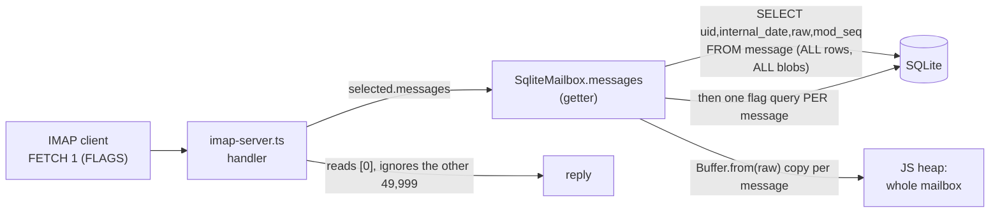

# Performance — where the server stops scaling, and why

*Measured 2026-07-19. Benchmarks live in [`perf/`](../perf) and drive the real production
code paths (`SqliteMailbox`, the IMAP + SMTP servers) — they are measurement rigs, not tests,
so `npm test` and `tsc` ignore them. Two machines: **laptop** (8-core, 16 GB, NVMe) and **box**
(the live target: Hetzner cx23, 2 vCPU, 3.7 GB, the hardware this is actually deployed on).*

> **Status: fixed (2026-07-19).** The lazy-storage refactor below landed (commits `3ec1a2b`,
> `97d26cc`). On the box, a single-message body fetch on a 50k mailbox went **1825 ms → 0.53 ms**,
> per-command heap churn **195 MB → 1.3 MB**, and greeting latency under load **4.6 s → 0.44 s**.
> The [Fixed](#what-was-fixed) section carries the full before/after. The diagnosis below is kept
> as the record of *why* — read it in the past tense.

## TL;DR

The server was correct and fine at rest, but **one moderately-large mailbox being read made
the whole server unresponsive for every other user and for all inbound mail.** Two root causes
compounded:

1. **Every IMAP command materialises the entire mailbox** — all message bytes + an N+1 flag
   query — even to answer `FETCH 1 (FLAGS)`. Cost is O(total mailbox bytes), not O(what was asked).
2. **`node:sqlite` is synchronous on a single-threaded server**, so that whole-mailbox read
   *blocks the event loop* — freezing every other connection and every delivery for its duration.

On the box, with a 221 MB mailbox (50k typical messages — a few years of one person's mail) and
just **3 concurrent readers**, a new IMAP connection waits **4.6 s** for its greeting and an
inbound email takes **25 s** to be accepted. A sending MTA would time out and retry; the box
looks dead. None of this needs an attacker — it is ordinary use at a boringly normal scale.

The good news: cause (1) is the lever. Making the storage layer fetch only what a command needs
turns almost every operation into a bounded, sub-millisecond query, which also removes the
event-loop stalls of (2) on the common path. It is a contained refactor behind one interface.

## How a command touches storage today



`messages` is a getter that re-runs on **every access**, and handlers touch it several times per
command (SELECT reads it 3×). The `ServableMailbox` interface itself — `readonly messages:
readonly ServableMessage[]` — is what forces this: there is no way to ask for less.

## Measured — mailbox-size scaling (`perf/storage-scaling.bench.ts`)

Cost to answer **one** `FETCH 1 (FLAGS)`, by mailbox size, 4 KB messages:

| mailbox | on disk | laptop FETCH1 | **box FETCH1** | heap churned | RSS spike (laptop) |
|--------:|--------:|--------------:|---------------:|-------------:|-------------------:|
|   1,000 |  4.5 MB |        4.2 ms |        35.9 ms |      3.9 MB |            7 MB |
|  10,000 | 44.2 MB |         55 ms |         273 ms |     39.1 MB |           82 MB |
|  50,000 |  221 MB |        311 ms |    **1,825 ms** |    195.3 MB |          426 MB |

Reading **one** message costs the same as reading **all 50,000**, because the whole mailbox is
materialised first. `sequenceNumber()` (an indexed `COUNT`) stayed <2 ms throughout — it is *not*
a problem; the BLOB materialisation is. Append held ~550 msg/s on the box (one fsync'd
transaction each) — fine for personal scale, and disk-fsync-bound, not CPU-bound.

## Measured — head-of-line blocking (`perf/concurrency.bench.ts`)

While N clients hammer `FETCH 1` on a 50k mailbox, we sample two things that should be cheap: a
fresh IMAP connection's time-to-greeting (touches no mailbox — a pure event-loop-responsiveness
probe) and a full inbound delivery (`MAIL`/`RCPT`/`DATA` → 250).

**Box, 3 loaders:**

| probe | idle p50 | under load | blow-up |
|---|--:|--:|--:|
| IMAP greeting (touches nothing) | 1.7 ms | **4,616 ms** | 2,710× |
| SMTP delivery (inbound email)   | 49 ms | **24,751 ms** | 505× |

```mermaid
sequenceDiagram
    participant New as New connection / inbound mail
    participant Loop as Event loop (single thread)
    participant SQL as node:sqlite (synchronous)
    Loop->>SQL: reader A: load 50k mailbox (~1.8s)
    Note over Loop: BLOCKED — nothing else runs
    New--xLoop: SYN / MAIL FROM sits in the OS queue
    SQL-->>Loop: done
    Loop->>SQL: reader B: load 50k mailbox (~1.8s)
    Note over Loop: still blocked; new work keeps waiting
    Loop-->>New: finally serviced, seconds later
```

The greeting delay is decisive: that probe reads no mailbox, yet it waits seconds — proof the
stall is event-loop starvation, not per-command work. Inbound mail waits in the same queue, so
throughput "in" and "out" don't share the machine gracefully; they exclude each other.

## Measured — many-users footprint (`perf/many-users.bench.ts`)

Holding user databases open (as `MailStores` does, permanently):

| open user DBs | RSS Δ | per user |
|--------------:|------:|---------:|
| 500 | 140 MB | 287 KB |
| 2,000 | 344 MB | 176 KB |

Memory per user is *reasonable* — RAM is not the first wall. Two sharper limits are:

- **File descriptors.** Each open WAL database holds ~3 fds (db + `-wal` + `-shm`), plus one per
  live connection. The box's `ulimit -n` is **1024**, so ~300 distinct active users would exhaust
  descriptors long before memory — and `MailStores` **never evicts**, so the floor only grows
  with distinct logins seen since boot.
- **Unbounded cache.** No cap, no idle close. A busy day's worth of distinct senders/logins is a
  monotonic leak of handles until restart.

## What was fixed

### 1. [DONE] The storage layer fetches only what a command needs

The `ServableMailbox.messages` getter — which loaded every message BLOB and ran a flag query per
message on every access — is replaced by two accessors ([`MessageMeta`](../src/store/mailbox.ts),
[`imap-server.ts`](../src/server/imap-server.ts)):

- **`index()`** — ordered per-message metadata (uid, flags, internalDate, modseq, **size**) with
  **no body bytes**. Two queries regardless of mailbox size: the message rows carry `LENGTH(raw)`
  (SQLite reads the octet count from the record header, never the BLOB), and all flags come in one
  grouped query joined in memory (no N+1). This is what FETCH FLAGS / STATUS / SELECT / EXPUNGE /
  STORE / sequence-set resolution read.
- **`raw(uid)`** — one message body, a single row, fetched only when a command actually needs it
  (BODY[…]/RFC822/ENVELOPE, a body/header SEARCH, COPY).

`STATUS` sums `meta.size` (no BLOBs); a `LARGER`/`SMALLER` SEARCH uses `meta.size` too; a
flag/date/uid SEARCH loads nothing. A new guard, `imap-fetch-laziness.test.ts`, asserts over the
wire that a metadata command loads **zero** bodies and a single-message body fetch loads **exactly
one** — so a regression to eager loading fails the suite. Behaviour is identical: the full suite
(1025) stays green, including the `SqliteCatalog`↔`MemoryCatalog` catalog-parity oracle.

**Measured (box, 50k / 221 MB mailbox), old `.messages` → new:**

| operation | before | after | change |
|---|--:|--:|--:|
| single-message body fetch (`raw(uid)`) | 1825 ms | **0.53 ms** | ~3200× |
| metadata read (`index()`; FETCH FLAGS / STATUS) | 1695 ms | **424 ms** | 4× |
| heap churned per command | 195 MB | **1.3 MB** | 153× |
| greeting latency under 3 readers | 4616 ms | **435 ms** | 10.6× |
| inbound delivery under 3 readers | 24,751 ms | **6825 ms** | 3.6× |

### 2. [DONE — insurance] fd headroom; cache eviction deliberately not built

`LimitNOFILE=65536` is set in the systemd unit ([`deploy/hetzner-up.sh`](../deploy/hetzner-up.sh)):
each open user DB holds ~3 fds and the default 1024 would wall before memory.

Refcounted `MailStores` eviction is **deliberately not built.** The cache is keyed by *login* and
only ever opens a store for a **real account** — both delivery (`deliverTo(login)`) and IMAP resolve
addresses/aliases/`+tags` to a bounded set of real logins before touching a store — so its size is
bounded by the account count, which is small at the project's personal scale (ADR 0009). Adding
refcounted eviction would put the load-bearing shared-instance/IDLE invariant (`mail-stores.ts`) at
risk to defend a limit (hundreds of accounts) the project does not target. **Revisit** if the
project ever grows a multi-tenant story. This corrects the earlier note above: the floor grows with
*account count*, not with distinct senders.

### 3. [DONE] No DDL on the mailbox hot path

`SqliteCatalog.get()` (run on every SELECT/STATUS/COPY) now calls `SqliteMailbox.attach()` — a bare
constructor — instead of `open()`, which had re-executed `CREATE TABLE IF NOT EXISTS` ×4, three
`pragma_table_info` probes, and `CREATE INDEX` every time. The catalog runs schema + migrations once
at open; `open()` stays for tests that create a bare mailbox.

### Deferred — a real lever, higher risk, only bites the extreme case

**Make a *bounded* fetch sub-linear.** `resolveForConn` still calls `index()` (all metadata) to map
sequence numbers, so even opening one message pays the metadata read (424 ms on the box for a 50k
mailbox; ~80 ms on a normal server). It could instead resolve the set to UIDs first — from the
in-memory client view for sequence mode, a cheap `MAX(uid)` for `*` in UID mode — and batch-fetch
metadata for only the matched messages, making `FETCH <one message>` O(matched) not O(mailbox). It
is **not built**: it touches the RFC 9051 §7.4.1 client-view sequence logic that is heavily tested
and has been a source of subtle bugs (audit runs 5–7), and the residual only hurts very large
mailboxes on very slow hardware — disproportionate risk for the mission. Recorded as the next lever
if a large-mailbox latency complaint ever materialises.

### Body/header SEARCH of a huge mailbox

Still inherently O(mailbox) — it must stream each candidate body — but now one row at a time (via
`raw(uid)`), never a single 195 MB allocation, and only for HEADER/BODY/TEXT criteria. Bounded by
the existing authenticated-only SEARCH-key DoS guards. Left as-is; the personal-scale answer.

### Not a problem (measured, so it isn't guessed at)

`sequenceNumber` (indexed COUNT, <2 ms at 50k); append throughput (~550/s on the box, disk-fsync-
bound, ample for personal scale); per-user memory (176 KB). No effort spent here.
