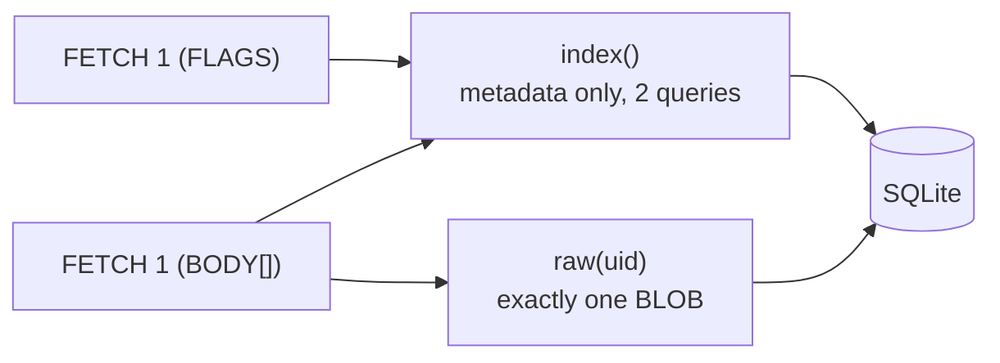

# Performance: what it handles, and where the ceilings are

cutiemail is one Node process over synchronous SQLite. The project chose this design for
simplicity and crash-safety. This page measures the consequences and does not dismiss them.
The benchmarks below ran on deliberately small hardware: a **2-vCPU, 4 GB cloud VM**, the class
of machine the project targets. An 8-core laptop runs the same rigs 5-10× faster.

The benchmark rigs live in [`perf/`](../perf) and drive the real production code paths
(`SqliteMailbox`, the IMAP and SMTP servers). They are measurement rigs, not tests (`npm test`
and `tsc` ignore them). You can reproduce every number on this page when you run them.

## Headline numbers

The 2-vCPU reference VM produced these numbers:

| operation | measured |
|---|--:|
| fetch one message body from a 50,000-message (221 MB) mailbox | **0.5 ms** |
| metadata command (`FETCH FLAGS`, `STATUS`) on that mailbox | 424 ms |
| heap churned per IMAP command | 1.3 MB |
| inbound SMTP accept, sustained (5,000 concurrent deliveries across 20 recipients) | **244 msg/s** |
| authenticated submission, including DKIM RSA-2048 signing | 59 msg/s |
| mark a 20,000-message folder read (`STORE 1:*`, one transaction) | ~3 s |
| local append (one fsync'd transaction per message) | ~550 msg/s |
| 20-minute connection-churn soak (4,881 connections) | 0 errors, 0 leaks |

For scale: 244 messages/s inbound is roughly 880,000 messages per hour, far beyond any personal
domain. A real flood queues at the sender's MX. It does not fail here. Sustained mixed
load (inbound, outbound, and IMAP all at once, with a 40 %-rejection bounce storm) runs
with zero errors, zero `SQLITE_BUSY`, and flat memory.

## The single-threaded design, and the rule it forces

`node:sqlite` is synchronous, and the server is single-threaded. Therefore every database
operation blocks the event loop for every connection while it runs. That is a fine trade **if
and only if each unit of work is small and bounded**. This constraint reduces the performance
design to one rule:

> No command may do work proportional to the size of the mailbox unless it asked for
> that much data.

Two mechanisms enforce it.

**Reads are lazy.** The storage layer exposes two accessors instead of a load-everything view
([`src/store/sqlite-mailbox.ts`](../src/store/sqlite-mailbox.ts)):

- `index()`: ordered per-message metadata (uid, flags, date, modseq, size) with **no body
  bytes**. It runs two queries for any mailbox size. The sizes come from `LENGTH(raw)` (SQLite
  reads the octet count from the record header, never the BLOB). All flags arrive in one grouped
  query, with no per-message lookups. This serves `FETCH FLAGS`, `STATUS`, `SELECT`, `EXPUNGE`,
  `STORE`, and sequence-set resolution.
- `raw(uid)`: one message body from one row. The server reads it only when a command needs bytes
  (`BODY[…]`, a body search, `COPY`).

```mermaid
flowchart LR
    C["FETCH 1 (FLAGS)"] --> IDX["index()<br/>metadata only, 2 queries"]
    C2["FETCH 1 (BODY[])"] --> IDX
    C2 --> RAW["raw(uid)<br/>exactly one BLOB"]
    IDX --> DB[(SQLite)]
    RAW --> DB
```

A wire-level guard test asserts two facts: a metadata command loads **zero** bodies, and a
single-message body fetch loads **exactly one**. Therefore a regression to eager loading fails
the suite, not a future benchmark run.

The rule is not academic. An earlier design materialised the entire mailbox to answer any
command. On the reference VM, a fetch of one message from that 50k mailbox cost **1,825 ms and
195 MB of heap**. SQLite is synchronous, so those two seconds froze everyone. With
three concurrent readers, a brand-new connection waited 4.6 s for its greeting, and the server
needed 25 s to accept an inbound delivery. When storage fetches only the requested data, you get
the difference between those numbers and the table above:

| operation (50k / 221 MB mailbox) | eager | lazy |
|---|--:|--:|
| single-message body fetch | 1,825 ms | **0.5 ms** |
| metadata command | 1,695 ms | 424 ms |
| heap churned per command | 195 MB | 1.3 MB |
| new-connection greeting under 3 readers | 4,616 ms | 435 ms |

**Writes are batched, and durable.** Each storage mutation is one fsync'd transaction.
`openMailDb` runs WAL with `synchronous=FULL`, so a `COMMIT` reaches stable storage before it
returns. This durability lets a `250`/`OK` acknowledgement mean the mail survives power loss,
not just a clean restart
([ADR 0028](decisions/0028-durability-fsync-before-acknowledgement.md)). The bulk commands
(`STORE 1:*`, `COPY 1:*`, `UID EXPUNGE`) wrap their whole loop in one transaction rather than
one fsync per message. This marks a 20,000-message folder read in ~3 s instead of ~37 s of
frozen server. The hot path also has no DDL. The schema and migrations run once when a mailbox is
first opened, not on every `SELECT`.

The rigs measured the append and inbound-accept figures above under the earlier
`synchronous=NORMAL`. With `FULL`, one fsync per acknowledged write now bounds those
single-message paths, and the figures are modestly lower. They are still an order of magnitude
beyond any personal domain. This cost is the deliberate price of the durability guarantee, not
an inefficiency to remove.

## How it defends its memory

Explicit budgets bound the worst-case memory. To verify a budget, a rig drives the server to the
wall and confirms the memory plateaus instead of a crash:

- **Write-backlog budget (256 MiB).** A client can request a large message and then stop
  reading. This leaves the response buffered in the process. One big fetch per connection is
  enough to exhaust the memory, whatever the connection cap. After each body write, the server
  sums the backlog across all sockets. If the total is over budget, the server drops the
  slowest-draining connections. A client that reads promptly buffers ~0 bytes, and the server
  never chooses it. The rig drives the process with 25 MB fetches from deliberately stalled
  clients. The process plateaus at ~325 MB out to 256 of them. Without the budget, the kernel's
  OOM killer ends the process at ~112.
- **APPEND reservation budget (256 MiB).** This is the mirror image on upload. `APPEND {25000000}`
  makes the server buffer the declared literal, so slow uploaders pin the memory. The client
  declares the size up front, so each APPEND *reserves* it against a server-wide budget. When the
  budget is full, the server refuses the APPEND with a transient `NO`. The server releases the
  reservation on completion or disconnect. Measured: a plateau of ~388 MB out to 128 stalled
  uploads, with real clients unaffected.
- **Outbound queue depth (default 10,000).** Submission (59/s) can outrun the relay. Each
  queued row holds a whole signed message, a disk-exhaustion vector for a runaway or
  compromised account. Over the cap, submission answers a transient `451`, and the client
  retries later. The server never refuses purely local mail.
- **Hard caps.** 512 concurrent connections, 64 KB command line, 25 MiB message/literal size.

The parsers behave the same way. They stay responsive with flat memory under pathological
inputs: a 64 KB explicit sequence set, `FETCH 1:4294967295`, astronomically large UIDs, a
literal declared but never sent, binary/NUL floods, 2,000-connection churn, and 10,000 pipelined
commands. The sequence-set parser clamps ranges to the largest UID in use, so a huge range
never becomes a huge allocation.

## The ceilings

These are the measured limits of the single-threaded synchronous design. All of them are far
beyond the intended scale of one domain and a few people:

- **The metadata floor scales with mailbox size.** `index()` is O(rows): 424 ms at 50k
  messages, and 1.2 s at 100k on the reference VM (~80 ms on a laptop). Under many concurrent
  heavy readers, `index()` serialises. Eight clients that hammer a 50k mailbox delay a new
  connection's greeting to ~3.8 s. This is pure latency, with no errors.
- **Relay drain is serial.** The outbound queue delivers one MX dialogue at a time. It reaches
  ~11 msg/s to an instant-accepting peer, and slower against the real internet. A burst drains
  steadily, not in parallel. The queue-depth budget above covers the gap.
- **Large concurrent body fetches cost ~3× the bytes in flight** (the SQLite read, the copy,
  and the literal framing). The 25 MiB size cap × the connection budget bounds this cost.
- **Body/header `SEARCH` is inherently O(mailbox).** It must stream each candidate, but now
  one row at a time, never a whole-mailbox allocation.
- **Disk is the sizing constraint, not CPU or memory.** The store holds the messages themselves.
  As a rough rule, **store size ≈ raw mail size** (SQLite's per-message overhead is small against
  the RFC 822 bytes). Add headroom for the outbound queue and the WAL. Each queued row holds a
  whole signed message, and the 10,000-row depth cap × the 25 MiB size cap bounds it. Size the
  volume for the mail you expect to keep, with margin. If the disk *does* fill, inbound delivery
  fails **transiently**. The storage write throws, and the SMTP receiver answers `451` instead of
  a lost message. Therefore the sending MX retries, and the mail waits for you to free space
  instead of a loss. (Submission over the queue-depth cap likewise gets a transient `451`.)

One further lever is known, and deliberately not used. A resolve of a sequence set to UIDs before
metadata access would make a bounded `FETCH` O(matched) instead of O(mailbox). This would cut the
metadata floor. But it touches the client-view sequence-number logic (RFC 9051 §7.4.1) that is
heavily tested and easy to get subtly wrong. It would serve only very large mailboxes under heavy
concurrent load. That is a disproportionate risk for the mission. This note records it as the
next move if that complaint ever appears.

## What is not a limit

These facts are measured, not guessed:

- **Memory per user is small:** ~180-290 KB per open user database (2,000 open at once cost
  344 MB). File descriptors are the sharper resource (~3 per open database), so the deployment
  unit raises `LimitNOFILE` to 65,536.
- **Append throughput** (~550 msg/s) is disk-fsync-bound, not CPU-bound. Ample headroom.
- **Contention behaves.** With all four SQLite writers active at once (delivery, enqueue,
  relay settle, IMAP store), sustained mixed load produces zero `SQLITE_BUSY` and a clean
  shutdown. The synchronous single thread serialises writers by construction.

## The soak: the search for slow leaks

Short bursts cannot reveal a slow leak: a per-connection handle or subscription that drips over
minutes. So one rig runs the full daemon for 20 minutes under connection *churn*: thousands of
short-lived connections that connect, do a little work, and vanish. A quarter of the IMAP ones
enter IDLE and then drop abruptly, the classic leak trigger. The rig samples live memory
(GC-forced), handles, file descriptors, and connection counts, and fits a slope to each:

| signal | slope over 20 min | verdict |
|---|--:|---|
| live JS heap | +0.06 MB/min | flat |
| active handles / open fds | ~0 | flat |
| live connections at rest | 0 | fully released |
| APPEND bytes reserved at rest | 0 | fully released |

RSS settles at a working-set plateau (~150 MB) with the live heap flat: this is allocator
stickiness, not a leak. A dedicated regression test pins the teardown path. Connections that
SELECT, IDLE, and die abruptly must release both their socket and their notifier subscription,
every cycle.
