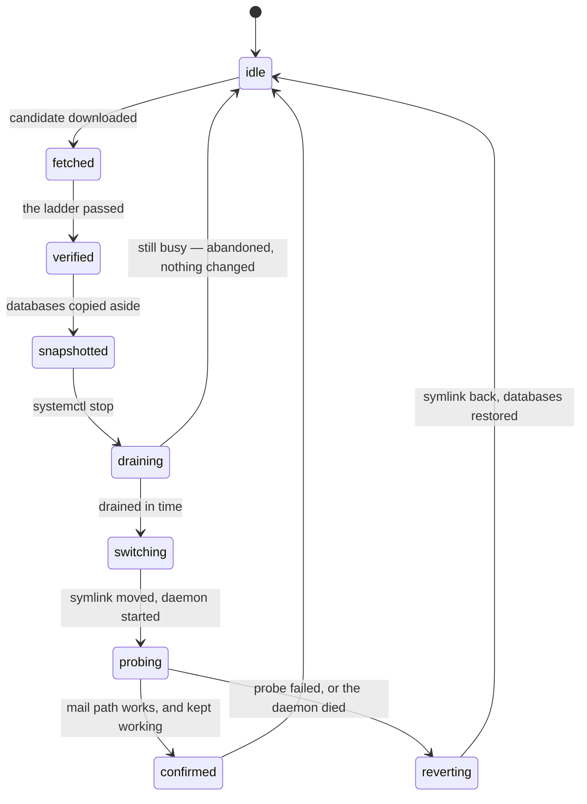

# Keeping a deployment up to date, by itself

Self-hosted software rots. It gets deployed, it works, and then it sits — unpatched, drifting away
from the internet around it — because upgrading is a chore nobody schedules. cutiemail can keep
itself current instead: fetch the next version, prove it works *on this machine, against this data*,
and switch to it with a rollback that runs automatically if the switch was wrong.

It ships **reporting-only**. It will tell you a new version is available and that it verified
cleanly; it will not switch until you say so. Turn switching on once you have watched it be right a
few times.

Reporting-only is about the **switch**, not about execution. Verifying a candidate means running it
— importing every module, and booting the daemon against a copy of your data — so `check` mode
already executes code from the remote, as the ladder below describes. What `apply` adds is the
symlink move. If you would rather a deployment ran nothing at all from the remote, `off` is the
setting for that.

The design and its reasoning are in [ADR 0025](decisions/0025-self-update.md), and what a live test
of it found is in [the backlog](BACKLOG.md#closed-what-a-live-self-update-test-found). This page is
how to run it. If you would rather upgrade by hand, that is
[a section of the deployment guide](DEPLOYMENT.md#upgrading-by-hand) and needs none of this.

## The shape of it

Two programs, two users, one symlink.

```text
/opt/mailserver/
  current -> versions/<commit>     the ONE thing that says what runs
  versions/<commit>/               a verified checkout, never modified after it lands
```

The daemon's unit runs `/opt/mailserver/current/src/main.ts`, so a cutover is a `rename(2)` over the
symlink plus a restart, and a rollback is the same rename in reverse. That is the whole switching
mechanism; everything else is deciding whether to pull the lever.

**The daemon must not own that directory.** It is the internet-facing part; if a remote compromise
of it could rewrite what runs next, the compromise becomes permanent. So the code belongs to a
separate `mailupd` user and the mail user only ever reads it.

## Setting it up

The updater cannot manage a deployment installed as a flat directory, because there is nothing to
switch. Lay the code out as a version store and give it its own user:

```sh
sudo useradd --system --home-dir /opt/mailserver --shell /usr/sbin/nologin mailupd
sudo chown -R mailupd:mailupd /opt/mailserver
sudo chmod -R u=rwX,go=rX /opt/mailserver
# the updater snapshots the databases, so it needs to read them — group access, not ownership
sudo usermod -a -G mail mailupd
sudo chown -R mail:mail /var/lib/mailserver
sudo chmod 770 /var/lib/mailserver
sudo chmod 660 /var/lib/mailserver/*.db*
```

**The group is the access-control decision, and it is the only one.** The daemon sets its databases
to `0660` — owner and group, never world — and re-applies that on every open. So whoever is in the
data group can read the mail and the credential material, and nobody else can. Check it with
`getent group mail`: it should contain the updater and nothing else. On a deployment with no
updater the group has one member, and `0660` is `0600` in effect.

Do not try to grant this with an ACL. The daemon's `chmod` resets an ACL's mask to nothing on every
open, so the grant survives exactly until the next restart — which a cutover always performs, making
the failure both silent and delayed. The pre-flight passes once and then fails forever with
`unable to open database file`, blaming your data.

The directory is group-**writable** because a failed cutover restores the databases from its
pre-cutover snapshot, which means creating files there. That path runs when something has already
gone wrong, which is the worst moment to meet a permission error.

The updater needs write access as well as read: the cutover probe mints an app password immediately
before checking and revokes it immediately after, so an update is confirmed by a real message
through authenticated submission rather than by the process merely being up. That is not the
privilege it appears to be — whoever chooses the code the mail server runs can already read all the
mail. The separation that does the work is the one above: **the daemon cannot write its own code.**

### Restarting the daemon without being root

Grant the updater **one unit and three verbs**:

```sh
# /etc/polkit-1/rules.d/50-mailserver-update.rules
polkit.addRule(function (action, subject) {
  if (action.id === 'org.freedesktop.systemd1.manage-units'
      && subject.user === 'mailupd'
      && action.lookup('unit') === 'mailserver.service'
      && ['start', 'stop', 'restart'].indexOf(action.lookup('verb')) !== -1) {
    return polkit.Result.YES;
  }
});
```

`systemctl restart polkit` afterwards, or the rule is not read.

### The timer

The updater is a `oneshot` unit on a timer, not a resident process — there is nothing for it to do
between checks, and a crashed daemon should never be able to take the thing that repairs it with it.

```ini
# /etc/systemd/system/mailserver-update.service
[Unit]
Description=cutiemail update check
After=network-online.target
Wants=network-online.target

[Service]
Type=oneshot
User=mailupd
WorkingDirectory=/opt/mailserver/current
ExecStart=/usr/bin/node --disable-warning=ExperimentalWarning /opt/mailserver/current/src/update/main.ts auto
Environment=MAIL_UPDATE_ROOT=/opt/mailserver
Environment=MAIL_UPDATE_UNIT=mailserver.service
# Reporting only until the mechanism has earned trust on this deployment; then set 'apply'.
Environment=MAIL_UPDATE_MODE=check
# The daemon's own configuration, because the pre-flight boots a candidate against a SNAPSHOT of
# your data with your real settings. MAIL_OUTBOUND is forced to hold there regardless of this.
Environment=MAIL_DOMAIN=example.com
Environment=MAIL_CONTROL_DB=/var/lib/mailserver/control.db
Environment=MAIL_SMTP_PORT=25
Environment=MAIL_SUBMISSION_PORT=587
Environment=MAIL_IMAP_PORT=993
NoNewPrivileges=true
ProtectSystem=strict
ProtectHome=true
ReadWritePaths=/opt/mailserver /var/lib/mailserver
PrivateTmp=true
UMask=0077
# The pre-flight imports the candidate's module graph and boots it several times, twice against a
# snapshot of the real data. The migration is the part that scales with your mailbox, so give it
# room.
TimeoutStartSec=45min
```

```ini
# /etc/systemd/system/mailserver-update.timer
[Unit]
Description=cutiemail update check

[Timer]
# Six-hourly, with a wide random delay so every deployment does not hit the remote at once.
OnCalendar=*-*-* 0/6:00:00
RandomizedDelaySec=2h
Persistent=true

[Install]
WantedBy=timers.target
```

```sh
sudo systemctl daemon-reload && sudo systemctl enable --now mailserver-update.timer
```

`MAIL_UPDATE_UNIT` defaults to `cutiemail.service`, so if you followed the deployment guide and
called the unit `mailserver.service` you must set it, as above. Getting it wrong means an updater
that verifies a candidate perfectly and then cannot restart anything.

### Telling it what you are running

Once, before anything else:

```sh
sudo -u mailupd env MAIL_UPDATE_ROOT=/opt/mailserver \
  node /opt/mailserver/current/src/update/main.ts adopt "$(git -C /opt/mailserver/current rev-parse HEAD)"
```

This records the baseline every later update is measured against. It **fetches** that commit from
the repository rather than trusting the files on disk, so a wrong or abbreviated id fails here
instead of quietly poisoning every later comparison.

## What a check actually does

`node src/update/main.ts check` fetches the branch tip and puts it through a ladder. Any failure at
any rung abandons the update and leaves the running version untouched, and `status` names the rung
that stopped it.

- **Provenance.** The candidate must have the commit you are running in its ancestry, so nobody can
  move a deployment backwards and a force-push over deployed history refuses rather than applying.
  It must also be at least `MAIL_UPDATE_BAKE_DAYS` old (default 3), so a mistake merged to the
  branch has a window to be noticed before it reaches you.
- **Integrity.** Every object hashes to the id it was fetched as; every file name in the tree passes
  an allow-list. A malformed download is "no update available", never a partial checkout.
- **`shape`.** Is this a checkout of this project, are the load-bearing modules present, and does
  the new version need a newer Node than this machine has — which is otherwise discovered *after*
  the switch, as a daemon that will not start.
- **`runs on this machine`**: every module imported under the Node actually installed. Not the test
  suite — that re-answers what CI settled, and on a small box it cannot finish.
- **`isolated boot and conformance`**: a boot with nothing else attached, plus the SMTP conformance
  corpus run against both the candidate and the version you are running. Only findings the candidate
  *introduces* fail it; refusing an update over a gap your current version already has would pin you
  on the version that has it.
- **`migration against your data`.** `VACUUM INTO` snapshots of every database, and the candidate
  booted against *those copies with your real configuration* on loopback ports. This answers the
  questions that actually break deployments: does the migration work at your size, **how long does
  it take** (that is your cutover downtime, measured before you commit to it), does your
  configuration still satisfy the new version, and are all your accounts, mailboxes and messages
  still there afterwards, byte for byte. Your stored authentication material is checked byte for
  byte too — a migration that rewrote it would lock out every client while the server looked
  perfectly healthy, and SCRAM means the passwords cannot be recovered from what is left.
- **`mail path against your data`**: a real message through submission, delivery and IMAP read-back
  against a real mailbox, on the snapshot.
- **`the running version can still read the migrated data`.** The version you are *running now* is
  booted against the snapshot the candidate just migrated. If it cannot read it, the update is
  one-way and is refused, because reverting restores the code and not the data — set
  `MAIL_UPDATE_ALLOW_IRREVERSIBLE=yes` to accept that deliberately.

That last rung is the one the rest leans on. The pre-flight cannot test the systemd sandbox, because
it spawns the candidate itself and there is no sandbox there; the cutover can, and its answer to any
failure is to rename the symlink back. Reversibility is what makes the rest of the ladder affordable
— a ladder that is the *only* line of defence has to be exhaustive, and one backed by a working
revert only has to catch what a revert cannot undo. That is why the expensive rungs are the ones
about your data, and why they run on copies.

The candidate is forced into `MAIL_OUTBOUND=hold` for all of that, because the snapshot contains
your outbound queue and a candidate booted in delivery mode would relay every queued message a
second time. It never binds 25, 587 or 993. The snapshots are destroyed whatever the outcome.

Only one update run works on a store at a time. systemd already prevents two instances of the
timer's unit; the lock covers the rest, so a hand-run `check` or `apply` during a timer tick is
declined rather than colliding with it. That matters because every run begins by *recovering* an
interrupted cutover, and to a starting process a cutover another process is legitimately part-way
through is indistinguishable from one that died. `status` is exempt — it changes nothing, and it is
what you want when a run looks stuck.

## Letting it switch

```sh
# by hand, once you want to
sudo -u mailupd env MAIL_UPDATE_ROOT=/opt/mailserver MAIL_UPDATE_UNIT=mailserver.service \
  node /opt/mailserver/current/src/update/main.ts apply

# or unattended: change the timer's service unit and reload
Environment=MAIL_UPDATE_MODE=apply
```

Every step below is written down before it is taken, under the name in the diagram, so an
interrupted run can be told apart from a finished one by a process that was not there.



A cutover drains before it switches: `systemctl stop` lets an in-flight `DATA` handler finish and
reply, and the relay tick complete. If that does not finish inside `MAIL_UPDATE_DRAIN_SECONDS` the
cutover is **abandoned rather than forced** — an update can wait, an interrupted delivery cannot be
undone.

That deadline only binds if systemd gives the daemon at least as long, which is why the unit sets
`TimeoutStopSec=180` against a 120-second drain default. Left at systemd's own 90-second default,
systemd would SIGKILL first and the stop job would still report success — and the updater, which
asked only whether the unit was still running, read that forced kill as a clean drain. It now asks
systemd *how* the unit stopped.

After the switch the new version has to pass a live mail-path probe and stay healthy for
`MAIL_UPDATE_PROBE_SECONDS`, or it is reverted automatically. The probe waits for the listeners to
accept before it decides anything, because `systemctl start` returns when the process has forked and
not when it is serving; it also gives up immediately if systemd reports the unit dead, rather than
waiting out the full window for something that is never coming back.

If the candidate's migration moved the schema forward, a revert restores the pre-cutover snapshot
too, because the older version cannot read a migrated database. Nothing is deleted in a revert: the
failed version's databases are kept aside with a `.failed-<timestamp>` suffix — including their
`-wal` and `-shm` sidecars, which is what makes the aside copy a complete database rather than one
rolled back to its last checkpoint.

A machine that loses power mid-switch comes back on something that works. The next run reads the
recorded phase: if the symlink was never moved, nothing was changed; if it was moved but nothing
confirmed the version it points at, that version is reverted, because "known to work" beats "was
probably fine" when nobody is watching. Either way the run ends with the daemon running or with a
message saying in as many words that this deployment needs attention. The update itself is simply
retried on the next tick.

## Watching it

```sh
sudo -u mailupd env MAIL_UPDATE_ROOT=/opt/mailserver node /opt/mailserver/current/src/update/main.ts status
```

The line to care about is **staleness**. If checks stop reaching the repository — a firewall change,
a DNS problem, an expired credential — nothing else would tell you: the deployment simply stops
being updated and looks fine. `status` exits non-zero once it has been longer than
`MAIL_UPDATE_STALE_DAYS` (default 30), which is the same rot the whole mechanism exists to prevent,
arriving through the mechanism itself. It is worth wiring into whatever already watches the queue
and the disk (see [monitoring](DEPLOYMENT.md#keeping-an-eye-on-it)).

That alarm is load-bearing rather than decorative for a specific reason: **an updater defect that
blocks updates is self-perpetuating.** A broken check refuses every candidate, including the one
that fixes the broken check, so the deployment cannot pull its own repair and nothing looks wrong.

`reset` clears a stuck cutover phase without touching what is running, for the rare case where an
operator has to be the one deciding.

## The commands

| command | what it does |
| --- | --- |
| `status` | what is running, what the last check found, and whether checks are getting through |
| `adopt <sha>` | record the commit this deployment is running (once, before anything else) |
| `check` | fetch and verify the next version, report, and change nothing |
| `apply` | check, and cut over if every rung passes |
| `auto` | what the timer runs: `check` or `apply`, whichever `MAIL_UPDATE_MODE` says |
| `reset` | clear a stuck cutover state, after looking at what it was |

Exit codes match the project's other CLIs: 0 success, 1 something failed or was refused, 2 usage or
configuration error.

## Settings

| variable | default | what it does |
| --- | --- | --- |
| `MAIL_UPDATE_MODE` | `check` | `off` pins the deployment; `check` reports; `apply` switches. A typo raises rather than guessing. |
| `MAIL_UPDATE_ROOT` | `update-store` | the version store |
| `MAIL_UPDATE_REPO` | this project | HTTPS only: TLS to the remote is the entire trust root |
| `MAIL_UPDATE_BRANCH` | `main` | whose tip is a release |
| `MAIL_UPDATE_UNIT` | `cutiemail.service` | the unit to stop and start |
| `MAIL_UPDATE_BAKE_DAYS` | `3` | how long a commit must sit before it is eligible |
| `MAIL_UPDATE_STALE_DAYS` | `30` | when `status` starts calling it a problem |
| `MAIL_UPDATE_KEEP` | `3` | superseded versions kept for rollback |
| `MAIL_UPDATE_DRAIN_SECONDS` | `120` | how long to wait for the daemon to finish before abandoning |
| `MAIL_UPDATE_PROBE_SECONDS` | `300` | how long the new version must stay healthy before it is confirmed |
| `MAIL_UPDATE_MAX_DEPTH` | `2000` | how far back to walk looking for the running commit before giving up on the ancestry check |
| `MAIL_UPDATE_ALLOW_IRREVERSIBLE` | unset | `yes` accepts an update the running version could not be rolled back from |

The updater also reads the daemon's own `MAIL_*` variables, because the pre-flight boots the
candidate with your real configuration.

## What this does not fix

Updating is not the same as staying healthy. Node going end-of-life, OS packages, certificate
renewal and provider policy changes are all outside what this can reach. `doctor` remains the answer
there, and it still needs running.

## Whether to believe any of it

The mechanism was exercised against a real deployment before this page was written: repeated
unattended cutovers, a candidate refused at each of the rungs that should refuse it, a version that
passed every pre-flight rung and died only under the real systemd sandbox (reverted), and a `SIGKILL`
delivered in the instant between the symlink move and the restart (recovered, mail intact). It found
nine defects that local testing had not, every one of them a property of the machine rather than of
the code. The list, and what each one says about where to look next time, is in
[the backlog](BACKLOG.md#closed-what-a-live-self-update-test-found).
