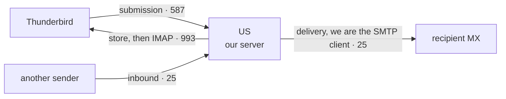

# Testing roadmap — from an SMTP-receiver suite to a whole-server test bed

This project builds a **modern, opinionated "SQLite of email"** — a heavily-tested mail server
in TypeScript that a person can spin up easily and use with existing clients (Thunderbird, Apple
Mail) to **send and receive** real mail. The design ethos (see also `docs/decisions/`):

- **TypeScript throughout; no large libraries for the actual mail work.** Protocol, parsing and
  crypto are hand-built on the byte layer — *bytes, never strings*.
- **SQLite for all storage.** Mailboxes, messages, IMAP state, the outbound queue, accounts.
- **Opinionated and modern.** We deliberately choose which spec corners to honour when it buys a
  cleaner solution, and we do **not** support every ancient server. Every such cut is a recorded
  decision (`§ Opinionated cuts` below), never blind omission.
- **Server minimal-first; test suite complete-first.** The server grows feature by feature
  through clean architecture. The *test bed* is built ahead of it — the SMTP-receiver suite
  existed before the server does. This document is the map of the rest.

## How the server actually works (why each harness exists)

A server Thunderbird can fully use plays four network roles plus a deliverability layer:

Thunderbird never talks SMTP to the world; it submits to us, and *we* relay outward as an SMTP
**client**. Reading mail is a different protocol entirely (IMAP). Every arrow, plus the message
bytes that flow along them and the auth that protects them, needs a test harness.

## The testing pattern (proven on the SMTP-receiver suite)

Each surface reuses the same spine that worked for RFC 5321:

1. **Requirement register** — every normative statement, verbatim-quoted, gated by a test that
   checks each quote against the vendored spec; tagged with RFC-2119 level and the bound party.
2. **Corpus** — test cases, each citing a RequirementId (compile-time traceable).
3. **Negative controls** — a defect model (mutant server / mutated input) proving each test
   *detects* its violation, not just passes. Coverage counts a test with no negative control as
   half-covered.
4. **Four-state outcome** — conformant / non-conformant / permitted-latitude / inconclusive.
5. **Calibration** — run against real independent implementations, triage every disagreement.

Two adapter shapes recur: a **network adapter** (drive a server over a socket — SMTP, IMAP) and
a **library adapter** (feed inputs to an in-process parser/engine — MIME, DKIM, address parsing).
The library-adapter areas define a thin interface the future implementation must satisfy, so the
corpus is server-agnostic and can exist before the code does.

---

## The map

Legend: **[have]** built · **[build]** must author · **[adopt]** vendor an existing suite ·
**[extend]** grows the existing SMTP suite.

### Tier 0 — done

| # | Area | Spec | Harness | Status |
|---|---|---|---|---|
| 1 | SMTP receiver conformance | RFC 5321 | network; register+corpus+mutant+calibration | **[have]** — calibrated vs Exim/mox/aiosmtpd, zero false positives |

### Tier 1 — the critical path to a working Thunderbird round-trip

| # | Area | Spec | Harness | Notes / opinionated lever |
|---|---|---|---|---|
| 2 | Submission + AUTH | RFC 6409, 4954, SCRAM 5802 | **[working — live submission AUTH over TLS]** SCRAM proof crypto landed (`src/auth/scram.ts`); message exchange + submission fix-up to come | AUTH mechanisms, STARTTLS-before-AUTH, submission fix-up (Date/Message-ID). **SCRAM proof crypto + message exchange landed:** the password-never-sent proof algebra (PBKDF2 → ClientProof/ServerSignature, server-side verify, pinned to the RFC 5802 §5 vectors, SHA-1 + SHA-256), AND the client-first/server-first/client-final message parsing with the nonce-continuation checks (client verifies the server nonce continues its own; server verifies the echoed nonce) that prevent splice/replay — each negative-controlled. **AUTH state machine landed** (`src/smtp/auth-state.ts`, RFC 4954 §4): AUTH-not-during-transaction, no-re-auth, and the opinionated no-plaintext-AUTH-without-TLS gate (ADR 0007), each negative-controlled. Still to build: SASLprep, the server-final message, wiring the state machine to a live submission server. *Lever: SCRAM-SHA-256 + PLAIN-over-TLS only; refuse plaintext AUTH.* |
| 3 | Outbound SMTP client / delivery | RFC 5321 (client half), 3464 (DSN) | **[PROVEN against real Gmail — the deployed daemon relayed a submission to gmail.com's MX and it was accepted (2026-07-16); IPv4-pinned, RFC 6409 fix-up]** reference delivery client + scriptable peer (`src/client/`) + live relay (`src/server/outbound.ts`); retry queue + DKIM-on-send to come | The sending leg. **Send-path core landed (ADR 0008):** a reference delivery client with switchable defects, driven against a scriptable peer, makes the client-binding requirements testable — 6 reclassified `not-testable`→`wire-client` (EHLO-preferred, HELO-fallback, CRLF-only, lock-step, terminating-dot, no-data-after-5yz), each negative-controlled. **Now assembled into a live relay:** `src/server/outbound.ts` snapshots real `node:dns` MX lookups into the tested `resolveMxHosts` ordering and delivers to the recipient MX; the submission handler routes remote recipients to it and local ones to the mailbox (`outbound.integration.test.ts` proves both, end to end through STARTTLS+AUTH). **Now complete:** a persistent SQLite retry queue with backoff and crash recovery (`relay-loop.ts` + `sqlite-queue.ts`), DKIM signing on the send path, outbound opportunistic STARTTLS with a plaintext fallback on handshake failure, null-MX (RFC 7505) permanent bounce, and full `multipart/report` bounce/DSN generation delivered to the sender (`bounce.ts`). 8BITMIME advertised. **DONE** — the whole send leg is live (Gmail accepts with DKIM/SPF/DMARC passing). |
| 4 | IMAP server | RFC 9051 (IMAP4rev2) | **[working — live IMAP + IMAPS: LOGIN/SELECT/FETCH/STORE/EXPUNGE/SEARCH/ENVELOPE]** reference response parser (`src/imap/response.ts`, `src/register/imap/`); **calibrated against Dovecot `imaptest`** (found + fixed a §7.4.1 cross-connection renumbering bug) | The read leg. **Both wire directions landed:** a reference response-line parser (tagged/untagged/continuation dispatch, the five status conditions, always-untagged PREAUTH/BYE, bracketed response codes) AND a command-line parser (strict spacing, tag/command/args, reserved-tag rejection, tag-reuse acceptance), and literal detection (synchronizing `{n}` vs non-synchronizing `{n+}`), each negative-controlled. Still to build: literal octet-reading + re-parse, mailbox state (SELECT/FETCH/SEARCH/STORE), and the curated extensions. *Lever (largest in the project): IMAP4rev2 + a curated few extensions (IDLE, MOVE, CONDSTORE, SPECIAL-USE); refuse the legacy long tail.* |
| 5 | Message format: RFC 5322 + MIME | RFC 5322, 2045-2049, 2047, 6532 | **[building]** reference parsers with switchable defects (`src/message/`) + **[adopt]** torture corpora to come | Foundational — every surface touches it. **Landed:** RFC 5322 §2.1/§2.2/§3.3/§3.4.1/§3.6 (structure, header-injection defence, date-time, addr-spec, field validation) RFC 2045 §4/§5/§6 (MIME-Version, Content-Type, Content-Transfer-Encoding — the MIME-confusion surface), RFC 2046 §5.1.1 (multipart boundary splitting — the boundary-confusion surface), and RFC 2047 §2/§5/§6.2 (encoded-word decoding — the header-confusion surface), each negative-controlled. **Torture corpus adopted:** `torture-corpus.test.ts` runs a vendored set of ~34 real-world-shaped nasty messages (deeply nested multiparts, malformed/missing boundaries, RFC 2047/2231 edge cases, 8-bit headers, bare CR/LF, empty parts) through the live parse + ENVELOPE/BODYSTRUCTURE serializers, asserting a defined outcome for each (parses, or is cleanly rejected — no throw, no malformed IMAP). The fixtures are byte-exact *derived equivalents* (the famous corpora have unclear licensing), each documenting the mode it models; the run was clean, confirming the existing fuzz/serializer hardening. Still to build: recursive part-header parsing / nested multipart in full, EAI/UTF-8 (6532). *Lever: parse modern strictly; reject rather than heroically repair, each rejection recorded.* |
| 5a | Address parsing | RFC 5321 §4.1.2, RFC 5322 §3.4 | **[have — isemail corpus adopted, validator tightened]** `address.ts` + `address.isemail.test.ts` | The "email address parsing is impossible" surface. **DONE:** the dominicsayers/isemail corpus (164 cases) is committed and partitioned as an oracle — all 66 `ISEMAIL_ERR` rejected (fixed 3 too-lenient gaps: domain-label LDH, quoted-string control/quoted-pair, address-literal dcontent), all VALID/DNSWARN/RFC5321 accepted, the obsolete tail (CFWS/DEPREC/RFC5322) deliberately rejected. Standalone (not on the live RCPT path, by choice). *Lever: accept the RFC-5321 mailbox grammar; reject the RFC-5322 exotica.* |

### Tier 2 — deliverability (so mail isn't silently junked)

| # | Area | Spec | Harness | Notes |
|---|---|---|---|---|
| 6 | SPF | RFC 7208 | **[building]** reference record parser + evaluator (`src/auth/spf.ts`, `src/register/auth/`); openSPF YAML suite (~200 cases) to adopt | Inbound sender check. **Foundation landed:** parse `v=spf1` records into ordered terms + evaluate with an injected match decision (no DNS yet), covering the version gate, left-to-right first-match, and qualifier semantics — each negative-controlled. **Inbound check wired (`auth/spf-check.ts`):** an async recursive evaluator — `a`/`mx`/`include`/`redirect` resolved over DNS, IPv4/IPv6 (and mapped `::ffff:`) CIDR matching, the §4.6.4 ten-lookup limit enforced, results in Authentication-Results. Macros are a deliberate safe non-match (never a false pass). **DONE** (openSPF vector adoption still nice-to-have). |
| 7 | DKIM | RFC 6376 | **[building]** verify path complete end-to-end (`src/crypto/dkim-*.ts`, `src/register/crypto/`); Ed25519 + signing direction to come | Sign outbound, verify inbound. **DKIM verify path complete end-to-end:** the four simple/relaxed canon algorithms (pinned to the RFC 6376 §3.4.5 vectors), the §3.5 tag-list parser (duplicate/required/unknown tags), the §3.7 body hash (real SHA-256 over the canon body vs `bh=`), and the §3.7-step-2 header hash + **RSA signature verification**, the §5 **signing (outbound) direction** — a signed message ROUND-TRIPS through the verifier — and **Ed25519** (RFC 8463), pinned to the §A vector (the public key derived from the published secret key equals the published one) with its own sign/verify round-trip — the `l=` body-length limit (with the §8.2 append-attack made visible), and the §3.6.1 **public-key record parser** (version discard + revocation, wired end-to-end: the key parsed from an RFC 8463 §A.2 record verifies a real Ed25519 signature) — all real `node:crypto`, all negative-controlled. **Inbound verification wired end-to-end (`server/dkim-inbound.ts`):** DNS key retrieval, all signatures verified (pass if any, RSA + Ed25519), the §5.4 From-must-be-signed check and §3.5 `x=` expiry — live-verified against the box's own published key. **DONE.** |
| 8 | DMARC | RFC 7489 | **[building]** reference record parser + alignment check (`src/auth/dmarc.ts`); policy-tree eval + PSL to come | Policy + SPF/DKIM **alignment**. **Foundation landed:** parse `v=DMARC1` records (required/ordered tags, unknown-tag tolerance, policy/mode extraction) + strict-vs-relaxed identifier alignment (Organizational Domain injected), each negative-controlled. **Inbound check wired (`server/dmarc-inbound.ts`):** DNS discovery with the §6.6.3 org-domain fallback, alignment against any passing DKIM `d=` or the SPF domain, and `sp=` for subdomains — result in Authentication-Results. **Now with the full embedded Public Suffix List** (`auth/public-suffix.ts`, passes the canonical suite) for org-domain, and **ENFORCEMENT** (ADR 0010): a `p=quarantine`/`p=reject` failure is filed to Junk (never hard-rejected), `pct` honored, `p=none` informational. **DONE.** Deliberately out: `rua`/`ruf` report emission (low value at personal scale). |
| 9 | ARC | RFC 8617 | **[have — inbound validation end-to-end + trusted-sealer DMARC override, ADR 0011]** `auth/arc.ts` (structure) + `crypto/arc-seal.ts`/`crypto/arc-ams.ts` (AS/AMS crypto) + `server/arc-inbound.ts` (§5.2 validator) + `testing/arc-sealer.ts` (test sealer) | Survives forwarding. **DONE (inbound):** the full §5.2 Validator Actions — collect sets, structure check, verify the newest AMS (body+headers) and every ARC-Seal N..1 (RSA **and** Ed25519), producing `cv` (none/pass/fail); all failures permanent (§5.2.1). The seal signing input (§5.1.1) reuses the RFC 6376-pinned `buildSigningInput`, so only the ARC header ordering is new — pinned by a **golden signing-input** test independent of the sign/verify round-trip. Wired into the daemon: `arc=<cv>` in Authentication-Results, and a **trusted-sealer override** of DMARC-to-Junk (ADR 0011) — a valid chain sealed by a listed forwarder is delivered to the INBOX; default-empty trust set = no behaviour change; trust only the outermost sealer (an attacker cannot forge a seal under a trusted key). **Deferred:** ARC *sealing* (we never forward), and the ValiMail `arc_test_suite` as an external vector pin (offline round-trip + golden bytes cover the scope; recorded nice-to-have). *Lever: **inbound only** — DKIM+SPF+DMARC remain the must-haves; ARC makes DMARC enforcement safe.* |

### Tier 3 — cross-cutting foundations (build alongside, test hard)

| # | Area | Spec | Harness | Notes / opinionated lever |
|---|---|---|---|---|
| 10 | TLS / transport security | RFC 3207, 8314, 8461, 7672 | **[working — STARTTLS (with injection defence) + IMAPS live on real sockets]** MTA-STS policy parser + MX matcher (`src/transport/mta-sts.ts`, `src/register/transport/`); STARTTLS (RFC 3207) already in the SMTP register; negotiation/downgrade tests to come | STARTTLS both ways, implicit TLS, cert lifecycle. **MTA-STS landed:** policy parse (version/mode gates) + the security-critical MX wildcard matcher (one left-most label only, RFC 8461 §4.1 examples), each negative-controlled. **Now with policy fetch/caching + ENFORCE** (`server/mta-sts-resolve.ts`): resolve the STS TXT id + a cert-validated HTTPS GET of the policy, cached per-id for max_age; an enforce policy restricts delivery to a policy-listed MX over a VALIDATED certificate (`deliver` `requireValidCert`), never downgrading to plaintext — live-verified against Gmail/Outlook. **DONE.** Deliberately out: TLS-RPT report emission (low value at personal scale). *Lever: **MTA-STS over DANE** — DANE needs DNSSEC validation Node does not provide.* |
| 11 | Storage (SQLite) | RFC 9051 §2.3.1.1 | **[working — real node:sqlite, durable across restart, wired to the live IMAP server]** reference mailbox model with UID semantics (`src/store/mailbox.ts`); SQLite backing + crash-recovery to come | Schema, crash consistency, concurrency, **IMAP UID monotonicity**, transaction integrity. **Semantics + real SQLite backing landed:** a reference in-memory mailbox pins the UID/flag/EXPUNGE/seq-number/UIDVALIDITY invariants (each negative-controlled), AND the **real `node:sqlite`-backed `SqliteMailbox`** implements them — validated DIFFERENTIALLY (one exercise sequence run against both; results must be identical), plus persistence across close/reopen and byte-exact BLOB storage. This is the "SQLite of email" made literal, zero external deps. **Crash consistency + WAL concurrency landed:** `sqlite-crash.integration.test.ts` SIGKILLs a child mid-workload and proves integrity + cross-table partition invariants on reopen; `sqlite-concurrency.integration.test.ts` drives two concurrent connections (real child processes) and proves no lost message / no UID collision / snapshot reads / convergent flag+expunge. That test **found a real bug**: the open path set WAL but no `busy_timeout`, so a second writer hit `SQLITE_BUSY` immediately — fixed with a shared `openMailDb()` (WAL + `busy_timeout=5000`) now used by both the daemon and the concurrency harness. Still nice-to-have: quotas, power-loss (vs process-crash) durability is a documented WAL trade-off, not a gap. |
| 12 | Queue / spool | RFC 5321 §4.5.4, 3464 | **[building]** reference queue with retry semantics (`src/store/queue.ts`); SQLite persistence + DSN + recovery to come | Persistence, retry scheduling, dead-letter, bounce, recovery-after-kill. Overlaps #3. **Retry semantics landed:** a reference queue (injected time) covering queue-and-retry, delayed backoff, permanent-bounce-not-retry, and the give-up window — each negative-controlled, citing the §4.5.4.1 client requirements the receiver suite can't observe. **SQLite persistence + crash-recovery landed** (`sqlite-queue.ts` — a message survives a restart mid-retry). **DSN generation (RFC 3464)** (`message/dsn.ts`) is now wrapped by `server/bounce.ts` into the full `multipart/report` bounce and delivered to the sender (never to a null return-path). **DONE**, including **dead-letter retention**: a message that exhausts retries (or hits a permanent error) is written to a `dead_letter` table in the same DB inside one transaction with its removal from the live queue — so a crash between the two cannot lose it — then bounced as before. A small operator API (`listDeadLetters`/`getDeadLetter`/`requeueDeadLetter`/`purgeDeadLetter`) allows inspection and re-queue (`dead-letter.test.ts`). |
| 13 | Accounts / auth backend | SCRAM | **[have — multi-account, ADR 0009; per-IP auth throttle]** `store/account-registry.ts` + `server/auth-throttle.ts` | **DONE:** a persistent SQLite account registry storing only SCRAM StoredKey/ServerKey (never the password — negative-controlled), plus per-user mail-DB routing; one SQLite database per user. **Brute-force throttle landed:** a per-source-IP sliding window (default 10 failures/15 min) shared across the IMAP LOGIN/AUTHENTICATE and submission AUTH paths — once over threshold, auth is refused without checking the password (no timing oracle, no SCRAM CPU) until the window drains; a success clears the IP. Deliberately **per-IP, not per-account** (a per-account lockout would let an attacker lock a victim out); the tracking map is bounded against an IP flood. |
| 14 | Fuzzing | — | **[build]** fuzz harness + corpora | The parsers (SMTP, MIME, IMAP, address) are the attack surface. Highest security ROI/hour. |
| 15 | End-to-end / interop / differential | — | **[build]** (started) | Full round-trip between two instances + a real MUA; differential vs real servers (begun: Exim/mox). |

## Opinionated cuts (recorded decisions — revisit only with a reason)

- **No POP3.** IMAP4rev2 serves every modern client; POP3 is a whole protocol + harness removed.
- **IMAP4rev2 only**, plus a curated extension set. The legacy IMAP extension long tail is refused.
- **MTA-STS, not DANE**, for outbound TLS policy (DNSSEC/DANE is impractical on Node).
- **Modern message parsing**: reject rather than repair ancient malformations; no source routes,
  no obscure MIME recovery. Each rejection is a register-recorded decision, not silent.
- **AUTH: SCRAM-SHA-256 + PLAIN-over-TLS only.** No CRAM-MD5, no plaintext AUTH, no NTLM.
- **ARC and Sieve deferred** to a later tier, not the minimum viable server.
- **JMAP** is a desirable later addition, not part of the minimum.

## Sequencing

- **Critical path to a demo round-trip:** Tier 1 (#2–#5) + minimal #10 (TLS) + minimal #11
  (storage). The smallest thing Thunderbird can send *and* read through.
- **Then deliverability** (Tier 2) so it works against Gmail/Outlook, not just itself.
- **Foundations** (Tier 3) grow underneath throughout.
- Harnesses are built **ahead of or alongside** their feature: the test bed leads, the server
  fills it in. "Test suite complete" and "server minimal" are not in tension.

## Status (2026-07-16): the test-bed-before-implementation phase is complete

Every pillar now has a **reference implementation with a negative-controlled corpus**, so the
test bed both specifies the server and provides the starting implementation of each piece.
`npm run registry` prints the live inventory (currently ~662 requirements across 6 domains from
18 RFCs). What is covered:

- **SMTP** — receiver conformance suite (socket, mutant-server) + outbound client harness
  (scriptable peer) + AUTH/SIZE decision logic.
- **Message/MIME** — RFC 5322 + MIME 2045/2046/2047 + DSN (3464), all the confusion surfaces.
- **IMAP (RFC 9051)** — responses, commands, literals, ENVELOPE, sequence-sets, SEARCH, and the
  full mailbox model (UID/UIDVALIDITY/flags/EXPUNGE/seq-numbers/read-only-session/INBOX-naming).
- **Crypto** — DKIM end-to-end both directions (canon → tags → body-hash/`l=` → RSA/Ed25519
  verify **and** sign → key records) and SCRAM (proof + messages + account storage), real
  `node:crypto` pinned to RFC vectors.
- **Auth** — SPF, DMARC, ARC (structure), SMTP-AUTH state machine.
- **Transport** — MTA-STS, SMTPUTF8, SIZE.
- **Storage / queue** — reference mailbox + account store + outbound retry queue.

## Status (2026-07-17): the real-world server is complete and deployed

The server the test bed specified now **runs, sends and receives real internet mail, and works
with real clients** — deployed on a public box, verified against Gmail and a real Thunderbird.
What the assembled daemon (`npm start`) does, all live-verified:

- **Receive** — live SMTP on 25: STARTTLS with the injection defence, SIZE (25 MiB, buffer-capped),
  8BITMIME, bare-CR/LF rejection (SMTP-smuggling defence), recipient validation (our domain only —
  no backscatter), mail-loop detection (Received count), an idle-connection timeout (slowloris),
  command-sequencing + control-octet validation (RFC 5321-conformant — the corpus run against the
  live server reports 61 conformant / **0 MUST-violations**, having found and fixed 5). Then it
  **authenticates the sender** — SPF + DKIM + DMARC verified over DNS and recorded in
  `Authentication-Results:` (forged results bearing our authserv-id stripped first) — before a
  `Received:` trace stamp and store.
- **Serve** — live IMAPS on 993 with the surface a real client uses (captured from Thunderbird):
  multi-folder catalog (CREATE/APPEND/COPY/MOVE/STATUS), FETCH incl. RFC822.HEADER
  and partial `<o.n>`, UID variants, STORE, SEARCH, EXPUNGE, **IDLE** (instant new mail), **UIDPLUS**,
  and **SPECIAL-USE** (RFC 6154 — the Sent/Drafts/Trash/Junk/Archive folders are provisioned and
  advertised, so a client files mail into them instead of inventing duplicates), plus **CONDSTORE**
  (RFC 7162 — a persisted per-message mod-sequence, HIGHESTMODSEQ on SELECT/STATUS, FETCH
  MODSEQ/CHANGEDSINCE, SEARCH MODSEQ, and STORE UNCHANGEDSINCE with the MODIFIED response for
  optimistic-concurrency flag edits) and **QRESYNC** (RFC 7162 §3.2 — a persisted expunge log lets
  SELECT (QRESYNC …) and UID FETCH VANISHED replay vanished UIDs + changed flags in one round-trip,
  the phone fast-reconnect). **Multi-connection sync** (RFC 9051 §7.4.1): two clients on one mailbox (a phone and a
  desktop) each learn what the other did — expunges, new mail, and flag changes propagate as untagged
  EXPUNGE/EXISTS/FETCH at a safe command boundary or live during IDLE. All live-verified against the
  box with two connections.
- **Send** — submission on 587 (SASL PLAIN over TLS): RFC 6409 fix-up → `Received:` → **DKIM** sign
  → persistent SQLite **retry queue** → relay to the MX over opportunistic STARTTLS, IPv4-pinned.
  Full **SPF + DKIM + DMARC** trifecta published and aligned; Gmail accepts on the primary MX.
- **Store** — `SqliteCatalog`/`SqliteMailbox` on `node:sqlite`, transactional writes, WAL journaling,
  differentially validated against the reference model, persistent across restart.
- **Robustness** — the internet-facing parsers are fuzzed (deterministic harness, ~30k adversarial
  inputs) and the command dispatch is crash-guarded; three memory-exhaustion DoS vectors
  (sequence-set range, APPEND literal, unterminated command line) found and closed.
- **Adversarial audit sweep** — every hostile-input subsystem (IMAP multi-connection sync, CONDSTORE/
  QRESYNC, inbound SMTP + SPF/DKIM/DMARC, outbound relay/queue/bounce, and the RFC 5322/MIME parsers)
  has had an independent adversarial correctness/security audit. Real bugs found and fixed with
  reproduce-first regression tests, e.g.: an `Authentication-Results` method-injection via MAIL FROM
  and two `stripOwnAuthResults` bypasses (forged auth verdicts under our authserv-id); a duplicate-`From`
  DMARC display-spoof; a TLS-handshake hang that could wedge the whole outbound queue; an MX SSRF to
  loopback/private targets; a cross-connection EXPUNGE-swallow desync; a quadratic FETCH-BODYSTRUCTURE
  CPU DoS; and an unbounded-RCPT memory DoS. The pattern — a fresh adversarial reviewer per subsystem —
  found defects that the passing suite and fuzzers had missed.
- **Federation** — two daemons exchange a signed, dual-`Received`-traced message end to end.

The IMAP server has now been calibrated against **Dovecot's `imaptest`** (built from vanilla
Dovecot 2.3.21 source; driven at a plaintext instance of our own server via
`src/testing/imap-plaintext-launcher.ts`). It found a real RFC 9051 §7.4.1 violation on the
first run — sequence numbers being renumbered across connections before the client was sent the
EXPUNGE — now fixed and re-verified clean under 5 concurrent clients (~12k mutations, zero
errors). See `reference-servers/CALIBRATION-imaptest.md`.

## Status (2026-07-17b): real-client milestone + a chosen feature/hardening slate

Apple Mail (macOS) has been driven end-to-end against the deployed server — connect (over
an IMAP4rev1+IMAP4rev2 CAPABILITY, both advertised for client compatibility), IDLE push,
send via Submission, STORE, and delete/EXPUNGE — the **#1 real-client milestone**. A slate
of chosen items then landed, each committed, and (where internet-facing) deployed and
live-verified:

- **Multi-account, one SQLite DB per user** (ADR 0009): a control DB (account registry +
  outbound queue) plus one `mail-<user>.db` per user; per-connection catalog resolution in
  IMAP; unknown local recipients rejected at RCPT (no catch-all); SCRAM-only credential
  registry — this closes the accounts/auth backend (#13). Isolation proven live.
- **Full Public Suffix List** for DMARC org-domain (#5a/#8): replaces the ccTLD heuristic;
  passes the canonical publicsuffix.org suite.
- **Inbound DMARC enforcement** (ADR 0010): a `p=quarantine`/`p=reject` failure is filed to
  Junk (never hard-rejected — no ARC, so a reject would lose forwarded mail), `pct` honored,
  `p=none` informational. Live-verified (a real `p=reject` spoof lands in Junk).
- **Address validator tightened** against the isemail corpus (#5a): all `ISEMAIL_ERR`
  rejected, all deliverable forms accepted; the obsolete tail (comments/folding/obs-*)
  deliberately rejected. (Standalone — still not on the live RCPT path, by choice.)
- **MTA-STS policy fetch/caching + enforce** (#10): validated-TLS-only delivery to a
  policy-listed MX, no plaintext downgrade; live-verified against Gmail/Outlook policies.

Opinionated cuts kept on purpose: no **DMARC `rua`/`ruf`** or **TLS-RPT** report emission
(low value at a personal server's scale), the standalone address validator kept off the live
RCPT path, and JMAP/Sieve/POP3/DANE (per ADR 0007). The server is feature-complete for the
stated vision: full send + receive with real clients (Apple Mail included), multi-account,
complete IMAP4rev2, and inbound + outbound email authentication with enforcement — all
deployed and live-verified.

## Status (2026-07-18): the remaining roadmap tail, worked measured against the mission

A pass to close the rest of the map, each item first justified against the mission (build
only what earns its place; record — don't silently skip — what does not). Landed:

- **ARC inbound verification (#9, ADR 0011)** — the flagship gap. DMARC enforcement (ADR
  0010) junks legitimate mailing-list mail; ARC is the mechanism that rescues it. Full §5.2
  validator (structure → newest AMS → every seal, RSA + Ed25519), `arc=<cv>` recorded, and a
  trusted-outermost-sealer override of DMARC-to-Junk (default-empty, so opt-in and safe).
  Proven by a golden signing-input pin + RSA/Ed25519 round-trips + a daemon integration test
  (trusted rescue to INBOX; untrusted and tampered both stay in Junk).
- **Storage WAL concurrency (#11)** — a concurrency harness that **found and fixed a real
  production bug**: WAL was set without a `busy_timeout`, so a second concurrent writer failed
  immediately. Shared `openMailDb()` now sets both.
- **Dead-letter retention (#12)** — give-up messages are retained transactionally (never lost
  on a crash between remove and retain) with an inspect/re-queue API; the bounce is unchanged.
- **Per-IP auth brute-force throttle (#13)** — across IMAP + submission, per-IP (not
  per-account, to avoid victim lockout), refusing over-threshold attempts without a password
  check.
- **External MIME torture corpus (#5)** — ~34 vendored real-world-shaped nasty messages run
  through the live parse + serialize path; clean, confirming the existing hardening.
- **Pre-existing `tsc` debt fixed** — 6 type errors the strip-types test runner never caught;
  the typecheck is now clean.

Recorded as **environment-blocked, not skipped** (verified this session, not assumed):

- **Postfix calibration of the receiver suite (#1).** Postfix is installed, but its `master`
  will not start as a non-root user in this sandbox (confirmed: no listener comes up). The
  SMTP receiver suite is already calibrated against **three** independent implementations —
  Exim, mox, aiosmtpd — with zero false positives; a 4th target is marginal value and not
  worth root-wrangling. Do when a root-capable environment is available.
- **Longer `imaptest` soak (#4).** The `imaptest` binary from the prior calibration is gone
  and rebuilding needs a full Dovecot-2.3.21 source compile (no Homebrew formula, Docker
  egress broken here). The IMAP server was already calibrated hard against it (~12k mutations,
  a real §7.4.1 bug found + fixed); a longer soak is marginal against that build cost.

Opinionated cuts re-affirmed against the mission (building them would be wasteful): **ARC
*sealing*** (we never forward — nothing to seal), **DMARC `rua`/`ruf` + TLS-RPT reporting**
(outbound scheduled-report machinery, ~zero value at personal scale), and **JMAP/Sieve/POP3/
DANE** (ADR 0007 — the modern-client round-trip is already met). Fuzzing (#14) already has
deterministic parser/socket/auth/CONDSTORE harnesses (~30k inputs); a continuous coverage-
guided corpus is a possible future addition, not a gap.
