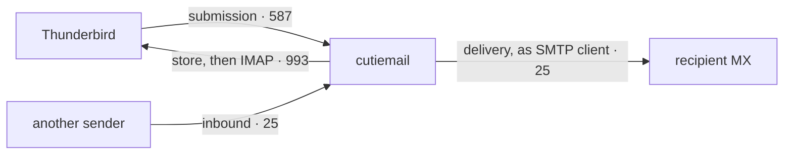

# How it's tested, and why that's trustworthy

Correctness is the point of this project, so the test bed is not an afterthought. For most of
the surfaces below it was built *before* the code it now verifies, and the server grew to fill
it in. Two disciplines run through everything:

- **Every conformance check is proven to detect its own violation.** Each check runs both ways:
  it must pass against a clean implementation *and* fail against one with exactly the defect it
  targets. A test never shown to fail is counted as half-covered, not covered.
- **Every claim traces to the spec.** Normative statements are quoted verbatim in a
  [requirement register](../src/register/) (a test checks each quote against the vendored RFC
  text), tagged with the RFC 2119 level and the party it binds.

## The four roles a mail server plays

A server Thunderbird can fully use plays four network roles, plus a deliverability layer, and
each arrow needs its own harness:

A mail client never talks SMTP to the world; it submits to its own server, which relays outward
as an SMTP **client**. Reading mail back is a different protocol entirely. The message bytes
that flow along the arrows, and the authentication that protects them, are surfaces of their
own.

## The pattern every surface follows

1. **Requirement register:** the spec's normative statements, verbatim, machine-checked
   against the vendored RFC.
2. **Corpus:** test cases, each citing a requirement ID (compile-time traceable).
3. **Negative controls:** a defect model (a mutant server, or mutated input) proving each test
   *detects* its violation.
4. **Four-state outcomes:** conformant / non-conformant / *permitted-latitude* / inconclusive.
   Most of RFC 5321 is SHOULD/MAY; a declined SHOULD is recorded latitude, not a failure, and
   only a violated MUST is a finding.
5. **Calibration:** run against real independent implementations, with every disagreement
   triaged to *our bug*, *our misreading*, or *a genuine divergence*.

Two adapter shapes recur: a **network adapter** (drive a server over a real socket: SMTP,
IMAP) and a **library adapter** (feed inputs to an in-process parser or engine: MIME, DKIM,
address parsing). The library-adapter corpora are server-agnostic, which is what allowed them
to exist before the server did.

## The map, surface by surface

### SMTP receiver: RFC 5321

The deepest harness: a full socket-driven conformance suite with a mutant server for negative
controls, **calibrated against Postfix, Exim, mox, and aiosmtpd with zero false positives** (the
divergences that surfaced are triaged and recorded in
[`reference-servers/`](../reference-servers/): all four honour bare-LF command terminators, a
widely-relaxed MUST NOT; Postfix was run vulnerable and hardened, and the suite flagged the
smuggling vectors on the first and cleared them on the second). The flagship coverage is the CRLF/SMTP-smuggling corpus and the RFC
3207 STARTTLS session-security class: pre-handshake injection, smuggle-into-TLS, post-handshake
reset. This suite doubles as a standalone tool you can point at any MTA:
[IMPLEMENTING-A-CONFORMANT-SERVER.md](IMPLEMENTING-A-CONFORMANT-SERVER.md).

The "no strict wire-testable MUST is a silent gap" invariant was widened to close a
category-shaped blind spot: it now also spans requirements that are testable *only with known
server state* (the `wire-with-fixture` kind). That exposed 57 strict MUSTs, now resolved as 13
authored / fixture-gated cases (3 new mutants prove they detect their own violation) plus 44
`deliberatelyUncovered` decisions recorded in the register. Live-receiver coverage was filled
in to match: `DATA` before `RCPT` => `503`, HELO fallback and `NOOP` pinned, multi-recipient
single-transaction delivery, and a non-ASCII (EAI) `MAIL FROM` / `RCPT TO` rejected `553 5.6.7`
because SMTPUTF8 is not advertised (ADR 0022, matching the conformance guide).

### Submission and authentication: RFC 6409, 4954, 5802

The SCRAM proof algebra (PBKDF2 → ClientProof/ServerSignature) is pinned to the RFC 5802 §5
test vectors, for both SHA-1 and SHA-256; the message exchange enforces the nonce-continuation
checks that prevent splice and replay. The AUTH state machine (`canAuth`) is now the single
source of truth wired into the production receiver, not a parallel model: it adds the
previously-missing no-AUTH-mid-transaction guard (RFC 4954 §4), and live-receiver tests pin
`AUTH LOGIN` / `CRAM-MD5` => `504`, a second `AUTH` => `503`, `AUTH` on the inbound listener =>
`504`, and a SASL cancel => `501`. Its checks: no-AUTH-mid-transaction, no re-auth, and the
deliberate no-plaintext-AUTH-without-TLS gate. Submission fix-up (missing
`Date`/`Message-ID`/`From`) is tested per RFC 6409, and **sender authorization** (an account
may only send as an address it owns) carries its own spoof-attempt corpus (ADR 0015).

### Outbound delivery: RFC 5321 (client half), 3464

Client-side requirements are unobservable from a receiver socket, so the harness inverts: a
reference delivery client with **switchable defects** is driven against a scriptable peer,
making the client-binding requirements (EHLO-preferred, HELO fallback, CRLF-only, lock-step
dialogue, terminating dot, no-data-after-rejection) testable and negative-controlled. On top of
that sit integration proofs for the real relay: MX resolution order with equal-preference
records shuffled (RFC 5321 §5.1 MUST), the persistent retry queue surviving a kill mid-retry,
opportunistic STARTTLS with downgrade rules, null-MX permanent bounce, and full
`multipart/report` DSN generation, now carrying `Diagnostic-Code` + `Remote-MTA` (sanitized,
RFC 3464 §2.3.6). The delivery-classification semantics (ADR 0023) each carry their own case:
**multi-MX outcome is worst-authoritative** (a `5yz` from a reachable MX stops the walk, but a
higher-preference transient failure is never overridden by a lower-preference stale `5yz`, so
deliverable mail is not bounced); a **post-DATA timeout is indeterminate** and defers as
transient with no next-MX resend (the duplicate guard); and a settle-failure after full
delivery never re-sends the delivered recipients. Transport-policy retention is proven too:
**MTA-STS keeps a cached enforce policy across a transient DNS TXT failure or an ambiguous
multi-record answer** (RFC 8461 §5.1 / §3.1), closing a TLS-downgrade hole, and enforce-mode
delivery has a positive control (a valid CA-chained name-matching cert delivers over TLS; a
wrong-name cert fails). The end-to-end proof is live: the reference deployment exchanges
authenticated mail with Gmail, SPF/DKIM/DMARC all passing.

### IMAP: RFC 9051

Both wire directions are parsed by tested reference parsers (response dispatch, command
grammar, synchronizing and non-synchronizing literals), and the full mailbox model (UIDs,
UIDVALIDITY, flags, EXPUNGE, sequence numbers, read-only sessions) is pinned by an
invariant suite. The server is **calibrated against Dovecot's `imaptest`**, which found a real
RFC 9051 §7.4.1 violation on its first run (sequence numbers renumbered across connections
before the client saw the EXPUNGE). It was fixed, then re-verified clean across ~12,000 mutations
with five concurrent clients ([`reference-servers/CALIBRATION-imaptest.md`](../reference-servers/CALIBRATION-imaptest.md)).
Multi-connection sync, CONDSTORE/QRESYNC semantics, and connection teardown each carry their
own regression suites.

The rev2 response and state details are pinned individually: **UIDVALIDITY is strictly
monotonic across delete+recreate** (a per-catalog high-water counter persisted in a
`catalog_meta` table in both the sqlite and memory backends, so a recreated mailbox never
reuses a prior incarnation's UID space, RFC 9051 §6.3.4); `* OK [CLOSED]` on every
deselect/switch plus the required untagged `LIST` in `SELECT` / `EXAMINE` (§6.3.2); `MOVE`
emits `* OK [COPYUID]` before the EXPUNGE / VANISHED (§6.4.8); after `ENABLE IMAP4REV2` a plain
`SEARCH` returns `ESEARCH` and a `RETURN` search always returns `ESEARCH` even on zero hits
(§6.4.4); `PERMANENTFLAGS` advertises `\*` and `FLAGS` lists the keywords in use (§7.1); mailbox
names are byte-transparent Net-Unicode with no mUTF-7 interpretation (ADR 0021); and a
hierarchy-child `CREATE` surfaces the missing parent as `(\NonExistent \HasChildren)` in a
`%`-walk rather than auto-creating it. The reject surface is pinned negatively: an unknown /
unsupported FETCH att (including `BINARY`) => `BAD`, a `VANISHED` FETCH modifier without
`ENABLE QRESYNC` => `BAD`, `RETURN (SAVE)` / `FETCH $` outside SEARCHRES scope => `BAD`, plus the
low-severity family (bare / malformed `UID EXPUNGE`, malformed FETCH set, `ENABLE` while
selected, `AUTHENTICATE` cancel/unsupported, `STATUS SIZE` / `RFC822.SIZE` value pins). The
IMAPS listener has a tight `handshakeTimeout` and destroys the socket on `tlsClientError` to
reclaim the slot, and the per-listener connection cap now carries a test.

### Message format: RFC 5322 + MIME (2045-2047)

Structure and header parsing, header-injection defence, date-time, addr-spec, MIME-Version /
Content-Type / Content-Transfer-Encoding (the MIME-confusion surface), multipart boundary
splitting (the boundary-confusion surface), and RFC 2047 encoded words (the header-confusion
surface), each negative-controlled. The parse-anomaly surface is pinned case by case: an RFC
5322 group address emits the RFC 9051 §7.5.2 ENVELOPE group markers (a start `(NIL NIL "name"
NIL)`, the members, an end `(NIL NIL NIL NIL)`) rather than corrupting the first mailbox or last
host; a Content-Transfer-Encoding other than `7bit` / `8bit` / `binary` on a `multipart` or
`message` composite type is flagged (RFC 2045 §6.4); a duplicate `Content-Transfer-Encoding` /
`MIME-Version` or a repeated boundary / charset parameter is flagged; an RFC 2047 encoded word
abutting non-LWSP text, or a B-word with invalid base64, is left literal and flagged (§5); a
header-count DoS is capped (`MAX_HEADERS` 1000, with a too-many-headers anomaly); and a
`message/rfc822` deep-nesting bomb has its own test. A **torture corpus** of ~34
real-world-shaped hostile
messages (deeply nested multiparts, malformed boundaries, 8-bit headers, bare CR/LF, empty
parts) runs through the live parse and the ENVELOPE/BODYSTRUCTURE serializers, asserting a
defined outcome for every message: it parses, or it is cleanly rejected. Never a crash, never
malformed IMAP output. The fixtures are byte-exact derived equivalents (the famous historical
corpora have unclear licensing), each documenting the failure mode it models.

### Address parsing: RFC 5321 §4.1.2, RFC 5322 §3.4

The "email address parsing is impossible" surface is pinned by the
[dominicsayers/isemail](https://github.com/dominicsayers/isemail) corpus, 164 cases
partitioned as an oracle: every `ISEMAIL_ERR` case rejected, every deliverable form accepted,
and the obsolete tail (comments, folding, `obs-*` grammar) deliberately rejected as a recorded
scope decision.

### SPF: RFC 7208

Record parsing into ordered terms, left-to-right first-match evaluation, qualifier semantics,
recursive `a`/`mx`/`include`/`redirect` resolution over DNS, IPv4/IPv6 (and mapped-IPv6) CIDR
matching, the §4.6.4 ten-lookup limit, and the §4.6.4 void-lookup limit (more than two
`a`/`mx`/`exists` queries resolving to no records => `permerror`). Macros are a deliberate safe
non-match, never a false pass.

### DKIM: RFC 6376, 8463

All four canonicalization algorithms pinned to the RFC 6376 §3.4.5 vectors; the tag-list
parser; the body hash against `bh=`; RSA and Ed25519 signature verification *and* signing, each
pinned to published RFC vectors and proven by round-trip; the `l=` body-length limit with the
§8.2 append attack made visible; the public-key record parser including revocation, the `i=`
within-`d=` constraint, and the `t=s` (exact-domain) / `t=y` (testing) flags (RFC 6376 §3.5 /
§3.6.1). Both the DKIM and ARC verifiers reject an RSA key under 1024 bits (RFC 8301 §3.2). On
the send path **`From` is oversigned** (listed in `h=` once more than it appears) so a
prepended-`From` replay breaks the signature (with a reproduce-first attack test), and signer
and verifier share one RFC 6376 §5.4.2 header selector, the same code ARC uses.

### DMARC: RFC 7489

Record parsing, strict and relaxed alignment, organizational-domain derivation via a fully
embedded Public Suffix List (it passes the canonical publicsuffix.org test suite), the §6.6.3
fallback, and `sp=` for subdomains. Three spoof / edge classes are pinned: a single-header
mailbox-list `From` (two addr-specs in one header) is treated as multi-author and fails to Junk,
the same hardening the outbound send-as gate uses; **multiple published DMARC records** =>
no policy applied (§6.6.3, never silently first-wins); and an IDN `From` is normalized to
A-labels before alignment (RFC 5890) so a U-label `From` aligns with an A-label `d=` / SPF
domain rather than false-failing. Enforcement is tested end to end: a `p=quarantine` /
`p=reject` failure is filed to Junk (never hard-rejected, so forwarded mail is not lost),
with `pct` honoured (ADR 0010).

### ARC: RFC 8617

The full §5.2 validator: chain structure, the newest AMS over body and headers, and every seal
back to the first, RSA and Ed25519, producing `cv=` with all failures permanent. The seal
signing input is pinned by a golden-bytes test independent of the sign/verify round-trip. The
one behavioural consumer (a **trusted-sealer override** that rescues a DMARC-failed but
validly-ARC-sealed message from a forwarder you explicitly trust) is integration-tested in
the daemon: trusted chains reach the inbox, untrusted and tampered chains stay in Junk
(ADR 0011).

### Transport security: RFC 3207, 8461

STARTTLS with the command-injection defence in both directions (the pre-handshake plaintext
buffer is discarded), the STARTTLS `TLSSocket` now under a handshake deadline, and MTA-STS end
to end: policy parsing, the security-critical one-label wildcard MX matcher (the RFC 8461 §4.1
examples), HTTPS policy fetch with per-id caching, and enforce-mode delivery restricted to a
policy-listed MX over a validated certificate, never a plaintext downgrade. Two additions close
a downgrade hole: a cached **enforce** policy is retained across a transient DNS TXT failure or
an ambiguous multi-record answer (§5.1 / §3.1), and enforce-mode delivery now has a positive
control (a valid name-matching cert delivers over TLS, a wrong-name cert fails), so the path is
proven to deliver, not only to refuse.

### Storage: SQLite

The semantics are pinned twice. A reference in-memory mailbox carries the invariant suite; the
real `node:sqlite`-backed store is then validated **differentially**: one exercise sequence
runs against both implementations and the results must be identical, so persistence can never
silently change the semantics. Crash consistency is proven by SIGKILLing a child process
mid-workload and checking integrity and cross-table invariants on reopen; WAL concurrency by
driving two real OS processes against one database (a harness that found a real bug: WAL
enabled without `busy_timeout`, failing a second concurrent writer instantly). Message storage
is byte-exact, proven by round-trip. A full **backup -> restore round-trip** is tested against a
real `startServer` boot (byte-exact FETCH after restore, queue and dead-letter rows surviving),
including the missing-mailbox-file variant (an account whose mailbox DB is absent from the
snapshot restores as an empty mailbox, not a failed restore); `verify` WARNs on a stale
`.db-wal` sidecar beside a snapshot (a restore hazard, advisory, never a failure); a disk-full
`SQLITE_FULL` on the append / enqueue path is proven atomic (no half-stored row, no reused UID);
and `doctor --store` runs `PRAGMA quick_check` over the control DB and every mailbox DB
(read-only, safe against a live daemon), negative-controlled by corrupting a b-tree page.

### Queue, bounces, dead letters: RFC 5321 §4.5.4, 3464

Retry semantics under injected time (backoff, permanent-failure-no-retry, the give-up window),
persistence across a kill mid-retry, DSN generation wrapped into full `multipart/report`
bounces (never to a null return path, so bounces cannot loop), and **transactional dead-letter
retention**: a message that exhausts retries moves to the dead-letter table in the same
transaction that removes it from the live queue, so no crash window can lose it.

### Accounts and abuse controls

The account registry stores only SCRAM `StoredKey`/`ServerKey`. A negative-controlled test
proves the password itself is never persisted. Authentication sits behind a per-IP
sliding-window brute-force throttle shared by IMAP and submission; over the threshold, auth is
refused without touching the password (no timing oracle). Deliberately per-IP rather than
per-account, so an attacker cannot lock a victim out of their own mailbox.

### Fuzzing and hostile-input review

The internet-facing parsers (SMTP, MIME, IMAP, address) run under deterministic fuzz harnesses
(~30,000 generated inputs), and every hostile-input subsystem has been security-reviewed with a
**reproduce-first regression test** for each defended attack. Among them: forged
`Authentication-Results` injection and strip-bypasses, a duplicate-`From` DMARC display spoof,
a TLS-handshake hang that could wedge the outbound queue, MX-record SSRF to loopback and
private targets, a cross-connection EXPUNGE desync, a quadratic `BODYSTRUCTURE` CPU blow-up,
and an unbounded-RCPT memory exhaustion. These are defects a passing conformance suite and a
fuzzer would both miss.

### End to end

Two daemon instances exchange a signed, dual-`Received`-traced message over real sockets;
real clients (Thunderbird and Apple Mail, desktop and phone) have been driven against a live
deployment through connect, IDLE push, send, flag changes, and delete/EXPUNGE; and the
[performance rigs](PERFORMANCE.md) double as robustness proofs under load.

## Opinionated cuts

Deliberate scope decisions, recorded so they are never mistaken for gaps (the full ledger with
reasons is in [BACKLOG.md](BACKLOG.md) and [the decision records](decisions/0000-about-these-decisions.md)):

- **No POP3.** IMAP4rev2 serves every modern client; POP3 is a whole protocol and harness
  bought for nothing.
- **IMAP4rev2 with a curated extension set** (IDLE, MOVE, UIDPLUS, SPECIAL-USE, CONDSTORE,
  QRESYNC; an `IMAP4rev1` capability is advertised for client compatibility). The legacy
  extension long tail is refused.
- **MTA-STS, not DANE:** DANE needs DNSSEC validation Node's resolver doesn't provide.
- **Modern message parsing:** reject rather than heroically repair; every rejection is a
  register-recorded decision.
- **SCRAM-SHA-256 and PLAIN-over-TLS only.** No CRAM-MD5, no plaintext AUTH, no NTLM.
- **ARC sealing not built:** this server never forwards, so there is nothing to seal;
  verification is the whole useful surface.
- **JMAP:** modern and desirable, but additive; the modern-client round-trip is already met
  without it.

## What's still open

The open test-bed items (adopting the openSPF vector suite, a longer `imaptest` soak, and an
optional OpenSMTPD calibration target) live in [BACKLOG.md](BACKLOG.md) with their reasons and
their blockers, alongside the one correctness follow-up the 2026-07-21 coverage
audit left open: the `RENAME INBOX` target draws its UIDVALIDITY from INBOX's own value rather
than the monotonic counter, so a rename onto a previously-deleted name could reuse a lower
validity (narrow, scoped for a follow-up).
