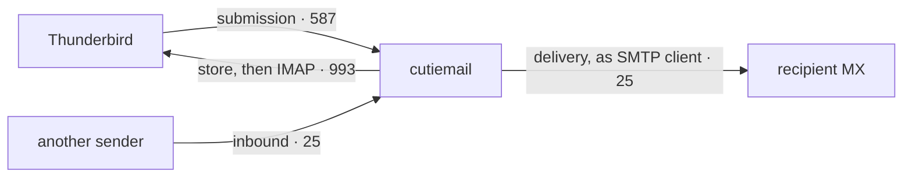

# How it is tested, and why that is trustworthy

Correctness is the point of this project, so the test bed is not an afterthought. The test bed
for most of the surfaces below was built *before* the code it now verifies, and the server grew
to fill it. Two disciplines apply to everything:

- **Every conformance check is proven to detect its own violation.** Each check runs both ways.
  It must pass against a clean implementation *and* fail against one with exactly the defect it
  targets. A test never shown to fail counts as half-covered, not covered.
- **Every claim traces to the spec.** A [requirement register](../src/register/) quotes each
  normative statement verbatim (a test checks each quote against the vendored RFC text), and
  tags it with the RFC 2119 level and the party it binds.

## The four roles a mail server plays

A server that Thunderbird can fully use plays four network roles plus a deliverability layer.
Each arrow needs its own harness:

```mermaid
flowchart LR
    TB["Thunderbird"]
    US["cutiemail"]
    MX["recipient MX"]
    SENDER["another sender"]

    TB -->|"submission · 587"| US
    US -->|"delivery, as SMTP client · 25"| MX
    SENDER -->|"inbound · 25"| US
    US -->|"store, then IMAP · 993"| TB
```

A mail client never speaks SMTP to the world. It submits to its own server, which relays outward
as an SMTP **client**. To read mail back is a different protocol entirely. The message bytes
that flow along the arrows, and the authentication that protects them, are surfaces of their
own.

## The pattern every surface follows

1. **Requirement register:** the spec's normative statements, verbatim, machine-checked
   against the vendored RFC.
2. **Corpus:** test cases, each citing a requirement ID (compile-time traceable).
3. **Negative controls:** a defect model (a mutant server, or mutated input) that proves each
   test *detects* its violation.
4. **Four-state outcomes:** conformant / non-conformant / *permitted-latitude* / inconclusive.
   Most of RFC 5321 is SHOULD/MAY. A declined SHOULD is recorded latitude, not a failure, and
   only a violated MUST is a finding.
5. **Calibration:** run against real independent implementations, with every disagreement
   triaged to *our bug*, *our misreading*, or *a genuine divergence*.

Two adapter shapes recur: a **network adapter** (drive a server over a real socket: SMTP,
IMAP) and a **library adapter** (feed inputs to an in-process parser or engine: MIME, DKIM,
address parsing). The library-adapter corpora are server-agnostic, which is what let them
exist before the server did.

## The map, surface by surface

### SMTP receiver: RFC 5321

The deepest harness is a full socket-driven conformance suite with a mutant server for negative
controls. It is **calibrated against Postfix, Exim, mox, and aiosmtpd with zero false positives**
(the divergences that surfaced are triaged and recorded in
[`reference-servers/`](../reference-servers/): all four honour bare-LF command terminators, a
widely-relaxed MUST NOT). Postfix was run vulnerable and hardened, and the suite flagged the
smuggling vectors on the first and cleared them on the second. The flagship coverage is the CRLF/SMTP-smuggling corpus and the RFC
3207 STARTTLS session-security class: pre-handshake injection, smuggle-into-TLS, post-handshake
reset. This suite also serves as a standalone tool you can point at any MTA:
[IMPLEMENTING-A-CONFORMANT-SERVER.md](IMPLEMENTING-A-CONFORMANT-SERVER.md).

The project widened the "no strict wire-testable MUST is a silent gap" invariant to close a
category-shaped blind spot. The invariant now also spans requirements that are testable *only
with known server state* (the `wire-with-fixture` kind). That exposed 57 strict MUSTs, now
resolved as 13 authored / fixture-gated cases (3 new mutants prove they detect their own
violation) plus 44 `deliberatelyUncovered` decisions recorded in the register. Live-receiver
coverage now matches and covers these cases: `DATA` before `RCPT` => `503`, HELO fallback and
`NOOP` pinned, multi-recipient single-transaction delivery, and a non-ASCII (EAI) `MAIL FROM` /
`RCPT TO` rejected `553 5.6.7` because SMTPUTF8 is not advertised (ADR 0022, matching the
conformance guide).

### Submission and authentication: RFC 6409, 4954, 5802

A test pins the SCRAM proof algebra (PBKDF2 → ClientProof/ServerSignature) to the RFC 5802 §5
test vectors, for both SHA-1 and SHA-256. The message exchange enforces the nonce-continuation
checks that prevent splice and replay. The AUTH state machine (`canAuth`) is now the single
source of truth wired into the production receiver, not a parallel model. It adds the
previously-missing no-AUTH-mid-transaction guard (RFC 4954 §4). Live-receiver tests pin
`AUTH LOGIN` / `CRAM-MD5` => `504`, a second `AUTH` => `503`, `AUTH` on the inbound listener =>
`504`, and a SASL cancel => `501`. A SASL response that the server cannot base64-decode (a
non-alphabet octet, or a `=` anywhere but the end) draws `501 5.5.2` per RFC 4954 §4. This is
distinct from the `535` that a decodable-but-wrong credential gets, so a client with a broken
encoder does not cause a new password prompt to the user. Its checks: no-AUTH-mid-transaction,
no re-auth, and the deliberate no-plaintext-AUTH-without-TLS gate. A test covers submission
fix-up (missing `Date`/`Message-ID`/`From`) per RFC 6409, and **sender authorization** (an
account may only send as an address it owns) carries its own spoof-attempt corpus (ADR 0015).

### Outbound delivery: RFC 5321 (client half), 3464

Client-side requirements are unobservable from a receiver socket, so the harness inverts. The
harness drives a reference delivery client with **switchable defects** against a scriptable
peer. This makes the client-binding requirements (EHLO-preferred, HELO fallback, CRLF-only,
lock-step dialogue, terminating dot, no-data-after-rejection) testable and negative-controlled.
Integration proofs for the real relay sit above that: MX resolution order with equal-preference
records shuffled (RFC 5321 §5.1 MUST), the persistent retry queue that survives a kill
mid-retry, opportunistic STARTTLS with downgrade rules, null-MX permanent bounce, and full
`multipart/report` DSN generation, which now carries `Diagnostic-Code` + `Remote-MTA`
(sanitized, RFC 3464 §2.3.6). The delivery-classification semantics (ADR 0023) each carry their
own case. **Multi-MX outcome is worst-authoritative**: a `5yz` from a reachable MX stops the
walk, but a lower-preference stale `5yz` never overrides a higher-preference transient failure,
so the relay does not bounce deliverable mail. A **post-DATA timeout is indeterminate** and
defers as transient with no next-MX resend (the duplicate guard). A settle-failure after full
delivery never re-sends the delivered recipients. A test also proves transport-policy retention.
**MTA-STS keeps a cached enforce policy across a transient DNS TXT failure or an ambiguous
multi-record answer** (RFC 8461 §5.1 / §3.1), which closes a TLS-downgrade hole. Enforce-mode
delivery has a positive control: a valid CA-chained name-matching cert delivers over TLS, and a
wrong-name cert fails. The end-to-end proof is live. The reference deployment exchanges
authenticated mail with Gmail, and SPF/DKIM/DMARC all pass.

### IMAP: RFC 9051

Tested reference parsers parse both wire directions (response dispatch, command grammar,
synchronizing and non-synchronizing literals). An invariant suite pins the full mailbox model
(UIDs, UIDVALIDITY, flags, EXPUNGE, sequence numbers, read-only sessions). The server is
**calibrated against Dovecot's `imaptest`**, which found a real RFC 9051 §7.4.1 violation on
its first run (sequence numbers renumbered across connections before the client saw the
EXPUNGE). The project fixed it, then re-verified it clean across ~12,000 mutations with five
concurrent clients ([`reference-servers/CALIBRATION-imaptest.md`](../reference-servers/CALIBRATION-imaptest.md)).
Multi-connection sync, CONDSTORE/QRESYNC semantics, and connection teardown each carry their
own regression suites.

Tests pin the rev2 response and state details individually. **UIDVALIDITY is strictly
monotonic across delete+recreate**: a per-catalog high-water counter persists in a
`catalog_meta` table in both the sqlite and memory backends, so a recreated mailbox never
reuses a prior incarnation's UID space (RFC 9051 §6.3.4). The server sends `* OK [CLOSED]` on
every deselect/switch, plus the required untagged `LIST` in `SELECT` / `EXAMINE` (§6.3.2).
`MOVE` emits `* OK [COPYUID]` before the EXPUNGE / VANISHED (§6.4.8). After `ENABLE IMAP4REV2`,
a plain `SEARCH` returns `ESEARCH`, and a `RETURN` search always returns `ESEARCH` even on zero
hits (§6.4.4). `PERMANENTFLAGS` advertises `\*`, and `FLAGS` lists the keywords in use (§7.1).
Mailbox names are byte-transparent Net-Unicode with no mUTF-7 interpretation, and CREATE/RENAME
refuse a denormalised 8-bit name (RFC 9051 §5.1, ADR 0021). A hierarchy-child `CREATE` surfaces
the missing parent as `(\NonExistent \HasChildren)` in a `%`-walk rather than auto-create it.
Tests pin the reject surface negatively. An unknown / unsupported FETCH att (including `BINARY`)
=> `BAD`, a `VANISHED` FETCH modifier without `ENABLE QRESYNC` => `BAD`, and `RETURN (SAVE)` /
`FETCH $` outside SEARCHRES scope => `BAD`. A malformed or `$` sequence-set on `STORE` and
`COPY`/`MOVE` => `BAD` (the same §9 guard that FETCH carries, so the server never answers a
no-op `OK`). An unknown or empty `STATUS` data item — and the same inside
`LIST RETURN (STATUS …)` — => `BAD`. The low-severity family also applies (bare / malformed
`UID EXPUNGE`, malformed FETCH set, `ENABLE` while selected, `AUTHENTICATE` cancel/unsupported,
`STATUS SIZE` / `RFC822.SIZE` value pins). The IMAPS listener has a tight `handshakeTimeout` and
destroys the socket on `tlsClientError` to reclaim the slot, and the per-listener connection cap
now carries a test.

### Message format: RFC 5322 + MIME (2045-2047)

Structure and header parsing, header-injection defence, date-time, addr-spec, MIME-Version /
Content-Type / Content-Transfer-Encoding (the MIME-confusion surface), multipart boundary
splitting (the boundary-confusion surface), and RFC 2047 encoded words (the header-confusion
surface), each negative-controlled. Tests pin the parse-anomaly surface case by case. An RFC 5322 group address emits the RFC 9051
§7.5.2 ENVELOPE group markers (a start `(NIL NIL "name" NIL)`, the members, an end
`(NIL NIL NIL NIL)`) rather than corrupt the first mailbox or last host. A header-less part
defaults to `text/plain`, except inside a `multipart/digest`, where RFC 2046 §5.1.5 makes it
`message/rfc822` (reported with its ENVELOPE and nested structure, not as a plain-text leaf). A
`FETCH BODY[n.1]` then navigates that part's encapsulated sub-parts the way BODYSTRUCTURE
advertises them: the `message/rfc822` level collapses, so `BODY[n.1]` is the encapsulated
message's first part (RFC 9051 §6.4.5), a differential that a client fetching an advertised leaf
would otherwise hit. The parser flags a Content-Transfer-Encoding other than
`7bit` / `8bit` / `binary` on a `multipart` or `message` composite type (RFC 2045 §6.4). The
parser flags a duplicate `Content-Transfer-Encoding` / `MIME-Version`, or a repeated boundary /
charset parameter. If an RFC 2047 encoded word abuts non-LWSP text, or is a B-word with invalid
base64, the parser leaves it literal and flags it (§5). The parser caps a header-count DoS
(`MAX_HEADERS` 1000, with a too-many-headers anomaly). A `message/rfc822` deep-nesting bomb has
its own test. A **torture corpus** of ~34 real-world-shaped hostile messages (deeply nested
multiparts, malformed boundaries, 8-bit headers, bare CR/LF, empty parts) runs through the live
parse and the ENVELOPE/BODYSTRUCTURE serializers. It asserts a defined outcome for every
message: the message parses, or the server cleanly rejects it. Never a crash, never malformed
IMAP output. The fixtures are byte-exact derived equivalents (the famous historical corpora have
unclear licensing), and each one documents the failure mode it models.

### Address parsing: RFC 5321 §4.1.2, RFC 5322 §3.4

The [dominicsayers/isemail](https://github.com/dominicsayers/isemail) corpus pins the "email
address parsing is impossible" surface with 164 cases partitioned as an oracle: the suite
rejects every `ISEMAIL_ERR` case, accepts every deliverable form, and deliberately rejects the
obsolete tail (comments, folding, `obs-*` grammar) as a recorded scope decision.

### SPF: RFC 7208

Record parsing into ordered terms, left-to-right first-match evaluation, qualifier semantics,
recursive `a`/`mx`/`include`/`redirect` resolution over DNS, IPv4/IPv6 (and mapped-IPv6) CIDR
matching, the §4.6.4 ten-lookup limit, and the §4.6.4 void-lookup limit (more than two
`a`/`mx`/`exists` queries that resolve to no records => `permerror`), and the §4.3
initial-processing rule (a malformed or single-label `<domain>` => `none` immediately, not the
`temperror` the resolver would otherwise return for an unqueryable name). Macros are a
deliberate safe non-match, never a false pass.

### DKIM: RFC 6376, 8463

Tests pin all four canonicalization algorithms to the RFC 6376 §3.4.5 vectors. They also cover
the tag-list parser and the body hash against `bh=`. RSA and Ed25519 signature verification
*and* signing are each pinned to published RFC vectors and proven by round-trip. The `l=`
body-length limit test makes the §8.2 append attack visible. A tag-spec with no `=` separator is
refused rather than salvaged (§3.2). The signature's `x=` must exceed its `t=` when both are
present (§3.5). The public-key record parser covers revocation, the `i=` within-`d=` constraint,
the `t=s` (exact-domain) / `t=y` (testing) flags, and the `s=` service-type gate (the server
does not use a key whose service list names neither `email` nor `*` for mail) (RFC 6376 §3.5 /
§3.6.1). Both the DKIM and ARC verifiers reject an RSA key under 1024 bits (RFC 8301 §3.2). On
the send path the signer **oversigns `From`** (lists it in `h=` once more than it appears), so a
prepended-`From` replay breaks the signature (with a reproduce-first attack test). The signer
and verifier share one RFC 6376 §5.4.2 header selector, the same code that ARC uses.

### DMARC: RFC 7489, and the parts of RFC 9989 that replace it

Record parsing, strict and relaxed alignment, organizational-domain derivation via a fully
embedded Public Suffix List (it passes the canonical publicsuffix.org test suite), and `sp=` for
subdomains. Tests pin three spoof / edge classes. The server treats a single-header mailbox-list `From` (two
addr-specs in one header) as multi-author and fails it to Junk, the same hardening that the
outbound send-as gate uses. **Multiple published DMARC records** => no policy applied (§6.6.3,
never silently first-wins). The server normalizes an IDN `From` to A-labels before alignment
(RFC 5890), so a U-label `From` aligns with an A-label `d=` / SPF domain rather than false-fail.
Tests cover enforcement end to end. The server files a `p=quarantine` / `p=reject` failure to
Junk (never hard-rejected, so the server does not lose forwarded mail) and honours `pct`. The
server files a `p=reject` failure to Junk even for the pct-*unsampled* share, which RFC 7489
§6.6.4 treats as `quarantine` rather than as no policy (ADR 0010).

Policy discovery follows RFC 9989 §4.10 rather than 7489's single jump to the organizational
domain. The tests cover the part that is easy to get backwards: where both an intermediate name
and the apex publish a record, §4.10.2 selects the one with the *fewest* labels, not the most
specific. That test kills a mutant that walks most-specific-first. The tests also pin these
cases. A record at the Author Domain costs exactly one query and outranks every ancestor. The
ordinary two-label sender still costs the two lookups it always did. A 202-label `From` stays
inside §4.10's eight-query budget. `t=y` demotes the policy one level, while `t=n`, `t=yes`,
`t=Y` and an empty value all leave it unchanged — only a literal `y` disarms enforcement. The
deliberate gaps (`np`, `psd`, tree-walk alignment) are ADR 0027, not oversights.

Tests exercise the author extractor against the grammar rather than against the common case,
because that gap was a live bypass. `victim@bank.com,` (obs-mbox-list),
`Accounts: victim@bank.com;` (group syntax, RFC 6854) and `victim@bank .com` (obs-domain CFWS)
are all one mailbox to a compliant parser, and all render as the plain address. Each one now
runs end to end against a domain that publishes `p=reject`, to prove that the server files it to
Junk. A `From` that yields no queryable domain at all is a failure rather than an absence of
policy. The previous behaviour handed the most malformed input the most lenient outcome. Per RFC
9989 §11.5, the server evaluates every author domain with the strictest failing policy in
control, and bounds both the domain count and the total lookups. §11.5 notes in the same breath
that unbounded evaluation is its own denial of service.

### ARC: RFC 8617

The full §5.2 validator covers chain structure, the newest AMS over body and headers, and every
seal back to the first, for RSA and Ed25519. It produces `cv=` with all failures permanent. A
golden-bytes test pins the seal signing input, independent of the sign/verify round-trip. An
integration test in the daemon covers the one behavioural consumer: a **trusted-sealer override**
that rescues a DMARC-failed but validly-ARC-sealed message from a forwarder you explicitly trust.
Trusted chains reach the inbox, and untrusted and tampered chains stay in Junk (ADR 0011).

### Transport security: RFC 3207, 8461

This surface covers STARTTLS with the command-injection defence in both directions (the server
discards the pre-handshake plaintext buffer), the STARTTLS `TLSSocket` now under a handshake
deadline, and MTA-STS end to end. MTA-STS coverage includes policy parsing (including the §3.2
ABNF rule that an `enforce`/`testing` policy that lists no `mx` is invalid, so it falls back to
opportunistic TLS rather than refuse every host and stop all mail — `mode: none` may omit `mx`),
the security-critical one-label wildcard MX matcher (the RFC 8461 §4.1 examples), HTTPS policy
fetch with per-id caching, and enforce-mode delivery restricted to a policy-listed MX over a
validated certificate, never a plaintext downgrade. Two additions close a downgrade hole. The
server retains a cached **enforce** policy across a transient DNS TXT failure or an ambiguous
multi-record answer (§5.1 / §3.1). Enforce-mode delivery now has a positive control (a valid
name-matching cert delivers over TLS, a wrong-name cert fails), so a test proves the path can
deliver, not only refuse.

### Storage: SQLite

Two mechanisms pin the semantics. A reference in-memory mailbox carries the invariant suite. A
**differential** validation then checks the real `node:sqlite`-backed store: one exercise
sequence runs against both implementations, and the results must be identical, so persistence
can never silently change the semantics. A test proves crash consistency: it SIGKILLs a child
process mid-workload, then checks integrity and cross-table invariants on reopen. Another test
proves WAL concurrency: it drives two real OS processes against one database. That harness found
a real bug — WAL enabled without `busy_timeout`, which failed a second concurrent writer
instantly. Message storage is byte-exact, and a round-trip proves it. A test covers a full
**backup -> restore round-trip** against a real `startServer` boot (byte-exact FETCH after
restore, queue and dead-letter rows that survive), including the missing-mailbox-file variant (an
account whose mailbox DB is absent from the snapshot restores as an empty mailbox, not a failed
restore). `verify` WARNs on a stale `.db-wal` sidecar beside a snapshot (a restore hazard,
advisory, never a failure). A test proves a disk-full `SQLITE_FULL` on the append / enqueue path
is atomic (no half-stored row, no reused UID). `doctor --store` runs `PRAGMA quick_check` over
the control DB and every mailbox DB (read-only, safe against a live daemon), and a corrupted
b-tree page is the negative control.

### Queue, bounces, dead letters: RFC 5321 §4.5.4, 3464

This surface covers retry semantics under injected time (backoff, permanent-failure-no-retry,
the give-up window), persistence across a kill mid-retry, and DSN generation wrapped into full
`multipart/report` bounces (never to a null return path, so bounces cannot loop) with the
REQUIRED per-recipient fields — `Final-Recipient`, `Action`, and `Status` (RFC 3464 §2.3.6) —
each one negative-controlled by an omit defect. It also covers **transactional dead-letter
retention**: a message that exhausts retries moves to the dead-letter table in the same
transaction that removes it from the live queue, so no crash window can lose it. The relay drains
the queue one message body at a time (a deep backlog of large messages cannot hold every body in
memory at once). The same injected clock that drives the reference queue drives the relay.

### Accounts and abuse controls

The account registry stores only SCRAM `StoredKey`/`ServerKey`. A negative-controlled test
proves the registry never stores the password itself. Authentication sits behind a per-IP
sliding-window brute-force throttle that IMAP and submission share. Over the threshold, the
server refuses auth without touching the password (no timing oracle). The throttle is
deliberately per-IP rather than per-account, so an attacker cannot deny a victim access to the
victim's own mailbox.

### Fuzzing and hostile-input review

The internet-facing parsers (SMTP, MIME, IMAP, address) run under deterministic fuzz harnesses
(~30,000 generated inputs). A security review covered every hostile-input subsystem, with a
**reproduce-first regression test** for each defended attack. These attacks include forged
`Authentication-Results` injection and strip-bypasses, a duplicate-`From` DMARC display spoof,
a TLS-handshake hang that could wedge the outbound queue, MX-record SSRF to loopback and
private targets, a cross-connection EXPUNGE desync, a quadratic `BODYSTRUCTURE` CPU blow-up,
and an unbounded-RCPT memory exhaustion. A passing conformance suite and a fuzzer would both
miss these defects.

A sixth review found the same shape a sixth time, and by now it is the most useful thing this
codebase knows about itself: **a rule applied on one path and not on its structural twin.** Thirteen
of that run's twenty-one findings were that. The two worst were cases where the flag already
existed and simply was not consulted again. First, `STARTTLS` was gated on whether TLS was
*configured* rather than *active*, so one unauthenticated connection could nest TLS sockets until
the stack overflowed and destroyed the whole daemon. Second, `LOGIN`/`AUTHENTICATE` stayed
reachable once authenticated, which kept the previous account's mailbox open while revocation began
to evaluate the new login, so `account disable` and a password rotation both stopped reaching the
session.

The same run made the point that **lenient parsing and correct parsing are not the same thing**.
Three `From` headers that RFC 5322 and RFC 6854 plainly permit — a trailing comma, group syntax,
CFWS inside the domain — produced "domains" that no resolver would accept, so policy discovery
failed, the verdict degraded to `temperror`, and the server never applied a published `p=reject`.
The more mangled the header, the more lenient the handling. Tests now pin every one of those forms
end to end, and the extractor parses the grammar it always claimed to model.

A later review added a second theme: a *bound* can be as dangerous as a missing one when it
degrades silently. A header-section cap made the parser stop reading, so authentication decided
a padded message had no `From`, while the server served the client the real one — a DMARC bypass
built from a DoS fix. The project has defended that now, along with an unbounded outbound write
and receive buffer, an MTA-STS policy read that applied its size cap only after it buffered the
whole body, a cached transport-security policy that a single forged DNS answer could evict,
revocation that never reached a session in IDLE, a shared upload budget one account could take
whole, and remote text that reached an operator's terminal unsanitised in the conformance tool.

**The project found and fixed three flaky tests alongside those**, none of them related to a
finding. Two raced a fixed `setTimeout` against work they should have waited for — a child
process's first write, and an outbound queue that drained after the recipient had already stored
the message, which necessarily happens later. Both now wait for the condition they actually mean.
The third was a set of wall-clock parse bounds tight enough to fail whenever the suite's other
files were busy. Each of those tests already had a deterministic assertion beside it (an anomaly
recorded, a value bounded by its cap), so the clock is now a loose second opinion rather than the
thing it asserts. A test that fails for a reason other than the defect it targets costs the same
as one that cannot fail at all: both teach you to stop reading the result.

### Self-update: ADR 0025

The updater downloads and then runs code, so the tests treat both halves as hostile input. The git
wire protocol (pkt-line framing, protocol v2 advertisement, packfile and delta decoding, object
ids) runs against a fake server that emits real encodings, and every malformed shape is a refusal
rather than a truncation: a delta with no base, a copy past the end of its base (including a high
copy-offset byte, which is a refusal rather than a raw `RangeError`), a decompression bomb, a pack
that promises more objects than it carries, and a small pack whose deltas would inflate past an
aggregate byte cap. The checkout refuses traversal, `.git` in any case, symlink and gitlink modes,
and a tree of more than `maxDirs` directories, and it leaves no partial tree when it refuses. Tests
cover provenance from both ends. The updater refuses a rewritten branch and a deployment older than
the fetch depth with *different* reasons, because "someone force-pushed" and "you are very far
behind" need different answers.

A candidate built to fail that rung and no other then tests each ladder rung: a missing
load-bearing module, a checkout of the wrong project, a version that demands a newer Node, a module
the runtime cannot parse, a candidate that cannot start, and one that breaks a conformance
requirement the running version satisfies. The snapshot layer has its own tests. The layer refuses
a control copy with any account that still points at live data, rather than use it. A test proves
the census comparison catches every way a migration can lose or alter data, credential material
included. A test drives the cutover through an injected service seam — a drain that never finishes,
a version that will not start, one that fails its probe, one that dies inside the probe window, and
an interruption on either side of the symlink move.

A fifth audit then found two of those rungs that reported success but did not establish what their
own text claims, which is the failure mode that matters most for a safety mechanism. Rung 4 said
"N modules load" after it imported one, because the sweep it spawns ends with `process.exit(0)`,
and a module that calls the same thing at import time ended the sweep early with status 0. Rung 6a
said "everything intact" while it compared only mailbox identity and message bytes, so a migration
that emptied every flag, zeroed every internal date and reset the catalog high-water marks produced
no findings. Both rungs now check what they claim. The sweep records progress to a file that the
parent reads, and the census covers flags, dates, the expunge journal and the marks that govern
identifiers not yet allocated.

The test that should have caught the first is worth recording, because it looked exactly like a
guard: `assert.ok(result.modules > 150, 'the whole tree was swept, not a corner of it')`. That count
is the number of modules *found*, not imported. It read 226 while the sweep imported four.

None of that could establish the thing that actually mattered, and the subsystem is the project's
sharpest example of why: the pre-flight *spawns* the candidate itself, so it has no systemd sandbox,
no second user, no polkit, and no real database checkpointed underneath it. A run against a
real deployment found nine defects that the whole suite missed, each a property of the machine
rather than of the code. That produced a rule the ladder now rests on: **a pre-flight check must
be able to fail for a reason CI could not have caught**. The rule removed the candidate's own test
suite from the ladder (rungs 1 and 2 already prove the checkout is byte-identical to a tested
commit), and added the rung that asks whether the *running* version can still read what the
candidate migrated. The defect list, the deliberate failure drills, and what each says about where
to look next are in [BACKLOG.md](BACKLOG.md#closed-what-a-live-self-update-test-found).

The same rule caught a further gap in the mail-path rung, and this one is the sharpest illustration
of why a green ladder is not evidence on its own. That rung delivers to the account itself, and the
server signs a submitted message only on the copy bound for a *remote* domain — so the signer never
ran, and the rung's configuration made that worse rather than better. Key material that the updater
could not read had its environment variable deleted, which disabled signing entirely and moved
TLS to the bundled-certificate branch instead of the one that reads a file. A candidate that
stopped signing altogether therefore passed every rung, the cutover probe, and the watch window,
because none of those can tell a healthy daemon from a healthy daemon that sends unsigned mail. The
negative control is a copy of this checkout with the signing call replaced by a pass-through, and
the mail-path rung must refuse it with `NO DKIM-Signature` — a test that fails against the ladder as
it stood. Unreadable keys now substitute stand-ins rather than disable the feature. A test checks a
second probe message to a reserved remote domain, in the queue it is held in, for a signature that
carries the expected domain and selector.

### End to end

Two daemon instances exchange a signed, dual-`Received`-traced message over real sockets. Real
clients (Thunderbird and Apple Mail, desktop and phone) ran against a live deployment through
connect, IDLE push, send, flag changes, and delete/EXPUNGE. The
[performance rigs](PERFORMANCE.md) also serve as robustness proofs under load.

## Opinionated cuts

Deliberate scope decisions, recorded so they are never mistaken for gaps (the full ledger with
reasons is in [BACKLOG.md](BACKLOG.md) and [the decision records](decisions/0000-about-these-decisions.md)):

- **No POP3.** IMAP4rev2 serves every modern client. POP3 is a whole protocol and harness
  bought for nothing.
- **IMAP4rev2 with a curated extension set** (IDLE, MOVE, UIDPLUS, SPECIAL-USE, CONDSTORE,
  QRESYNC — the server also advertises an `IMAP4rev1` capability for client compatibility). The
  server refuses the legacy extension long tail.
- **MTA-STS, not DANE:** DANE needs DNSSEC validation that Node's resolver does not provide.
- **Modern message parsing:** reject rather than heroically repair. Every rejection is a
  register-recorded decision.
- **SASL PLAIN over TLS on the wire. SCRAM-SHA-256 for credential storage.** The server
  advertises only the `AUTH=PLAIN` mechanism, and only after STARTTLS. SCRAM-SHA-256 is the
  storage/verification scheme (StoredKey/ServerKey, the password never persisted), not a wire
  mechanism. No CRAM-MD5, no plaintext AUTH without TLS, no NTLM. (SCRAM on the wire is an
  ADR 0007 revisit item, not yet built.)
- **ARC sealing not built:** this server never forwards, so there is nothing to seal.
  Verification is the whole useful surface.
- **JMAP:** modern and desirable, but additive. The project already meets the modern-client
  round-trip without it.

## What is still open

The open test-bed items (adoption of the openSPF vector suite, a longer `imaptest` soak, and an
optional OpenSMTPD calibration target) live in [BACKLOG.md](BACKLOG.md) with their reasons and
their blockers. The correctness follow-ups the earlier coverage audits left open — the
`RENAME INBOX` target's UIDVALIDITY and the MTA-STS empty-`mx` policy — are now closed
(see [BACKLOG.md](BACKLOG.md)). The correctness/usability/security queue is empty again.
