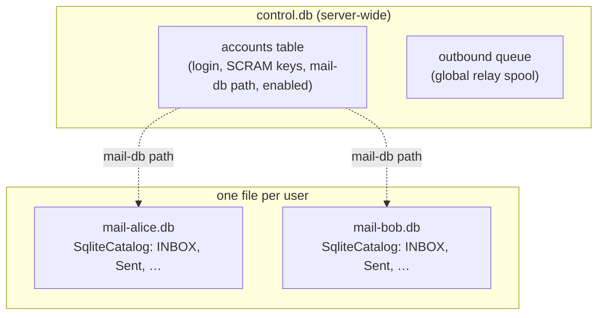

# 0009. Multi-account: one SQLite database per user

## Status

Accepted (2026-07-17).

## Context

Until now the server has run a **single hardcoded account**: `startServer` opens one
`mail.db`, builds one `SqliteCatalog`, and every inbound message and local submission
lands in that one catalog's INBOX. `AccountStore` holds credentials in memory, re-seeded
from config on each boot. The IMAP server takes one fixed catalog at construction and
serves it to whoever logs in.

That is the right *minimum* for proving the protocols, but it is not the product. The
north star (ADR 0007) is a **modern "SQLite of email"** a
person spins up and uses, which means more than one mailbox. This ADR records
how multi-account is added, and the one strong opinion behind it: **one SQLite
database file per user, if it can be done cleanly**. A user then *is* a file you
can back up, move, or delete, which is the most literal expression of the "SQLite of
email" idea.

## Decision

### Storage: a control-plane DB + one mail DB per user



- **`control.db`**: a small server-wide database holding the **account registry** (the
  persistent form of `AccountStore`: login name, SCRAM salt/iterations/hash/StoredKey/
  ServerKey, the path to that user's mail DB, and an `enabled` flag) **and the global
  outbound queue**. The queue stays server-global (one relay identity, one spool) with
  each row already carrying its return-path; per-user queues would buy nothing here.
- **`mail-<user>.db`**: one file per user, each a `SqliteCatalog` with today's exact
  schema (mailboxes, messages, flags, modseq, expunge log). No schema change: the
  per-user DB is byte-for-byte what a single-account `mail.db` is today. Isolation is
  physical: a user's data is one file, reachable only through their authenticated
  session.

### Identity

The **login name stays the bare username** (e.g. `test`), not the full address: an
already-configured client authenticates with the bare username, and changing that would break
its saved account.

The registry maps `login → {credential, mailDbPath, enabled}`, and delivery matches the
address `login@domain` to the same account. (A future multi-domain story can widen the
key; not now.)

### The IMAP change: per-connection catalog resolution

The IMAP server currently binds one `#catalog` at construction. It gains an **optional
account resolver**:

```
resolveAccount?: (login: string) => { catalog: ServableCatalog; notifier?: MailboxNotifier } | undefined
```

- When a resolver is supplied, a successful `LOGIN`/`AUTHENTICATE` resolves the
  authenticated user's `{catalog, notifier}` and binds them **for that connection only**;
  every mailbox operation on the connection runs against that catalog.
- When no resolver is supplied (the shape **every existing test uses**), the server keeps
  its single fixed catalog and behaves exactly as before. This preserves all 777 tests
  and is the seam that keeps the change bounded.

`#verifySaslPlain` is refactored to return the authenticated **username** (or null) rather
than a bare boolean, so the AUTHENTICATE path can resolve the account too.

### Notifications scoped per user

`MailboxNotifier` keys listeners by mailbox name (`INBOX`). With multiple users that would
cross the streams: Bob's new mail must not wake Alice's IDLE. Each user gets **their own
notifier** (resolved alongside their catalog), so an `INBOX` notification is inherently
scoped to one user. No change to `MailboxNotifier` itself; we simply hold one per user.

### Delivery routing

- **Inbound (port 25):** `acceptRecipient` accepts `local@domain` **only if `local` is a
  known, enabled account; an unknown local recipient is rejected** (`550`, no catch-all).
  A message to N local recipients is appended to each
  recipient's own INBOX and each user's notifier fired.
- **Submission (587):** local recipients are delivered to their account's INBOX (not one
  shared mailbox); remote recipients queue to the global spool as today.
- **Bounces:** a bounce for a local sender lands in that sender's INBOX; otherwise it
  relays with a null return-path, unchanged.

### Passwords

The registry persists **only SCRAM stored keys** (never the password), reusing the
existing `AccountStore` derivation, the accounts/auth backend the multi-account design
needs. Brute-force lockout remains a recorded later nice-to-have.

### Migration

An existing single-account `mail.db` becomes that user's mail DB: the registry seeds the
account with its `mailDbPath` pointed at the existing file. **No data loss, and no re-sync
for an already-connected client.**

## Consequences

- **Verification is owned by this change.** The design is only sound if each of these holds,
  so each is proven:
  1. **Isolation**: a session authenticated as A cannot LIST/SELECT/FETCH/STATUS any of
     B's mailboxes or messages; a negative control proves the test detects a leak.
  2. **Concurrency**: many users connected at once, *and* multiple sessions for one user
     (phone + desktop on a single per-user DB), exercised via the imaptest launcher;
     no cross-user contamination, WAL holds.
  3. **Crash consistency**: the existing SIGKILL crash test, extended so each per-user DB
     stays independently consistent and the registry survives.
  4. **Differential**: the per-user `SqliteCatalog` still passes the reference-vs-SQLite
     differential harness (unchanged schema, just one file each).
  5. **Live**: multiple real accounts provisioned and each driven with a real IMAP client;
     isolation and per-user delivery verified end to end.
- Config grows from `{user, pass}[]` to accounts that may name a mail-DB path (default
  `mail-<login>.db` beside the control DB).
- The single-catalog `ImapServer.start(catalog, …)` signature is retained (the resolver
  is additive), so this is not a rewrite of the IMAP server, only a new seam.
- Revisitable, like every ADR, with a stated reason.

## Outcome

Built and verified against the five obligations above. Two points are worth recording beyond
"it passed":

- **Crash consistency was deliberately not given a new test.** Each per-user database is the
  *identical* `SqliteCatalog` + WAL already proven to survive `kill -9`; the multi-account layer
  changes no storage internals, so a new multi-DB crash test would pass for a reason already
  covered, against the project's "no test that passes for the wrong reason" rule. The control
  database's registry durability is proven by its own close/reopen test.
- **Isolation carries a negative control**: a deliberately mis-wired resolver leaks, proving the
  isolation test can detect a leak.

Verified end-to-end with a real IMAP client: separate accounts served concurrently, each user's
mail delivered only to their own mailbox, and a pre-existing single-account database migrated in
place with no data loss and no client re-sync. Unknown local recipients are rejected `550` at RCPT.
