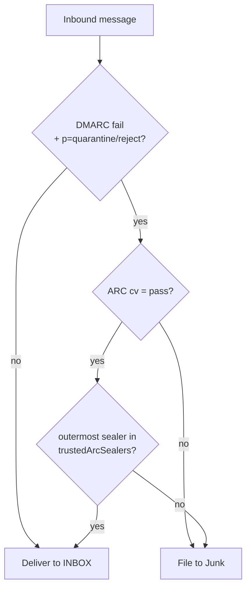

# 0011 — ARC inbound verification with a trusted-sealer DMARC override

## Status

Accepted (2026-07-18). Un-defers the inbound half of ARC that ADR 0007 parked and ADR
0010 flagged as "the concrete thing that would justify un-deferring it."

## Context

ADR 0010 made cutiemail enforce inbound DMARC by filing failures to Junk. That is correct
for spoofs, but it has a known cost: a mailing list (or any forwarder) rewrites a message —
appends a footer, tags the subject — which breaks the author's DKIM signature, and the
list's own SMTP source is not in the author's SPF. The message now fails DMARC through no
fault of the author, and lands in Junk. ARC (RFC 8617) exists precisely for this: each
intermediary seals, into headers, the authentication result it observed *before* it modified
the message, plus a signature over the message as it forwarded it. A receiver that trusts the
forwarder can believe that sealed result and deliver normally.

The crypto foundations were already present — chain-structure validation (`auth/arc.ts`) and
AMS-RSA verification (`crypto/arc-ams.ts`). What was missing was the ARC-Seal, Ed25519, the
full §5.2 validator, and — the real question — *what to do with a valid chain*.

## Decision

**Evaluate ARC on every inbound message and record `arc=<cv>` in `Authentication-Results`.
Additionally, override the DMARC-to-Junk decision — delivering to the INBOX — when the chain
is valid AND its outermost sealer is one the operator has explicitly listed as trusted.**

- **The `cv` is always recorded, the override is opt-in.** `trustedArcSealers` defaults to
  empty, so ARC changes *nothing* about delivery until an operator names a forwarder they
  trust (e.g. a specific mailing list). Recording the verdict is standard and safe; acting on
  it is a deliberate local-policy decision, exactly as RFC 8617 §5.2 says it must be.
- **Trust is placed only in the OUTERMOST sealer** — the intermediary that handed the message
  directly to us. This is the security crux. A `cv=pass` on its own means only that *some*
  chain is intact and sealed by *someone*; an attacker can build a chain claiming the origin
  passed and seal it with their own valid key. What makes ARC safe is trusting a specific
  sealing domain, and an attacker cannot forge a seal under a trusted domain's key. Their own
  outer seal would carry their own `d=`, which is not trusted — so a spoof cannot ride in.
- **Validation is faithful to §5.2 and fails closed.** Structure (continuous 1..N, one of each
  field, `cv` discipline), the newest AMS over the body, then every seal N..1. All failures
  are permanent (§5.2.1): a DNS miss, a parse error or a bad signature all yield `cv=fail`,
  never a retry, and a failed chain is treated as no chain.
- **The ARC-Seal signing scope reuses the DKIM machinery.** `buildSealInput` is the RFC 6376
  §3.7-step-2 rule (`buildSigningInput`) applied to the ARC header ordering; the only new
  logic is that ordering, pinned by a golden signing-input test independent of the round-trip.

### What stays deferred

- **ARC sealing (the outbound/forwarding half).** cutiemail is a final-delivery server; it
  does not forward, so it has nothing to seal. A test-only sealer (`testing/arc-sealer.ts`)
  exists to drive the validator and stands as a reference should sealing ever be needed.
- **The ValiMail `arc_test_suite` as an external vector pin.** The offline proof here is a
  self-sealing RSA + Ed25519 round-trip plus a golden signing-input assertion; the
  canonicalization underneath is already pinned to the RFC 6376 vectors elsewhere. Adopting
  ValiMail's cases would be a nice extra cross-check (the repo could not fetch it cleanly at
  build time); recorded as a future nice-to-have, not a correctness gap.

## Consequences

- DMARC enforcement is now safe to leave on without silently junking legitimate mailing-list
  mail — the operator opts a trusted list in and its mail reaches the INBOX, spoofs do not.
- The default remains behaviourally identical to before (empty trust set), so no existing
  deployment changes until it is configured.
- `arc=pass/fail/none` now appears in `Authentication-Results` for every inbound message,
  transparent to the reading client.
- Revisitable with a stated reason, like every ADR.
