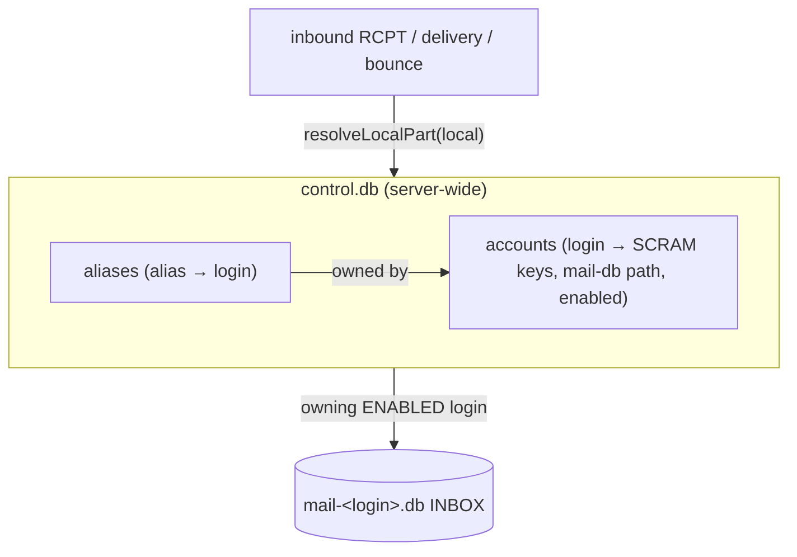

# 0014. Aliases and subaddressing

## Status

Accepted (2026-07-19).

## Context

Since ADR 0009 an account is one login = one address = one SQLite file. That is the right
minimum, but a mailbox you actually use needs to answer to more than one address: a role
address (`sales@`, `support@`, `postmaster@`) that lands in a person's inbox, a second
personal address (`j.smith@` as well as `jamie@`), and per-service tagged addresses
(`jamie+github@`) for filtering and leak-detection. All three are the same underlying idea:
*an address that is not the login, but delivers to the login's mailbox*.

The north star (ADR 0007) is a mail server a person spins up and **uses**, and this is one
of the sharpest edges between "proves the protocols" and "usable". The constraint the design
must not break is ADR 0009's invariant: **a user is still one file** you can back up, move,
or delete. Aliases must not become per-alias mailboxes or hidden state.

## Decision

### An alias is control-plane routing, not identity or storage

An alias is a row in the control database mapping an address's local-part to an owning
login. It adds **no** per-user storage: mail to an alias lands in the owner's existing
mailbox database. So a user is still exactly one file; the alias is a pointer in
`control.db`, backed up with it automatically.



An alias is **not** an identity:

- **You cannot log in as an alias.** Authentication (SCRAM) is keyed on the login only; an
  alias has no credential. `jamie+github@` and `sales@` are ways to *reach* a mailbox, not
  ways to *be* one.
- **You cannot (yet) send as an alias.** See the deferral below.

### One resolution chokepoint

All address→account resolution already flows through a single function
(`loginForLocalAddress`: RCPT acceptance, inbound delivery, and bounce-to-a-local-sender).
Aliases and subaddressing are added *there* (`registry.resolveLocalPart(local)`), so every
path honours them identically and none can drift. Precedence, all case-insensitive:

1. an exact **login** match →  that account;
2. an exact **alias** match → its owning login;
3. a **subaddress** `base+tag` → `base` resolved as a login or alias (one `+`, tag discarded).

In every case the owning account must be **enabled**; a disabled owner resolves to nothing
and the recipient is rejected at RCPT (550), exactly as a disabled login is, no catch-all,
no backscatter (ADR 0009 preserved).

### Subaddressing (`+`) is on by default: an opinion

`jamie+anything@` delivering to `jamie` is a hallmark of a modern mailbox (Gmail, Fastmail),
and it is safe here: the base must still be a real login or alias, so it opens no catch-all.
It is worth the one opinion. Consequently `+` is **reserved**: it is not a legal character in
a login (already true) or an alias, so a literal `a+b` address can never exist to be shadowed
by the subaddress rule. The tag is delivered as-is to the one INBOX; per-tag filing into
folders is a future concern (it wants a rules/Sieve layer, out of scope here).

### Aliases normalise to lower-case; logins keep their case

A login is an identity and preserves the case it was created with (ADR 0012). An alias is a
delivery address, and RFC 5321 §2.4 leaves local-part case to the destination (which is us),
so aliases are stored lower-cased and matched case-insensitively. This makes the alias the
PRIMARY KEY (uniqueness is the table constraint) and removes a class of "why didn't `Sales@`
work" confusion.

### Uniqueness spans both namespaces

An address resolves to at most one account, so the login and alias namespaces are checked
together: `alias add` refuses an address equal (case-insensitively) to any login or existing
alias, and (the easy-to-miss direction) `account add` / `init` refuse a login that collides
with an existing alias. A name is a login or an alias, never both.

### CLI

```
account alias add <login> <local-part>   # e.g. account alias add jamie sales
account alias remove <local-part>
account alias list [<login>]
```

The argument is a bare local-part (like a login), not a full address: the domain is the
server's `MAIL_DOMAIN`, and requiring `@domain` would only invite a foreign-domain typo the
CLI cannot check. `account list` shows each account's aliases inline. Changes are live:
the daemon resolves per RCPT, so a new alias receives immediately, no restart (ADR 0012).

### Deferred, deliberately: sending *as* an alias

Using an alias (or another account's address) as the `From` on submission is **out of scope
here** and recorded as the next decision, because it is a *sender-authorization* change wearing
a routing feature's clothes:

- Submission today does not check that `From` matches the authenticated user at all: any
  authenticated user can already send as any address. "Granting" an alias send-rights is
  meaningless until that gate exists.
- Submission should verify `From`'s local-part is the authenticated login *or one of its
  aliases*, over our own domain. That closes the multi-account cross-account spoof
  (submission never checked `From`; see ADR 0015) **and** enables legitimate send-as in one
  stroke. But it is a security-policy decision that deserves its own ADR and its own live
  deliverability re-validation, not a rider on this one.

An alias that only receives is complete and useful on its own (role addresses forward, tagged
addresses filter); this ADR ships that, and names send-as as the deliberate follow-up.

## Consequences

- A person can give their mailbox as many addresses as they like without another database,
  and ADR 0009's "a user is a file" holds unchanged.
- The accept surface widens only to explicitly-created aliases plus subaddresses of real
  addresses, never to an unknown recipient, so the no-backscatter property is intact.
- There is no `alias`-owns-a-mailbox concept to later regret: an alias is always a pointer,
  and removing it never touches mail.
- The next step is scoped and written down (submission sender-authorization / send-as), and
  the cross-account-spoof concern has a concrete home (ADR 0015).
