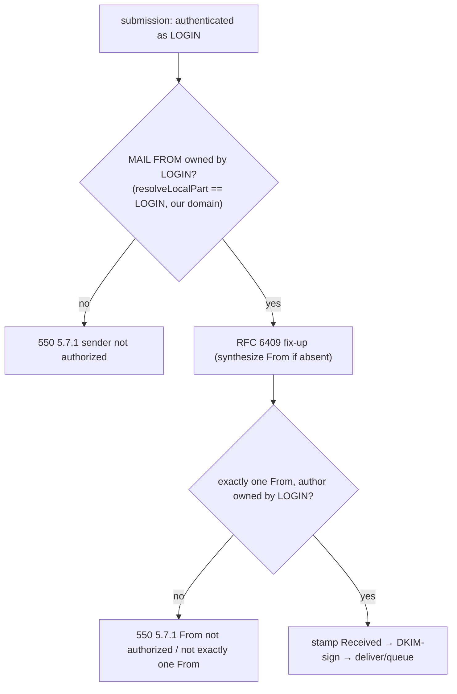

# 0015 — Submission sender-authorization (send-as)

## Status

Accepted (2026-07-19). The deliberate follow-up named in [ADR 0014](0014-aliases-and-subaddressing.md),
and it closes the cross-account spoof that [ADR 0009](0009-multi-account-per-user-database.md)'s
multi-account model left open.

## Context

Two things were true after aliases (ADR 0014) shipped, and together they were a hole:

1. **Aliases only *received*.** You could give your mailbox the address `sales@`, but you
   still had to *send* as your login. Sending as an alias — the obvious other half — was
   explicitly deferred to here.
2. **Submission never checked `From`.** The submission handler authenticated the user, then
   relayed whatever `From:` and `MAIL FROM` the client supplied. Any authenticated account
   could put *any* address in `From` — including **another local account's** (alice sending as
   bob), the cross-account spoof — and DKIM would then sign it with our key and Gmail would
   accept it as us. At personal scale the blast radius is small, but it is a real
   authorization gap, and it is the same change that enables legitimate send-as. One decision
   settles both.

The north star (ADR 0007) is a server a person *uses* with real clients; "send as the
addresses I own" is table stakes, and "don't let one account impersonate another" is
correctness.

## Decision

### An authenticated user may send only AS an address they own

At the submission chokepoint, before any routing, signing, delivery, or relay, require:

- the **envelope `MAIL FROM`** is an address the authenticated login owns; and
- the message carries **exactly one `From:` header** (RFC 5322 §3.6.1), whose author address
  the authenticated login **also** owns.

"Owns" is exactly the ADR 0014 routing relation, read in reverse: the address resolves — as a
login, an alias, or a `base+tag` subaddress, case-insensitively, on our domain — to the
authenticated login. It reuses the *same* `registry.resolveLocalPart` chokepoint that inbound
RCPT uses, so "who may I send as" and "who may receive here" can never drift apart. A
violation is a **permanent 550**, not a transient error — it is a policy no, not a "try again".

### The `From:` author is parsed spoof-hardened, and by the same code as DMARC

The author address is extracted with the display-name-decoy defence DMARC already uses (strip
comments and quoted-strings, take the **last** angle-addr — so `From: "x <a@evil>"
<victim@bank>` is judged as `victim@bank`, the address the MUA shows). This logic now lives in
one shared extractor (`src/message/from-author.ts`) that **both** inbound DMARC alignment and
this gate call. If send-as and DMARC parsed `From` differently, an address one blessed could
be a different one the other aligns — the divergence-by-two-implementations bug this project
rejects on principle. Unifying them also means the existing DMARC spoof-regression corpus now
guards the send-as parse for free.

### Why the check is *after* the RFC 6409 fix-up

A client that omits `From` entirely gets one synthesized from the (already-authorized)
envelope sender, so it passes as an owned single `From`. Checking before the fix-up would
reject those clients for a header the submission service is meant to add for them.

### Why the envelope MUST be owned too, and single-domain only

The envelope `MAIL FROM` becomes the Return-Path and the SPF identity. Letting it be an
arbitrary address invites backscatter aimed at a victim and SPF misalignment, so it is gated
too — a submitting client always sets a real return-path (a null sender `<>` is a bounce,
which never originates at submission). `From` on a **foreign domain** is refused outright:
ADR 0009 fixes one domain per server, so a personal server never relays a third-party
identity. (A future multi-domain story would widen "our domain" here; recorded, not built.)

### What this deliberately does NOT do

- **No per-alias send *permissions*.** Every alias of your login is sendable; there is no
  notion of "this alias may receive but not send". A user owns their addresses uniformly —
  finer control has no use at this scale and would be state to regret.
- **No `Sender:` header synthesis** when `From` is an alias. RFC 6409 permits adding `Sender:`;
  we don't, because the `From` is genuinely an address of the authenticated user, not a
  third party sending on their behalf — the case `Sender:` exists for.

## Consequences

- Sending as any address you own (login, alias, `+tag`) now works and is DKIM-signed as us;
  impersonating another account, or any foreign/unauthorized address, is refused 550.
- The cross-account spoof open since the multi-account work (ADR 0009) is closed, at the one chokepoint,
  fail-closed (a disabled/removed account mid-session resolves to nothing → refused).
- DMARC and send-as share one hardened `From` parser, so the spoof surface has a single
  source of truth.
- The delivery-handler contract gained a typed permanent rejection (`MessageRejected`), so a
  policy 5xx is distinct from the transient 451 an unexpected store error still returns.
- Revisitable with a stated reason, like every ADR — the obvious future trigger is
  multi-domain support.
