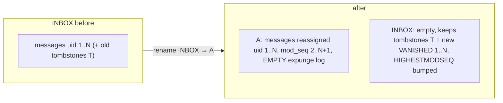

# 0016 — Renaming INBOX produces a fresh mailbox

## Status

Accepted (2026-07-19). Closes the RENAME-INBOX catalog-parity item parked after security-audit
run-8 (the second-consecutive-rename QRESYNC residual).

## Context

RFC 9051 §6.3.5 makes renaming INBOX special: INBOX cannot truly be renamed, so its messages
are *moved* into a newly-created target mailbox and INBOX itself stays, emptied. The project
has two catalog implementations that must be observably identical — `MemoryCatalog` (the
reference / differential-test oracle) and `SqliteCatalog` (production) — but they had drifted on
exactly what "move INBOX's messages into a new mailbox" means, and there was **no catalog-level
differential test** to catch it (the existing differential harness only exercised per-mailbox
operations, never RENAME). That gap is how two INBOX-rename bugs reached production while the
suite stayed green:

- run-7: the source INBOX kept an unchanged HIGHESTMODSEQ and empty expunge log after the move,
  so a QRESYNC client was told "nothing changed" while every cached message had moved out.
- run-8 residual: production **moved INBOX's whole expunge log onto the new target**, so a
  *second* consecutive INBOX rename stranded the tombstones the first rename created — INBOX
  again told a client nothing had vanished, the same desync one level deeper.

The run-7 half was fixed; the run-8 residual and the underlying divergence (production
*reparented* messages keeping their UIDs and INBOX's high mod-sequence, while the reference
built a *fresh* mailbox) were parked for this dedicated pass.

## Decision

### The target is a brand-new mailbox

Renaming INBOX creates a target that looks new, because it *is* new — the reference model's
behavior is the decided semantics, and production now conforms to it:

- **UIDs reassigned from 1**, in arrival order. The target never existed before the rename, so
  no client has cached its UID space; starting fresh keeps the target independent of INBOX's UID
  history.
- **Mod-sequence starts fresh** (the moved messages get `mod_seq` 2..N+1, HIGHESTMODSEQ = N+1),
  so the RFC 7162 §3.1.2.1 invariant HIGHESTMODSEQ ≥ every message's MODSEQ holds by
  construction — the run-2 concern, satisfied by renumbering rather than by carrying INBOX's
  value.
- **Empty expunge log.** Nothing has been expunged *from* the target — its messages are all
  live — so it carries no tombstones. INBOX's tombstones stay on INBOX.

### INBOX keeps its identity and its whole vanished history

INBOX retains its UIDVALIDITY and its **entire** expunge log (pre-existing tombstones are never
migrated), and the moved-out UIDs are logged as VANISHED against a bumped HIGHESTMODSEQ. So a
QRESYNC/CONDSTORE client resyncing INBOX after any number of renames learns exactly which of its
cached UIDs are gone.

### The rejected alternative

Keeping the moved messages' original UIDs and carrying INBOX's high mod-sequence onto the target
(production's former behavior) is also internally consistent *if* the expunge log is not
migrated. It was rejected because it makes a "new" mailbox present old UIDs and a large,
discontinuous mod-sequence for no benefit, and because conforming production to the simpler
reference — rather than the reverse — keeps the reference model the single definition of correct
behavior.

## Consequences

- The run-8 second-rename residual is closed: INBOX's tombstones no longer migrate, so any number
  of consecutive INBOX renames each report VANISHED correctly.
- A new **catalog-level differential harness** (`catalog-parity.test.ts`) serialises every
  mailbox after a nasty CREATE/DELETE/RENAME sequence (including the double INBOX rename) and
  asserts `SqliteCatalog` and `MemoryCatalog` are byte-for-byte identical — the oracle this class
  of bug slipped through for want of. RENAME parity is now covered, not assumed.
- Production's INBOX-rename does more work (rebuild instead of reparent), but it runs once per
  RENAME INBOX — a rare operator/client action — inside the existing single transaction.
- Revisitable with a stated reason, like every ADR.
