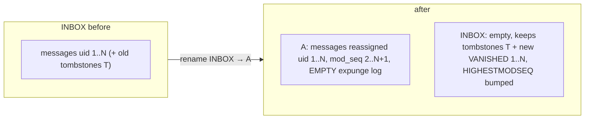

# 0016. Renaming INBOX produces a fresh mailbox

## Status

Accepted (2026-07-19). Fixes a QRESYNC desync that two consecutive INBOX renames trigger,
and adds the catalog-level differential test whose absence let it through.

## Context

RFC 9051 §6.3.5 makes a rename of INBOX special: INBOX cannot truly be renamed, so the server
*moves* its messages into a newly-created target mailbox, and INBOX itself stays, emptied. The
project has two catalog implementations that must be observably identical: `MemoryCatalog` (the
reference / differential-test oracle) and `SqliteCatalog` (production). But they had drifted on
exactly what "move INBOX's messages into a new mailbox" means, and **no catalog-level
differential test** caught it (the existing differential harness only exercised per-mailbox
operations, never RENAME). That gap is how two INBOX-rename bugs reached production while the
suite stayed green:

- The first bug: the source INBOX kept an unchanged HIGHESTMODSEQ and empty expunge log after the
  move, so the server told a QRESYNC client "nothing changed" while every cached message had
  moved out.
- A second, subtler bug: production **moved INBOX's whole expunge log onto the new target**, so a
  *second* consecutive INBOX rename stranded the tombstones the first rename created. INBOX
  again told a client nothing had vanished, the same desync one level deeper.

The first was fixed earlier. This ADR addresses the second, and the underlying divergence
(production *reparented* messages, kept their UIDs and INBOX's high mod-sequence, while the
reference built a *fresh* mailbox).

## Decision

### The target is a brand-new mailbox

A rename of INBOX creates a target that looks new, because it *is* new. The reference model's
behavior is the decided semantics, and production now conforms to it:

- **UIDs reassigned from 1**, in arrival order. The target never existed before the rename, so
  no client has cached its UID space. A fresh start keeps the target independent of INBOX's UID
  history.
- **Mod-sequence starts fresh** (the moved messages get `mod_seq` 2..N+1, HIGHESTMODSEQ = N+1),
  so the RFC 7162 §3.1.2.1 invariant HIGHESTMODSEQ ≥ every message's MODSEQ holds by
  construction, through renumbering rather than through a carry-over of INBOX's
  value.
- **Empty expunge log.** Nothing was expunged *from* the target (its messages are all
  live), so it carries no tombstones. INBOX's tombstones stay on INBOX.

### INBOX keeps its identity and its whole vanished history

INBOX retains its UIDVALIDITY and its **entire** expunge log (the server never migrates
pre-existing tombstones), and logs the moved-out UIDs as VANISHED against a bumped HIGHESTMODSEQ.
So a QRESYNC/CONDSTORE client that resyncs INBOX after any number of renames learns exactly which
of its cached UIDs are gone.

```mermaid
flowchart LR
    subgraph before["INBOX before"]
        M["messages uid 1..N (+ old tombstones T)"]
    end
    before -->|rename INBOX → A| after
    subgraph after["after"]
        A["A: messages reassigned uid 1..N, mod_seq 2..N+1, EMPTY expunge log"]
        I["INBOX: empty, keeps tombstones T + new VANISHED 1..N, HIGHESTMODSEQ bumped"]
    end
```

### The rejected alternative

To keep the moved messages' original UIDs and carry INBOX's high mod-sequence onto the target
(production's former behavior) is also internally consistent *if* the server does not migrate
the expunge log. This ADR rejects it, because it makes a "new" mailbox present old UIDs and a
large, discontinuous mod-sequence for no benefit, and because conformance of production to the
simpler reference (rather than the reverse) keeps the reference model the single definition of
correct behavior.

## Consequences

- The second-rename bug is closed: INBOX's tombstones no longer migrate, so any number
  of consecutive INBOX renames each report VANISHED correctly.
- A new **catalog-level differential harness** (`catalog-parity.test.ts`) serialises every
  mailbox after a nasty CREATE/DELETE/RENAME sequence (including the double INBOX rename) and
  asserts that `SqliteCatalog` and `MemoryCatalog` are byte-for-byte identical: the oracle this
  class of bug slipped through for want of. RENAME parity is now covered, not assumed.
- Production's INBOX-rename does more work (rebuild instead of reparent), but it runs once per
  RENAME INBOX (a rare operator/client action) inside the existing single transaction.
- Revisitable with a stated reason, like every ADR.
