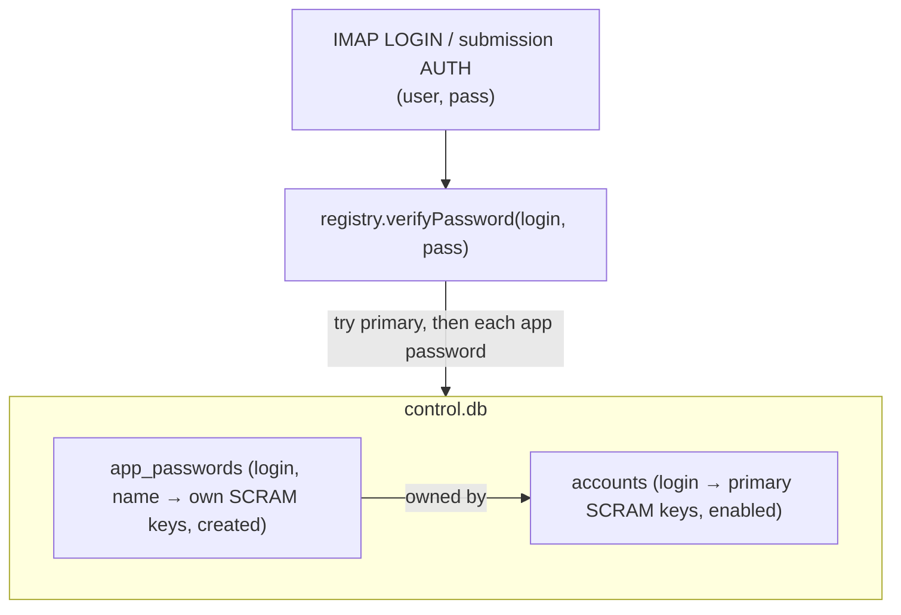

# 0017 — App-specific passwords

## Status

Accepted (2026-07-19). A production-readiness item; the reachable modern auth-hygiene win while
2FA stays ecosystem-blocked.

## Context

An account has one password, and it is used on every device *and* is the management credential.
So a stolen phone means full compromise with no remedy short of changing the password everywhere.
The usual fix — 2FA — is not available: IMAP/SMTP clients and the SASL mechanisms don't support
it, so there is nothing to build until the ecosystem moves (recorded in the backlog ledger). A
revocable per-device credential is the part of that hygiene we *can* deliver now, and it does not
need any client to change.

## Decision

### Named, server-generated, independently-revocable credentials per login

An account can have any number of named app passwords (`phone`, `work-laptop`). Each is a row in
the control database storing **its own SCRAM material** — salt, iterations, StoredKey, ServerKey
— exactly like the primary, never the secret. It authenticates as the same account and grants the
same access; it is simply another credential the account owns, and it can be revoked alone.

### The secret is server-generated and shown once

`account app-password add <login> <name>` **generates** a strong secret (144 bits, base64url),
stores only its SCRAM material, and prints the plaintext **once**. The operator never chooses it
(so it sidesteps the human-password length policy of the previous ADR entirely — it is far
stronger by construction) and it is never taken on argv (which `ps` exposes) nor stored anywhere
recoverable. `list` shows names and dates, never secrets; `remove` revokes one, honoured live.

### One verification chokepoint — no protocol changes

`verifyPassword` is the single point every live auth path funnels through (IMAP LOGIN /
AUTHENTICATE and submission AUTH, via one closure in `main.ts`). It now tries the primary
StoredKey first, then each of the login's app-password credentials. So an app password
authenticates *everywhere* the primary does, is gated by the same enabled check, and is bounded
by the same per-IP brute-force throttle — with **no change** to the IMAP or SMTP servers.

### Deliberately out of scope (v1)

- **No protocol scope.** An app password is a full credential, exactly like the primary — there
  is no "IMAP-only, can't send" variant. Scoping is cheap to add later (a column + a check at two
  chokepoints) and a read-only-device credential is a real future win, but it is not needed to
  deliver the core value (revoke a lost device) and is recorded as the first refinement, not built.
- **The primary keeps working.** We do not copy the model where enabling app passwords disables
  the primary for IMAP/SMTP — that only makes sense with 2FA enrollment and would force a
  migration. App passwords are opt-in *extras*. Recommended practice (documented): put app
  passwords on devices and keep the primary for CLI management, so no device holds the primary.

## Consequences

- A lost device is revoked with one command, no primary rotation, no other device disturbed.
- "A user is one file" holds (ADR 0009): app passwords live in the control DB alongside aliases,
  adding no per-user storage.
- Cost on a *failed* auth is up to N+1 PBKDF2 derivations (primary + N app passwords). N is a
  handful of devices at personal scale, and the per-IP throttle bounds probing; a wrong guess
  cannot enumerate whether an account has app passwords beyond a coarse timing signal, which is
  not the password. Accepted at this scale.
- Revisitable — the obvious future trigger is per-credential scope (IMAP vs submission) and a
  per-credential last-used timestamp (more useful than the parked per-account one).
