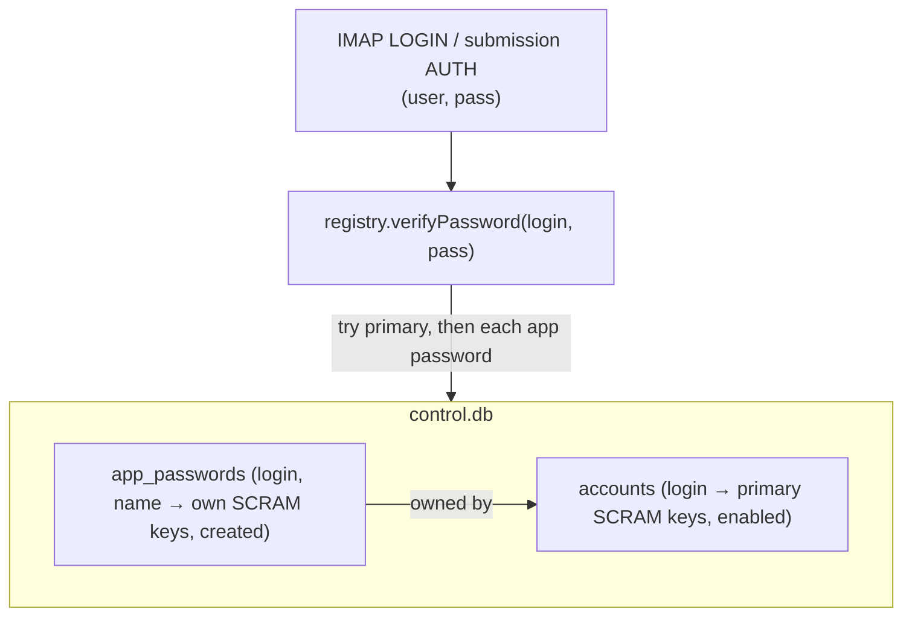

# 0017. App-specific passwords

## Status

Accepted (2026-07-19).

## Context

An account has one password. It serves every device *and* is the management credential.
So a stolen phone means full compromise, with no remedy short of a password change everywhere.
The usual fix (2FA) is not available: IMAP/SMTP clients and the SASL mechanisms do not support
it, so there is nothing to build until the ecosystem moves (recorded in the backlog ledger). A
revocable per-device credential is the part of that hygiene we *can* deliver now, and it needs
no client to change.

## Decision

### Named, server-generated, independently-revocable credentials per login

An account can have any number of named app passwords (`phone`, `work-laptop`). Each is a row in
the control database that stores **its own SCRAM material** (salt, iterations, StoredKey,
ServerKey), exactly like the primary, never the secret. It authenticates as the same account and
grants the same access. It is simply another credential the account owns, and you can revoke it
alone.

```mermaid
flowchart TD
    subgraph control["control.db"]
        A["accounts (login → primary SCRAM keys, enabled)"]
        P["app_passwords (login, name → own SCRAM keys, created)"]
        P -->|owned by| A
    end
    L["IMAP LOGIN / submission AUTH<br/>(user, pass)"] --> V["registry.verifyPassword(login, pass)"]
    V -->|"try primary, then each app password"| control
```

### The secret is server-generated and shown once

`account app-password add <login> <name>` **generates** a strong secret (144 bits, base64url),
stores only its SCRAM material, and prints the plaintext **once**. The operator never chooses it,
so it avoids the human-password length policy (the NIST SP 800-63B 8-character floor) entirely
and is far stronger by construction. The command never takes it on argv (which `ps` exposes), nor
stores it anywhere recoverable. `list` shows names and dates, never secrets. `remove` revokes one,
honoured live.

### One verification chokepoint: no protocol changes

`verifyPassword` is the single point every live auth path funnels through (IMAP LOGIN /
AUTHENTICATE and submission AUTH, via one closure in `main.ts`). It now tries the primary
StoredKey first, then each of the login's app-password credentials. So an app password
authenticates *everywhere* the primary does, the same enabled check gates it, and the same per-IP
brute-force throttle bounds it, with **no change** to the IMAP or SMTP servers.

### Deliberately out of scope (v1)

- **No protocol scope.** An app password is a full credential, exactly like the primary. There
  is no "IMAP-only, cannot send" variant. Scope is cheap to add later (a column + a check at two
  chokepoints), and a read-only-device credential is a real future win. But it is not necessary to
  deliver the core value (revoke a lost device), and is recorded as the first refinement, not built.
- **The primary keeps working.** We do not copy the model where an enabled app password disables
  the primary for IMAP/SMTP. That only makes sense with 2FA enrollment and would force a
  migration. App passwords are opt-in *extras*. Recommended practice (documented): put app
  passwords on devices and keep the primary for CLI management, so no device holds the primary.

## Consequences

- One command revokes a lost device, with no primary rotation and no other device disturbed.
- "A user is one file" holds (ADR 0009): app passwords live in the control DB alongside aliases,
  and add no per-user storage.
- Cost on a *failed* auth is up to N+1 PBKDF2 derivations (primary + N app passwords). N is a
  handful of devices at personal scale, and the per-IP throttle bounds a probe. A wrong guess
  cannot enumerate whether an account has app passwords beyond a coarse timing signal, which is
  not the password. Accepted at this scale.
- Revisitable: the obvious future trigger is per-credential scope (IMAP vs submission) and a
  per-credential last-used timestamp (more useful than a per-account one would be).
