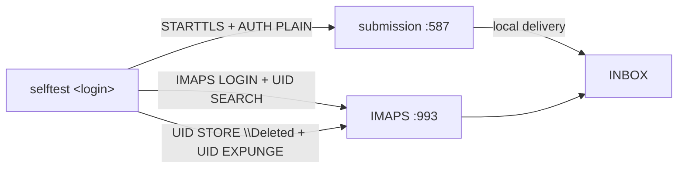

# 0018 — `selftest` end-to-end command

## Status

Accepted (2026-07-21). A usability gap in the getting-started experience:
`doctor` proves the *outside* is right, but nothing proved the
*inside* — the mail path through the running server — actually works.

## Context

After first boot, the question a new operator most wants answered is "did my setup actually send
and receive a message?" The pieces to answer it existed — a submission listener, local delivery,
IMAP — but answering it required speaking SMTP+STARTTLS+AUTH and IMAP by hand (a self-signed cert
in the way, the bare-login vs email-address trap, STARTTLS vs implicit TLS). In practice that means
a newcomer either has prior protocol fluency or cannot verify their install at all. `doctor` covers
DNS, reverse DNS, the certificate, and outbound port 25 — deliberately the *deployment* surface —
but it never authenticates, submits, or reads, so a working DNS setup with a broken auth or storage
path passes `doctor` and still delivers no mail.

## Decision

### A first-class command that exercises the real path against the running daemon

`node src/main.ts selftest <login>` connects to the configured submission and IMAP ports (the same
`MAIL_HOST`/`MAIL_SUBMISSION_PORT`/`MAIL_IMAP_PORT`/`MAIL_DOMAIN` the daemon reads), authenticates
as `<login>`, submits a uniquely-tagged message from the account **to itself**, then logs in over
IMAPS, finds the tag, and **deletes it again** so the check leaves no trace. Exit 0 means the whole
path works; 1 means a step failed (with a message naming which); 2 is a usage error.

### In-spirit implementation

The SMTP and IMAP clients are hand-rolled on the byte layer like the rest of the project — no mail
libraries. The password is read from a hidden prompt (or one stdin line when piped), never from
argv. TLS certificate trust is **not** verified by `selftest`: a local run uses the bundled
self-signed dev cert, and connecting to `127.0.0.1` would fail a hostname check regardless — cert
validity is `doctor`'s job, and this is a proof of the mail path. Cleanup uses UIDPLUS
(`UID EXPUNGE`) so only the tagged message is removed, never another `\Deleted` message in the box.

## Consequences

A newcomer runs two commands to know their install works: `npm start`, then `selftest`. It is also
a natural post-deploy check on a real box and a cheap smoke test for CI or a cron health check
(it needs an account password, so a dedicated low-value test account is the intended pattern).
It does **not** exercise outbound relay to a remote MX (that is `doctor`'s port-25 dial plus real
delivery) — `selftest` is scoped to the local submit→store→read loop, the part a single machine can
prove about itself.
