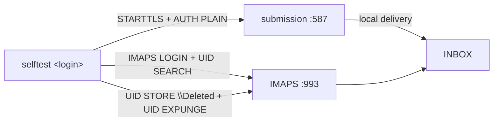

# 0018. `selftest` end-to-end command

## Status

Accepted (2026-07-21). A usability gap in the getting-started experience.
`doctor` proves that the *outside* is correct, but nothing proved that the
*inside* works — the mail path through the running server.

## Context

After first boot, a new operator most wants an answer to one question: "did my setup actually send
and receive a message?" The pieces to answer it existed: a submission listener, local delivery, and
IMAP. But to answer it, the operator had to speak SMTP+STARTTLS+AUTH and IMAP by hand. Several
obstacles remained: a self-signed cert, the bare-login vs email-address trap, and STARTTLS vs
implicit TLS. In practice, a newcomer either has prior protocol fluency or cannot verify the install
at all. `doctor` covers DNS, reverse DNS, the certificate, and outbound port 25 — deliberately the
*deployment* surface. But it never authenticates, submits, or reads. So a working DNS setup with a
broken auth or storage path passes `doctor` and still delivers no mail.

## Decision

### A first-class command that exercises the real path against the running daemon

`node src/main.ts selftest <login>` connects to the configured submission and IMAP ports. It reads
the same `MAIL_HOST`/`MAIL_SUBMISSION_PORT`/`MAIL_IMAP_PORT`/`MAIL_DOMAIN` the daemon reads. It
authenticates as `<login>` and submits a uniquely-tagged message from the account **to itself**. It
then connects over IMAPS, finds the tag, and **deletes it** so the check leaves no trace. Exit 0
means the whole path works. Exit 1 means a step failed, with a message that names which step. Exit 2
is a usage error.

```mermaid
flowchart LR
    S["selftest &lt;login&gt;"] -->|"STARTTLS + AUTH PLAIN"| SUB["submission :587"]
    SUB -->|local delivery| BOX["INBOX"]
    S -->|"IMAPS LOGIN + UID SEARCH"| IMAP["IMAPS :993"]
    IMAP --> BOX
    S -->|"UID STORE \\Deleted + UID EXPUNGE"| IMAP
```

### In-spirit implementation

The project hand-writes the SMTP and IMAP clients on the byte layer, like the rest of the code. It
uses no mail libraries. The command reads the password from a hidden prompt, or from one stdin line
when piped. It never reads the password from argv. `selftest` does **not** verify TLS certificate
trust. A local run uses the bundled self-signed dev cert, and a connection to `127.0.0.1` would fail
a hostname check regardless. Cert validity is `doctor`'s job, and `selftest` is a proof of the mail
path. The cleanup uses UIDPLUS (`UID EXPUNGE`), so it removes only the tagged message, never another
`\Deleted` message in the box.

## Consequences

A newcomer runs two commands to confirm the install works: `npm start`, then `selftest`. It is also
a natural post-deploy check on a real box, and a cheap smoke test for CI or a cron health check. It
needs an account password, so a dedicated low-value test account is the intended pattern. It does
**not** exercise outbound relay to a remote MX. That job is `doctor`'s port-25 dial plus real
delivery. `selftest` covers the local submit→store→read loop, the part a single machine can prove
about itself.
