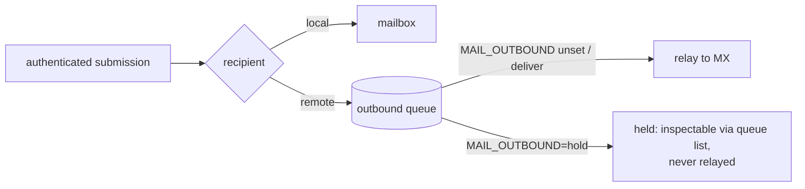

# 0019 — `MAIL_OUTBOUND=hold`: the outbound sink mode

## Status

Accepted (2026-07-21). Using cutiemail as a local dev/test mail server — a use the project turns
out to be accidentally good at — exposes a real hazard: a staging instance fed realistic fixture
data **actually emails the addresses in the fixtures**. Authenticated submission to any external
domain queues for real MX relay with
days of retries, and there was no off switch.

## Context

A dev or CI instance wants everything a real instance does — accounts, authenticated submission,
local delivery, IMAP read-back, `+tag` subaddressing, `:memory:` databases — except one thing:
mail must never actually leave the machine. Tools like Mailpit exist solely for this; cutiemail
already does the rest better (it is a real server, so the code under test speaks real SMTP), but
"never actually leave" was impossible to guarantee short of firewalling port 25.

## Decision

One environment variable, `MAIL_OUTBOUND=deliver|hold` (default `deliver`), checked at the only
two places a relay tick is ever triggered — the post-enqueue kick and the boot-time loop start.
Everything up to the queue is **identical** in both modes: sender-authorization, header fix-up,
DKIM signing, the durable enqueue. In `hold` the relay loop simply never runs.

- **Held mail is durably queued, not discarded** — `queue list` shows it (the assertion a test
  suite wants: "my app really submitted that email"), `queue cancel` moves it to dead-letter,
  and a restart without `hold` relays whatever is still queued. The never-silently-dropped
  invariant holds in both modes.
- **A parse failure is a boot failure.** `MAIL_OUTBOUND=holdd` refuses to start rather than
  falling back to `deliver` — this is the one variable where a silent fallback inverts a safety
  property (a typo would mean real mail leaves a test instance).
- The startup banner states the mode loudly when holding, so a forgotten `hold` in a real
  deployment is visible on the first `journalctl` look (mail piling up in `queue list` is the
  other tell).

## What was deliberately not built

- No third "sink-and-drop" mode that accepts and discards: retention is what makes held mail
  useful to a test, and dropping conflicts with the project's core invariant.
- No per-domain allowlist (relay only to `*.test`): more knobs than the use case needs; `hold`
  plus reading the queue covers it.

## Verification

`src/server/outbound-hold.integration.test.ts`: in `hold`, a remote submission is accepted and
queued and the capture MX sees **zero connections** past the would-be relay interval; the
negative control proves the identical config in `deliver` mode does reach the MX (so the
"nothing arrived" assertion is shown capable of failing). `main-config.test.ts` pins the
fail-loud parse.
