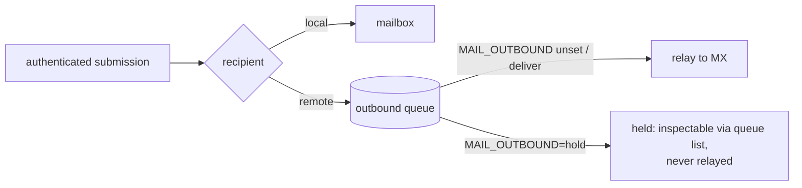

# 0019. `MAIL_OUTBOUND=hold`, the outbound sink mode

## Status

Accepted (2026-07-21). cutiemail works well as a local dev/test mail server, a use it turns out to
be accidentally good at. But that use exposes a real hazard: a staging instance fed realistic
fixture data **actually emails the addresses in the fixtures**. Authenticated submission to any
external domain queues for real MX relay with days of retries, and there was no off switch.

## Context

A dev or CI instance wants everything a real instance does: accounts, authenticated submission,
local delivery, IMAP read, `+tag` subaddressing, and `:memory:` databases. It wants all of that
except one thing: mail must never leave the machine. Tools like Mailpit exist only for this.
cutiemail already does the rest better, because it is a real server, so the code under test speaks
real SMTP. But nothing could guarantee "never leave the machine" short of a firewall on port 25.

```mermaid
flowchart LR
    A[authenticated submission] --> B{recipient}
    B -- local --> C[mailbox]
    B -- remote --> D[(outbound queue)]
    D -- "MAIL_OUTBOUND unset / deliver" --> E[relay to MX]
    D -- "MAIL_OUTBOUND=hold" --> F["held: inspectable via queue list,<br/>never relayed"]
```

## Decision

One environment variable controls this: `MAIL_OUTBOUND=deliver|hold` (default `deliver`). The
server checks it at the only two places that ever trigger a relay tick: the post-enqueue kick and
the boot-time loop start. Everything up to the queue is **identical** in both modes: sender-
authorization, header fix-up, DKIM signing, and the durable enqueue. In `hold` mode the relay loop
never runs.

- **The server queues held mail durably, and never discards it.** `queue list` shows it — the
  assertion a test suite wants: "my app really submitted that email". `queue cancel` moves it to
  dead-letter, and a restart without `hold` relays whatever is still queued. The
  never-silently-dropped invariant holds in both modes.
- **A parse failure is a boot failure.** `MAIL_OUTBOUND=holdd` refuses to start. It does not fall
  back to `deliver`. This is the one variable where a silent fallback inverts a safety property. A
  typo would mean real mail leaves a test instance.
- When the server holds mail, the startup banner states the mode loudly. So an operator sees a
  forgotten `hold` in a real deployment on the first `journalctl` look. Mail that accumulates in
  `queue list` is the other tell.

## What was deliberately not built

- No third "sink-and-drop" mode that accepts and discards. Retention is what makes held mail
  useful to a test, and a drop conflicts with the project's core invariant.
- No per-domain allowlist (relay only to `*.test`). That is more knobs than the use case needs.
  `hold` plus a read of the queue covers it.

## Verification

`src/server/outbound-hold.integration.test.ts` proves it. In `hold` mode, the server accepts and
queues a remote submission, and the capture MX sees **zero connections** past the would-be relay
interval. The negative control proves that the identical config in `deliver` mode does reach the MX.
So the test shows that the "nothing arrived" assertion can fail. `main-config.test.ts` pins the
fail-loud parse.
