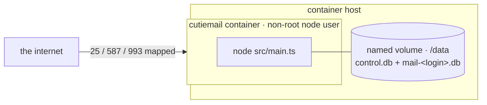

# 0020. A container image (Dockerfile + compose)

## Status

Accepted (2026-07-21). A container-native deployment path was missing: someone who deploys
everything as `docker compose up` found no container story at all (no Dockerfile, no compose, no
mention), and none of the existing ADRs recorded the absence. For an audience that deploys nothing
else by hand, that reads as "not built for people like me", and it broke the project's own "every
omission is a recorded decision" promise.

## Context

The bare-metal path (systemd unit, `setcap` for privileged ports, run-as-`mail`-user) is the
documented one, and it is good. But it assumes the operator is comfortable on a
Linux host with systemd. A large share of self-hosters instead run a Synology/Unraid box or a
docker-compose stack and expect a container.

The project is, by construction, almost perfectly container-shaped already:

- **zero runtime dependencies and no build step**: the image is "Node runtime + `src/`", with
  no `npm install`, no compile stage, no multi-stage juggling;
- **configured entirely by environment**: the exact model a container wants;
- **all state in one directory** (the control DB + per-user mailbox files): one volume mount;
- **clean SIGTERM shutdown**: `docker stop` is graceful.

So the cost of providing it is a ~20-line Dockerfile and a compose file, and the cost of *not*
providing it is turning away an entire deployment audience over nothing.

## Decision

Ship a minimal `Dockerfile`, `docker-compose.yml`, and `.dockerignore` at the repo root.

- The image binds the **unprivileged** default ports inside (2525/5587/5993) and the compose
  file maps them to 25/587/993 on the host, so nothing inside the container needs a
  privileged-port capability and it runs as the base image's non-root `node` user.
- **One named volume** at `/data` holds every database; `MAIL_CONTROL_DB` points there and the
  per-user `mail-<login>.db` files land beside it.
- The compose file documents, in comments, the one thing a container operator must not miss: a
  **real certificate is required** for the public bind, because the daemon refuses to serve the
  bundled dev cert off loopback (its public private key). No hidden default makes an insecure
  bind quietly work.
- `docker compose exec mail node src/main.ts <command>` is the account/setup/queue surface,
  the same single entry point as everywhere else.

## What was deliberately not built

- **No bundled TLS automation (ACME sidecar).** Cert provisioning stays the operator's job
  (mount a cert), consistent with [ADR 0013](0013-no-http-listener.md). The daemon speaks no
  HTTP, so it cannot answer an ACME HTTP-01 challenge itself. Built-in ACME remains a recorded
  backlog candidate, not a container-specific one.
- **No published image on a registry (yet).** The Dockerfile builds locally from source, which
  matches the "clone and run" ethos; publishing a tagged image is a release-process decision for
  when the project versions past v0.
- **No orchestration/HA manifests (Kubernetes, Swarm).** Personal scale; consistent with the
  backup-MX/clustering decline in [docs/BACKLOG.md](../BACKLOG.md).

## Verification

The image is source-plus-runtime with no build step, so its correctness is the daemon's own
(the full suite). The compose file is exercised by hand (`docker compose up`, `selftest`, a
submission), and the security-critical property (dev cert refused on a public bind) is already
pinned by `main-config.test.ts` and holds identically inside the container.
