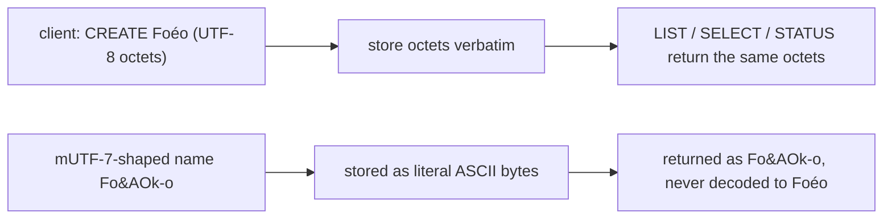

# 0021. IMAP mailbox names are byte-transparent Net-Unicode

## Status

Accepted (2026-07-22). Pins the encoding the server already implemented and closes the
test gap that left mailbox-name round-tripping unverified.

## Context

IMAP4rev1 (RFC 3501) encoded a non-ASCII mailbox name as **modified UTF-7** (`Fo&AOk-o`
for `Foéo`), a bespoke `&`-escaped variant the client and server both had to implement.
IMAP4rev2 (RFC 9051 §5.1) **removed** modified UTF-7: a rev2 mailbox name is Net-Unicode
(UTF-8) octets on the wire, carried in a quoted string or a literal like any other astring.

The server advertises both `IMAP4REV2` and, for client compatibility, `IMAP4REV1`. That
raises the question a rev1-shaped world makes tempting: should the server *interpret*
modified UTF-7, decoding `Fo&AOk-o` back to `Foéo` on input and re-encoding it on output, so a
legacy client sees the name it expects?

## Decision

### The stored name is the exact octets the client sent

A mailbox name is byte-transparent. Whatever octets a client puts in `CREATE`, the server
stores verbatim and hands back verbatim through `LIST` / `SELECT` / `STATUS` / `RENAME`. The
whole server reads and writes latin1, so one JS character is one wire byte and `name.length`
is the true octet count for a literal header. A UTF-8 name round-trips unchanged; a byte
outside atom / quoted-string range forces a literal so the exact bytes survive.

The server **never** interprets modified UTF-7. A name shaped like `Fo&AOk-o` is stored and
returned as those literal ASCII bytes, not decoded to `Foéo`. This is the deliberate rev2
position (§5.1), not an omission.

### Why not interpret modified UTF-7 for the rev1 capability

Two clients, one account, is the case that decides it. If the server decoded mUTF-7 on the
rev1 path but stored Net-Unicode from the rev2 path, the *same* mailbox would carry two
different byte identities depending on which client last touched it, and a client switching
between the two encodings (or two clients sharing the account) would disagree about the
mailbox's name. Byte-transparency makes the name one thing: the octets on disk. A rev2 client
speaking UTF-8 gets its UTF-8 back; a legacy client that still emits mUTF-7 gets its own
bytes back, which is self-consistent *for that client* even though the server assigns them no
special meaning. The server does not have to guess a client's dialect, because it never
re-encodes.

### The rejected alternative

Full mUTF-7 codec on the rev1 path (decode on input, re-encode on output, keyed on the
negotiated capability) was rejected. It buys interoperability only with a legacy client using
non-ASCII names, a vanishing case, at the cost of a stateful per-connection encoding
decision and the two-identities-for-one-mailbox hazard above. rev2 removed the encoding for
exactly this reason; the server follows rev2.

## Consequences

- `CREATE` / `LIST` / `SELECT` / `STATUS` / `RENAME` round-trip any octet sequence
  identically across both catalog backends, now pinned by test rather than assumed.
- Names are compared and stored as bytes, so there is no Unicode-normalization surface and
  no mUTF-7 parser to attack.
- A legacy client that relied on the server decoding mUTF-7 would see raw `&`-escapes. Judged
  a non-case: rev2 is the target, and non-ASCII mailbox names are rare at personal scale.
- Revisitable with a stated reason, like every ADR: if a real rev1-only client with non-ASCII
  mailboxes ever appears, a capability-keyed codec is the reopened design.
