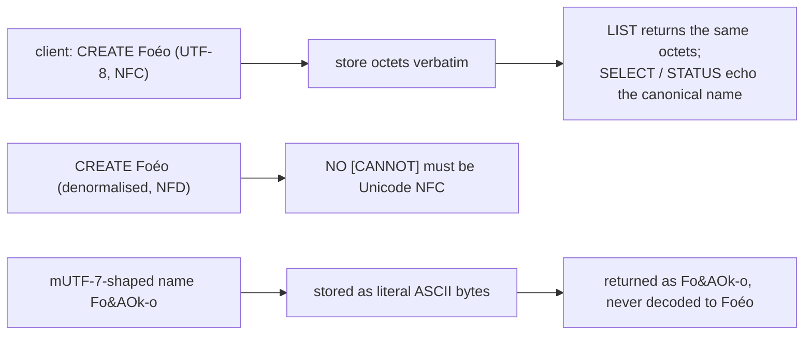

# 0021. IMAP mailbox names are byte-transparent Net-Unicode

## Status

Accepted (2026-07-22). Pins the encoding the server already implemented and closes the
test gap that left mailbox-name round-tripping unverified.

## Context

IMAP4rev1 (RFC 3501) encoded a non-ASCII mailbox name as **modified UTF-7** (`Fo&AOk-o`
for `Foéo`), a bespoke `&`-escaped variant the client and server both had to implement.
IMAP4rev2 (RFC 9051 §5.1) **removed** modified UTF-7: a rev2 mailbox name is Net-Unicode
(UTF-8) octets on the wire, carried in a quoted string or a literal like any other astring.

The server advertises both `IMAP4REV2` and, for client compatibility, `IMAP4REV1`. That
raises the question a rev1-shaped world makes tempting: should the server *interpret*
modified UTF-7, decoding `Fo&AOk-o` back to `Foéo` on input and re-encoding it on output, so a
legacy client sees the name it expects?

## Decision

### The stored name is the exact octets the client sent

A mailbox name is byte-transparent, within one gate at creation. Whatever octets a client
puts in `CREATE`, the server stores verbatim and hands back verbatim through `LIST` /
`SELECT` / `STATUS` / `RENAME` — with two qualifications added later and recorded in the
Follow-up below: an 8-bit name that is not Net-Unicode is refused outright, and
`SELECT` / `STATUS` echo the *canonical* name rather than the client's spelling. The
whole server reads and writes latin1, so one JS character is one wire byte and `name.length`
is the true octet count for a literal header. A UTF-8 name round-trips unchanged; a byte
outside atom / quoted-string range forces a literal so the exact bytes survive.

The server **never** interprets modified UTF-7. A name shaped like `Fo&AOk-o` is stored and
returned as those literal ASCII bytes, not decoded to `Foéo`. This is the deliberate rev2
position (§5.1), not an omission.

```mermaid
flowchart LR
    C["client: CREATE Foéo (UTF-8, NFC)"] --> S["store octets verbatim"]
    S --> L["LIST returns the same octets;<br/>SELECT / STATUS echo the canonical name"]
    D["CREATE Foéo (denormalised, NFD)"] --> R["NO [CANNOT] must be Unicode NFC"]
    M["mUTF-7-shaped name Fo&AOk-o"] --> S2["stored as literal ASCII bytes"]
    S2 --> L2["returned as Fo&AOk-o, never decoded to Foéo"]
```

### Why not interpret modified UTF-7 for the rev1 capability

Two clients, one account, is the case that decides it. If the server decoded mUTF-7 on the
rev1 path but stored Net-Unicode from the rev2 path, the *same* mailbox would carry two
different byte identities depending on which client last touched it, and a client switching
between the two encodings (or two clients sharing the account) would disagree about the
mailbox's name. Byte-transparency makes the name one thing: the octets on disk. A rev2 client
speaking UTF-8 gets its UTF-8 back; a legacy client that still emits mUTF-7 gets its own
bytes back, which is self-consistent *for that client* even though the server assigns them no
special meaning. The server does not have to guess a client's dialect, because it never
re-encodes.

### The rejected alternative

Full mUTF-7 codec on the rev1 path (decode on input, re-encode on output, keyed on the
negotiated capability) was rejected. It buys interoperability only with a legacy client using
non-ASCII names, a vanishing case, at the cost of a stateful per-connection encoding
decision and the two-identities-for-one-mailbox hazard above. rev2 removed the encoding for
exactly this reason; the server follows rev2.

## Consequences

- `CREATE` / `LIST` / `SELECT` / `STATUS` / `RENAME` round-trip any *accepted* octet
  sequence identically across both catalog backends, pinned by test rather than assumed.
  One class is refused up front — see the Follow-up below.
- Names are stored and compared as bytes, so there is no mUTF-7 parser to attack. The one
  Unicode surface is the Net-Unicode check at `CREATE`/`RENAME`, which decodes to test the
  name and never rewrites it.
- A legacy client that relied on the server decoding mUTF-7 would see raw `&`-escapes. Judged
  a non-case: rev2 is the target, and non-ASCII mailbox names are rare at personal scale.
- Revisitable with a stated reason, like every ADR: if a real rev1-only client with non-ASCII
  mailboxes ever appears, a capability-keyed codec is the reopened design.

## Follow-up (2026-07-24): Net-Unicode at creation, canonical echo at `SELECT`/`STATUS`

Byte-transparency was taken one step too far. RFC 9051 §5.1 makes prohibiting a
non-Net-Unicode 8-bit mailbox name a MUST, and storing raw octets meant the NFC and NFD
spellings of `Café` created two mailboxes that render identically in every client: mail
filed into one is invisible in the other, and a client that normalises its own input
(macOS yields NFD) cannot `SELECT` the folder it can see in `LIST`. Three changes:

- **`CREATE` and `RENAME` refuse a denormalised 8-bit name**, with
  `NO [CANNOT] mailbox name must be Unicode NFC (RFC 9051 §5.1)`. Invalid UTF-8 is refused
  on the same rule: it decodes to U+FFFD and would not survive a normalising client. A
  7-bit name is trivially conformant, so no ASCII folder is affected. Both doors that can
  put a name in the catalog are gated — guarding only `CREATE` would let `RENAME` introduce
  one by the back door. We reject rather than silently rewriting, which keeps the
  byte-transparent stance for everything that *is* accepted: what a client stores is what
  it gets back.
- **`SELECT` / `STATUS` echo the canonical name**, not the client's spelling. `SELECT inbox`
  answering `* LIST … "inbox"` while `LIST` reports `INBOX` gives a client keying its folder
  cache on the response two entries for one mailbox (§6.3.2's examples echo `INBOX`).
- **A leading separator no longer mints a phantom.** `CREATE "/Sent"` used to make `LIST`
  describe the empty name as `\NonExistent \HasChildren`, while the bare-root probe
  described that same name as `\Noselect` — two contradictory answers for one name, and a
  nameless folder in the client.

The INBOX case-fold is ASCII-only. It used `toUpperCase()`, which is Unicode-aware and folds
U+0131 (dotless i) into `INBOX`; §9 defines the rule on the literal sequence `I N B O X`.
Not reachable over the wire, since the parser reads latin1, but the resolver is exported and
used directly by both catalog backends.
