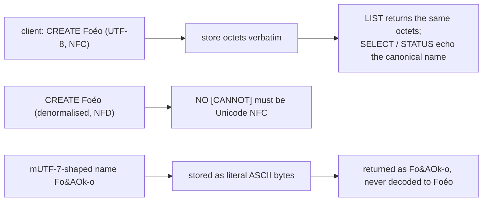

# 0021. IMAP mailbox names are byte-transparent Net-Unicode

## Status

Accepted (2026-07-22). Pins the encoding the server already implemented, and closes the test gap
that left the mailbox-name round-trip unverified.

## Context

IMAP4rev1 (RFC 3501) encoded a non-ASCII mailbox name as **modified UTF-7** (`Fo&AOk-o`
for `Foéo`), a bespoke `&`-escaped variant the client and server both had to implement.
IMAP4rev2 (RFC 9051 §5.1) **removed** modified UTF-7: a rev2 mailbox name is Net-Unicode
(UTF-8) octets on the wire, carried in a quoted string or a literal like any other astring.

The server advertises both `IMAP4REV2` and, for client compatibility, `IMAP4REV1`. That raises a
question a rev1-shaped world makes tempting: should the server *interpret* modified UTF-7? That is,
should it decode `Fo&AOk-o` back to `Foéo` on input and re-encode it on output, so a legacy client
sees the name it expects?

## Decision

### The stored name is the exact octets the client sent

A mailbox name is byte-transparent, within one gate at creation. Whatever octets a client puts in
`CREATE`, the server stores verbatim and returns verbatim through `LIST` / `SELECT` / `STATUS` /
`RENAME`. Two qualifications were added later and recorded in the Follow-up below: the server refuses
an 8-bit name that is not Net-Unicode outright, and `SELECT` / `STATUS` echo the *canonical* name
rather than the client's spelling. The whole server reads and writes latin1, so one JS character is
one wire byte, and `name.length` is the true octet count for a literal header. A UTF-8 name
round-trips unchanged. A byte outside atom / quoted-string range forces a literal, so the exact bytes
survive.

The server **never** interprets modified UTF-7. It stores and returns a name shaped like `Fo&AOk-o`
as those literal ASCII bytes, and never decodes it to `Foéo`. This is the deliberate rev2 position
(§5.1), not an omission.

```mermaid
flowchart LR
    C["client: CREATE Foéo (UTF-8, NFC)"] --> S["store octets verbatim"]
    S --> L["LIST returns the same octets;<br/>SELECT / STATUS echo the canonical name"]
    D["CREATE Foéo (denormalised, NFD)"] --> R["NO [CANNOT] must be Unicode NFC"]
    M["mUTF-7-shaped name Fo&AOk-o"] --> S2["stored as literal ASCII bytes"]
    S2 --> L2["returned as Fo&AOk-o, never decoded to Foéo"]
```

### Why not interpret modified UTF-7 for the rev1 capability

Two clients, one account, is the case that decides it. Suppose the server decoded mUTF-7 on the
rev1 path but stored Net-Unicode from the rev2 path. Then the *same* mailbox would carry two
different byte identities, by which client last touched it. A client that switched between the two
encodings — or two clients that shared the account — would disagree about the mailbox name.
Byte-transparency makes the name one thing: the octets on disk. A rev2 client that speaks UTF-8
receives its UTF-8 in return. A legacy client that still emits mUTF-7 receives its own bytes in
return, which is self-consistent *for that client*, even though the server assigns them no special
meaning. The server does not have to guess a client's dialect, because it never re-encodes.

### The rejected alternative

The project rejected a full mUTF-7 codec on the rev1 path (decode on input, re-encode on output,
keyed on the negotiated capability). It buys interoperability only with a legacy client that uses
non-ASCII names, a vanishing case. The cost is a stateful per-connection encoding decision and the
two-identities-for-one-mailbox hazard above. rev2 removed the encoding for exactly this reason, and
the server follows rev2.

## Consequences

- `CREATE` / `LIST` / `SELECT` / `STATUS` / `RENAME` round-trip any *accepted* octet sequence
  identically across both catalog backends. A test pins this rather than an assumption. The server
  refuses one class at the start — see the Follow-up below.
- The server stores and compares names as bytes, so there is no mUTF-7 parser to attack. The one
  Unicode surface is the Net-Unicode check at `CREATE`/`RENAME`, which decodes to test the name and
  never rewrites it.
- A legacy client that relied on the server to decode mUTF-7 would see raw `&`-escapes. This is a
  non-case: rev2 is the target, and non-ASCII mailbox names are rare at personal scale.
- Revisitable with a stated reason, like every ADR. If a real rev1-only client with non-ASCII
  mailboxes ever appears, a capability-keyed codec is the reopened design.

## Follow-up (2026-07-24): Net-Unicode at creation, canonical echo at `SELECT`/`STATUS`

Byte-transparency went one step too far. RFC 9051 §5.1 makes it a MUST to prohibit a
non-Net-Unicode 8-bit mailbox name. Raw octet storage meant the NFC and NFD spellings of `Café`
created two mailboxes that render identically in every client. Mail filed into one is invisible in
the other, and a client that normalises its own input (macOS yields NFD) cannot `SELECT` the folder
it can see in `LIST`. Three changes follow:

- **`CREATE` and `RENAME` refuse a denormalised 8-bit name**, with
  `NO [CANNOT] mailbox name must be Unicode NFC (RFC 9051 §5.1)`. The same rule refuses invalid
  UTF-8: it decodes to U+FFFD and would not survive a client that normalises. A 7-bit name is
  trivially conformant, so no ASCII folder is affected. The server gates both doors that can put a
  name in the catalog. A guard on `CREATE` alone would let `RENAME` introduce one by the back door.
  The server rejects rather than silently rewrites, which keeps the byte-transparent stance for
  everything that *is* accepted: what a client stores is what it receives in return.
- **`SELECT` / `STATUS` echo the canonical name**, not the client's spelling. Suppose `SELECT
  inbox` answered `* LIST … "inbox"` while `LIST` reported `INBOX`. A client that keys its folder
  cache on the response would then hold two entries for one mailbox (§6.3.2's examples echo
  `INBOX`).
- **A leading separator no longer mints a phantom.** `CREATE "/Sent"` used to make `LIST`
  describe the empty name as `\NonExistent \HasChildren`, while the bare-root probe
  described that same name as `\Noselect` — two contradictory answers for one name, and a
  nameless folder in the client.

The INBOX case-fold is ASCII-only. It used `toUpperCase()`, which is Unicode-aware and folds U+0131
(dotless i) into `INBOX`. §9 defines the rule on the literal sequence `I N B O X`. This is not
reachable over the wire, because the parser reads latin1. But both catalog backends export and use
the resolver directly.
