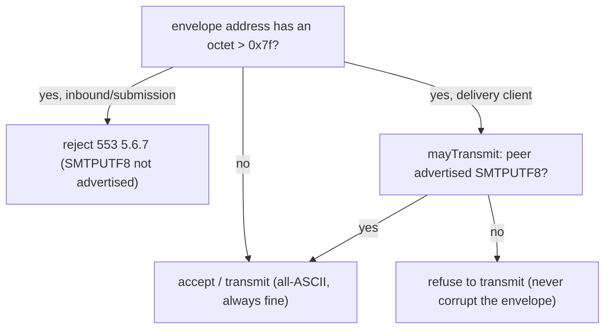

# 0022. EAI / SMTPUTF8: the envelope is ASCII-only, for now

## Status

Accepted (2026-07-22). Records the deliberate boundary and the reject behaviour on every
edge, so internationalized email is a named future item rather than a silent gap.

## Context

Email Address Internationalization (EAI) lets the SMTP *envelope* carry non-ASCII addresses
(`用户@例え.jp` as a reverse-path or forward-path), gated by the SMTPUTF8 extension (RFC 6531).
A server that wants it advertises `SMTPUTF8` in EHLO; a client transmits an internationalized
envelope only after seeing that advertisement. Header-level internationalization (RFC 2047
encoded words, and UTF-8 in a MIME body) is a separate, older thing the parser already
handles; EAI is specifically the *envelope* and the SMTPUTF8 negotiation around it.

Supporting EAI fully means UTF-8 encoding on the envelope, advertising SMTPUTF8 on the
receiver, and `BODY=8BITMIME` handling, across submission, inbound, and the delivery client.
That is a real surface with its own conformance corpus.

## Decision

### The envelope is ASCII-only, and every edge fails closed

The server does not advertise SMTPUTF8, so under ADR 0001's conditional-scope rule (an
extension requirement binds *only when the server advertises the extension*) it owes nothing
on the EAI envelope. What it does owe is to never silently mishandle one. Every edge is
explicit:

- **Submission and inbound receivers reject** a non-ASCII `MAIL FROM` / `RCPT TO` with
  `553 5.6.7`. SMTPUTF8 was not offered, so an internationalized reverse-path or
  forward-path is refused, never accepted-then-mojibaked. This matches the project's own
  conformance guide, which certifies exactly this rejection.
- **The delivery client refuses to transmit** internationalized envelope content to a peer
  that did not advertise SMTPUTF8 (the `mayTransmit` gate, RFC 6531 §3.5). "Internationalized"
  is an octet-level property: any octet above `0x7f` in an address makes the content require
  the extension. Refusing to ship is the honest failure; corrupting the bytes is not.

### Full EAI is a recorded future item

Accepting internationalized submission, advertising SMTPUTF8 on inbound, and negotiating
`BODY=8BITMIME` outbound are the reopened design, listed in [BACKLOG.md](../BACKLOG.md). The
revisit trigger is a concrete need: EAI submission actually being asked for. Until then the
boundary is drawn where the code enforces it, not left implicit.

### The rejected alternative

Accepting a non-ASCII envelope while not advertising SMTPUTF8 (leniently coercing or
best-effort forwarding it) was rejected. It violates RFC 6531's negotiation contract, and it
turns a clean `553` into silent corruption or an ambiguous downstream failure. A server that
cannot faithfully carry an internationalized envelope should say so.

## Relationship to other decisions

- **ADR 0001** (spec baseline): extension requirements are conditional and cannot fail a
  server that does not advertise the extension. EAI is the applied case: SMTPUTF8 is
  unadvertised, so the server is conformant by refusing internationalized envelopes, not by
  half-supporting them.
- **The bytes-never-strings discipline**: `isInternationalized` is an octet test (`> 0x7f`),
  not a decode-and-inspect, so the gate cannot be fooled by an encoding that hides the
  non-ASCII octets.

## Consequences

- No internationalized envelope is ever accepted or transmitted, so none is ever corrupted.
- The receiver's EHLO stays free of a capability the server does not honour, keeping the
  advertised set truthful (which the inbound conformance suite checks).
- International *content* (headers, bodies) is unaffected: it already parses. Only the
  *envelope* is scoped out.
- Revisitable with a stated reason: full EAI is a scope expansion, weighed and deferred, not
  forgotten.
