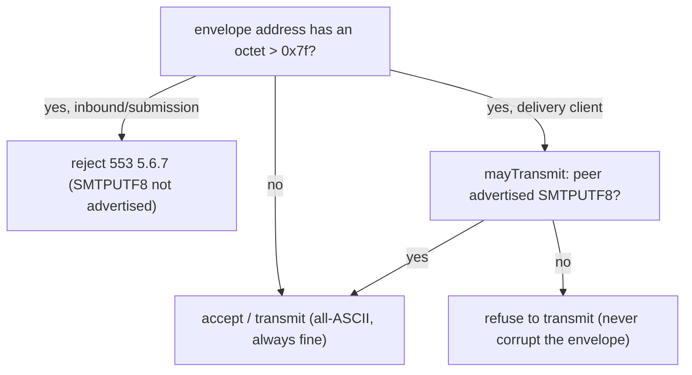

# 0022. EAI / SMTPUTF8: the envelope is ASCII-only, for now

## Status

Accepted (2026-07-22). This ADR records the deliberate boundary and the reject behaviour on
every edge. Thus internationalized email is a named future item, not a silent gap.

## Context

Email Address Internationalization (EAI) lets the SMTP *envelope* carry non-ASCII addresses
(`用户@例え.jp` as a reverse-path or forward-path). The SMTPUTF8 extension (RFC 6531) gates it.
A server that wants it advertises `SMTPUTF8` in EHLO. A client transmits an internationalized
envelope only after it sees that advertisement. Header-level internationalization (RFC 2047
encoded words, and UTF-8 in a MIME body) is a separate, older matter that the parser already
handles. EAI is specifically the *envelope* and the SMTPUTF8 negotiation around it.

Full EAI support means UTF-8 encoding on the envelope, SMTPUTF8 advertisement on the
receiver, and `BODY=8BITMIME` handling, across submission, inbound, and the delivery client.
That is a real surface with its own conformance corpus.

## Decision

### The envelope is ASCII-only, and every edge fails closed

The server does not advertise SMTPUTF8. So under ADR 0001's conditional-scope rule, it owes
nothing on the EAI envelope. That rule says an extension requirement binds *only when the
server advertises the extension*. What it does owe is to never mishandle one silently. Every
edge is explicit:

- **Submission and inbound receivers reject** a non-ASCII `MAIL FROM` / `RCPT TO` with
  `553 5.6.7`. SMTPUTF8 was not offered. So the server refuses an internationalized
  reverse-path or forward-path. It never accepts one and then corrupts the bytes. This
  matches the project's own conformance guide, which certifies exactly this rejection.
- **The delivery client refuses to transmit** internationalized envelope content to a peer
  that did not advertise SMTPUTF8 (the `mayTransmit` gate, RFC 6531 §3.5). "Internationalized"
  is an octet-level property: any octet above `0x7f` in an address makes the content require
  the extension. To refuse the message is the honest failure. To corrupt the bytes is not.

```mermaid
flowchart TD
    A["envelope address has an octet > 0x7f?"] -->|no| OK["accept / transmit (all-ASCII, always fine)"]
    A -->|yes, inbound/submission| R["reject 553 5.6.7 (SMTPUTF8 not advertised)"]
    A -->|yes, delivery client| G["mayTransmit: peer advertised SMTPUTF8?"]
    G -->|no| RF["refuse to transmit (never corrupt the envelope)"]
    G -->|yes| OK
```

### Full EAI is a recorded future item

The reopened design has three parts: acceptance of internationalized submission, SMTPUTF8
advertisement on inbound, and `BODY=8BITMIME` negotiation outbound. [BACKLOG.md](../BACKLOG.md)
lists it. The revisit trigger is a concrete need: a real request for EAI submission. Until
then, the code draws the boundary where it enforces it, and does not leave it implicit.

### The rejected alternative

One rejected alternative was to accept a non-ASCII envelope without an SMTPUTF8 advertisement,
and to coerce it leniently or forward it best-effort. It violates RFC 6531's negotiation contract, and it
turns a clean `553` into silent corruption or an ambiguous downstream failure. A server that
cannot faithfully carry an internationalized envelope should say so.

## Relationship to other decisions

- **ADR 0001** (spec baseline): extension requirements are conditional and cannot fail a
  server that does not advertise the extension. EAI is the applied case: SMTPUTF8 is
  unadvertised. So the server is conformant because it refuses internationalized envelopes,
  not because it half-supports them.
- **The bytes-never-strings discipline**: `isInternationalized` is an octet test (`> 0x7f`),
  not a decode-and-inspect. So no encoding that hides the non-ASCII octets can fool the gate.

## Consequences

- The server never accepts or transmits an internationalized envelope, so it never corrupts
  one.
- The receiver's EHLO stays free of a capability the server does not honour. This keeps the
  advertised set truthful, which the inbound conformance suite checks.
- International *content* (headers, bodies) is not affected: it already parses. The scope
  excludes only the *envelope*.
- Revisitable with a stated reason: full EAI is a scope expansion, weighed and deferred, not
  forgotten.
