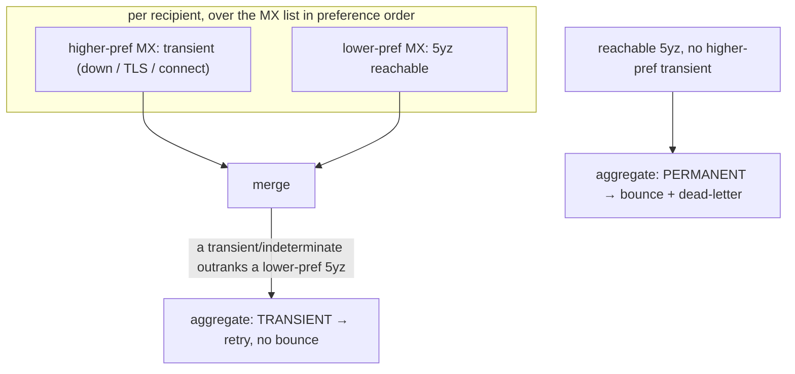

# 0023. Outbound delivery semantics: at-least-once, indeterminate post-DATA, worst-authoritative multi-MX

## Status

Accepted (2026-07-22). Names three delivery-classification choices the relay already makes,
now that each has a negative-controlled test. Kept as an ADR rather than a code comment
because each is a deliberate, revisitable trade with a plausible rejected alternative.

## Context

A message accepted for relay is enqueued durably, then the drain loop tries each MX and
records a per-recipient outcome (success / transient / permanent) that decides whether it is
removed, dead-lettered, or rescheduled. Three points in that flow are genuine decisions, not
mechanics, and each one, gotten wrong, either loses mail or duplicates it.

## Decision

### 1. Delivery is at-least-once

The queue row is deleted (or dead-lettered, or rescheduled) **after** the message has gone on
the wire, in a durable state transition that commits only once the outcome is known. A crash
in the window between the peer's `250` and that commit leaves the row still due, so the next
tick re-relays it. The alternative, deleting first (at-most-once), turns the same crash into
*lost* mail with no trace. We choose the duplicate over the loss: a duplicate is a visible,
tolerable failure mode that receivers dedupe on `Message-ID`, and mail loss is silent and
unrecoverable.

### 2. A post-DATA timeout is indeterminate, and does not walk to the next MX

After the terminating `<CRLF>.<CRLF>` the client waits for the peer's reply under a 10-minute
timeout (RFC 5321 §4.5.3.2.6). If that reply never comes (timeout, reset, early close), the
peer may have committed the message or may not have: the outcome is **indeterminate**. The
relay treats it as transient and defers, but it explicitly does **not** try the next MX,
because the current one may already hold the copy and a resend to a sibling would guarantee a
duplicate. A best-effort `QUIT` is sent and the indeterminate result is returned intact.

### 3. Multi-MX outcome is worst-authoritative

Hosts are tried in preference order; the aggregate per-recipient class merges the per-host
outcomes rather than taking the first or the last:

- a `5yz` from a **reachable** MX is authoritative-permanent and stops the walk;
- but a higher-preference host that failed only *transiently* (down, connect error, TLS
  failure before a reply) is **not** overridden by a later, lower-preference `5yz`: that
  primary may recover and accept, so the aggregate stays transient. This is the fix for
  bouncing mail the primary would have taken just because a stale backup answered `550`;
- a post-DATA indeterminate outcome (decision 2) also keeps the aggregate transient.

So `transient` (or indeterminate) anywhere in the walk beats a lower-preference `permanent`;
only a reachable `5yz` with no higher-preference transient is a permanent bounce.

Equal-preference MX records are Fisher-Yates shuffled before the walk (RFC 5321 §5.1 MUST),
so load spreads and no single sibling is always tried first.

## Consequences

- A crash mid-relay costs at most a duplicate, never a lost message. Receivers dedupe;
  senders never wonder whether mail silently vanished.
- A flaky or slow receiver that accepts-then-stalls after DATA cannot be turned into a storm
  of duplicates across its own MXes.
- Deliverable mail is not bounced because a lower-preference backup MX is misconfigured or
  stale; the sender's bounce means the *reachable* server refused, not that any server did.
- The cost is real duplicates in the crash and post-DATA-timeout cases. Accepted: at personal
  scale these are rare, and `Message-ID` dedupe is universal. A true exactly-once relay needs
  a two-phase commit no SMTP peer offers.
- Revisitable with a stated reason, like every ADR.
