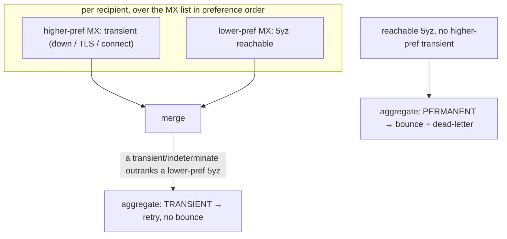

# 0023. Outbound delivery semantics: at-least-once, indeterminate post-DATA, worst-authoritative multi-MX

## Status

Accepted (2026-07-22). This ADR names three delivery-classification choices that the relay
already makes, now that each has a negative-controlled test. It stays an ADR rather than a
code comment, because each choice is a deliberate, revisitable trade with a plausible
rejected alternative.

## Context

The server enqueues a message accepted for relay durably. Then the drain loop tries each MX
and records a per-recipient outcome (success / transient / permanent). That outcome decides
whether the loop removes, dead-letters, or reschedules the message. Three points in that flow
are genuine decisions, not mechanics. Each one, if you get it wrong, either loses mail or
duplicates it.

## Decision

### 1. Delivery is at-least-once

The server deletes the queue row (or dead-letters it, or reschedules it) **after** the message
goes on the wire. This durable state transition commits only after the outcome is known. A crash
in the window between the peer's `250` and that commit leaves the row still due, so the next
tick re-relays it. The alternative deletes the row first (at-most-once). That turns the same
crash into *lost* mail with no trace. We choose the duplicate over the loss. A duplicate is a
visible, tolerable failure mode that receivers dedupe on `Message-ID`, and mail loss is silent
and unrecoverable.

### 2. A post-DATA timeout is indeterminate, and does not walk to the next MX

After the terminating `<CRLF>.<CRLF>` the client waits for the peer's reply under a 10-minute
timeout (RFC 5321 §4.5.3.2.6). If that reply never comes (timeout, reset, early close), the
peer may or may not hold the message: the outcome is **indeterminate**. The relay treats it as
transient and defers. But it explicitly does **not** try the next MX. The current one may
already hold the copy, and a resend to a sibling would guarantee a duplicate. The relay sends a
best-effort `QUIT` and returns the indeterminate result intact.

### 3. Multi-MX outcome is worst-authoritative

The relay tries hosts in preference order. The aggregate per-recipient class merges the
per-host outcomes. It does not take the first or the last:

- A `5yz` from a **reachable** MX is authoritative-permanent and stops the walk.
- A later, lower-preference `5yz` does **not** override a higher-preference host that failed
  only *transiently* (down, connect error, TLS failure before a reply). That primary may
  recover and accept, so the aggregate stays transient. This fixes a case: the relay used to
  bounce mail the primary would have taken, just because a stale backup answered `550`.
- A post-DATA indeterminate outcome (decision 2) also keeps the aggregate transient.

So `transient` (or indeterminate) anywhere in the walk beats a lower-preference `permanent`.
Only a reachable `5yz` with no higher-preference transient is a permanent bounce.

```mermaid
flowchart TD
    subgraph walk["per recipient, over the MX list in preference order"]
        H1["higher-pref MX: transient (down / TLS / connect)"]
        H2["lower-pref MX: 5yz reachable"]
    end
    H1 --> M["merge"]
    H2 --> M
    M -->|"a transient/indeterminate outranks a lower-pref 5yz"| T["aggregate: TRANSIENT → retry, no bounce"]
    R["reachable 5yz, no higher-pref transient"] --> P["aggregate: PERMANENT → bounce + dead-letter"]
```

The relay applies a Fisher-Yates shuffle to equal-preference MX records before the walk
(RFC 5321 §5.1 MUST). So load spreads, and the relay does not always try one sibling first.

### 4. The MX walk is bounded and cancellable

"Tries each MX" above means the preference-ordered candidates, not an unbounded RRset. RFC 5321
§5.1 sets no ceiling on how many MX records a domain may publish. So a hostile
recipient domain could publish thousands. They all resolve to addresses it controls, but
black-hole the connection. Each one costs a full connect timeout. The drain loop walks them
serially and single-flight, so they stall outbound mail for every account. The walk therefore
has three limits. It caps at the first ten hosts by preference. A per-recipient wall-clock
budget bounds it, checked between attempts, never mid-delivery, so decision 2's post-DATA
window stays untouched. It cancels at the next host or recipient boundary when the loop shuts
down. Whatever the walk does not attempt defers as `transient` — durably queued, retried next
tick. So it preserves the three classification decisions above, and loses nothing.

## Consequences

- A crash mid-relay costs at most a duplicate, never a lost message. Receivers dedupe, and
  senders never wonder whether mail silently vanished.
- A flaky or slow receiver that accepts and then stalls after DATA cannot become a storm
  of duplicates across its own MXes.
- The relay does not bounce deliverable mail because a lower-preference backup MX is
  misconfigured or stale. The sender's bounce means the *reachable* server refused, not that
  any server did.
- The cost is real duplicates in the crash and post-DATA-timeout cases. Accepted: at personal
  scale these are rare, and `Message-ID` dedupe is universal. A true exactly-once relay needs
  a two-phase commit no SMTP peer offers.
- Revisitable with a stated reason, like every ADR.
